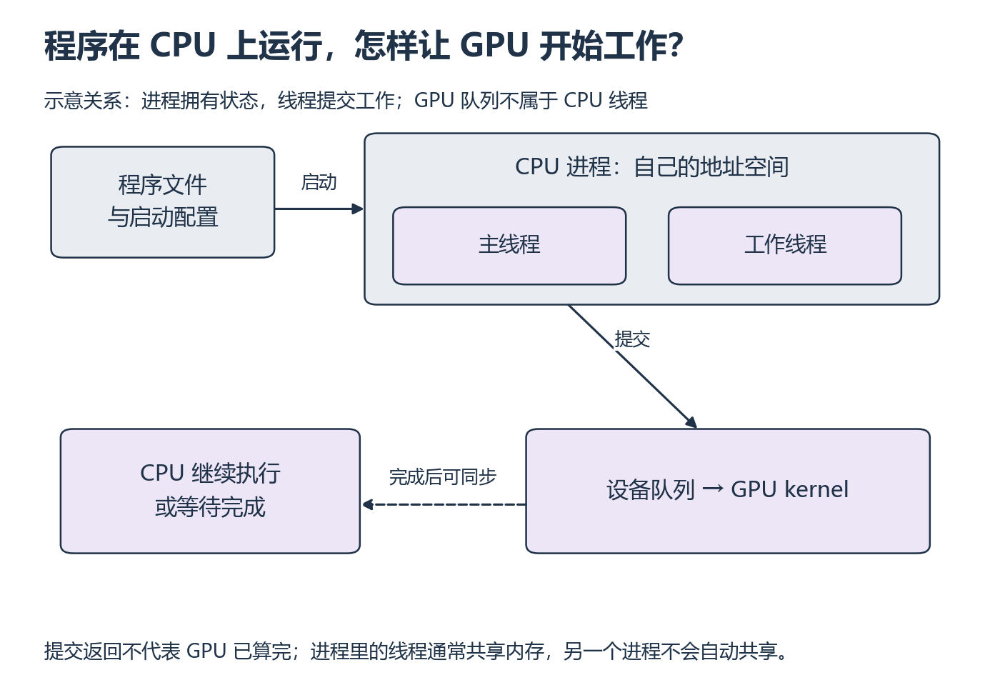

# S1：程序如何运行在机器上

[系统衔接目录](README.md)

同一个脚本可以运行很多次，每次都有自己的变量、文件和执行位置。观察程序“还活着”还是“卡住了”之前，先分清文件、进程、线程和设备分别负责什么。

## 从哪里开始

先看 [Missing Semester 2026 · Course Overview + Introduction to the Shell](https://missing.csail.mit.edu/2026/course-shell/) 页内视频。导航、PATH 和重定向各停一次，用自己的工作目录验证；Job Control 查下文 2020 正文，不混用两年的视频时间轴。

视频分钟位置待核验；下面的正文范围、例子和练习可以独立完成。

**阅读范围：** 本节中文例子；接口查 [MIT Shell](https://missing.csail.mit.edu/2026/course-shell/) 的导航、PATH、重定向及 Exercises 9 的执行权限题，以及 [Command-line Environment](https://missing.csail.mit.edu/2020/command-line/) 的 Job Control，停在 Terminal Multiplexers 前。P7 已学的虚拟环境不重学。

程序文件是指令，进程是一次运行及其地址空间、打开的文件等状态。线程是进程内的一条执行路径，同一进程的线程通常共享内存；多进程之间不能把普通 Python 列表当作自动共享的数据。操作系统安排 CPU 执行；GPU 工作由 CPU 进程提交。启动 GPU kernel 后 CPU 可以继续执行，故 W2 要明确同步边界。

*先看程序如何启动为进程，再追踪提交与完成两个方向 [放大查看 SVG](../../assets/figures/s01-process-device.svg)。暂停：提交函数已经返回，但 GPU 还在工作，此刻停止 CPU 计时会漏掉什么？*

## 工作目录和环境，为什么会影响同一份代码？

相对路径从当前工作目录解释；绝对路径从文件系统根开始。Linux 文件的 r/w/x 是读/写/执行权限；目录的 x 表示可穿过目录访问其条目。环境变量是启动进程时继承的字符串配置；修改某个 shell 的变量不会自动修改已经运行的其他进程。虚拟环境选择 Python 包，不能替代 GPU 驱动。

## 先把输出和错误分开

终端通常连接三个标准流：标准输入接收输入，标准输出保存正常输出，标准错误保存诊断信息。把它们重定向到不同文件后，你才能判断“没有正常结果”与“错误被写到了另一个地方”的区别。

**先预测，再补上关键一步：** 先预测 `python practice.py > output.txt 2> error.txt` 三条流去向，补写读取 `DATA_DIR` 环境变量的语句。未设置时用命令行输入的路径，日志记录最终绝对路径与 `sys.executable`。

**自己动手：** 在自己的 Linux/WSL 练习目录写一个每秒输出计数的短程序，打印 `os.getpid()`；从另一个终端用 `ps -p PID -o pid,ppid,stat,cmd` 观察该 PID，用 `ps -T -p PID` 观察线程。回到前台用 Ctrl-C 结束。再让程序在后台运行，确认 PID 与命令确为自己的程序后用 `kill -TERM PID` 停止，保存退出前后的观察。无需终止其他进程。

**改变条件再试：** 从另一个工作目录运行同一脚本，解释为什么相对数据路径可能失效；用配置中的绝对路径修复。对自己新建的 `own-permission.txt` 用 `chmod u-w own-permission.txt` 去掉所有者写权限，在普通用户身份下尝试写入，观察 PermissionError，再用 `chmod u+w own-permission.txt` 恢复写权限重试。用 `ls -l` 对照变化；若以 root 身份运行可能绕过权限检查，先确认身份。不要用系统目录做权限实验。

**排错：** `ModuleNotFoundError`、`FileNotFoundError`、`PermissionError` 各首先检查什么？增加线程为何不一定加快 Python 计算？

展开核对；先找出失败发生在哪一层

依次核对解释器和环境中的包、最终解析的路径、文件与父目录权限。线程增加可能只是等待 I/O，也可能增加争用；常规 CPython 的 GIL 会限制 Python 字节码并行，原生库和不同运行时另论。线程数不等于可用 CPU 核数。Ctrl-C 通常发送 SIGINT，TERM 请求退出；退出信号不代表状态已经保存。进程终止后普通内存变量消失，文件持久化见 S5。卡在语法回 P5/P6，卡在流与工作目录回先修 A。

## 返回当前单元

[返回 W1](../../weeks/week-01-foundations/README.md) · [返回 W2](../../weeks/week-02-cuda-execution/README.md)
