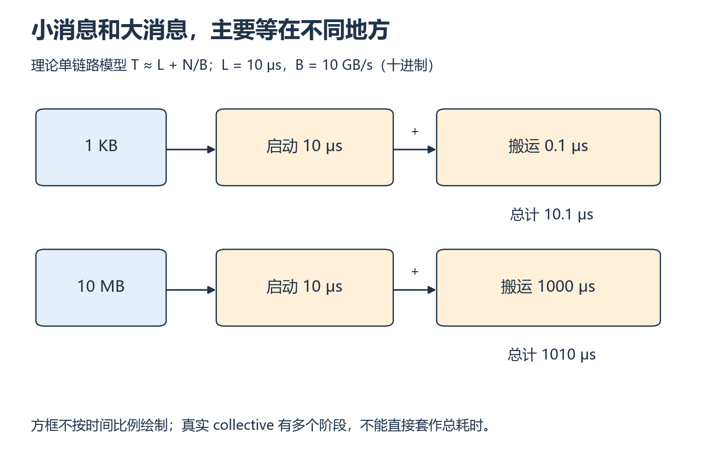
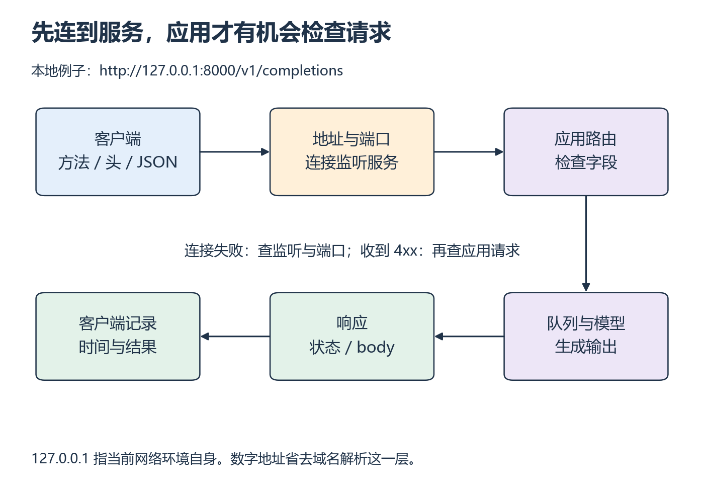

# S2：一次搬运和一次请求

[系统衔接目录](README.md)

一次请求迟迟没有返回，可能还没连上服务，也可能已经在队列里等待。这里先用一个搬运算例区分延迟和带宽，再顺着 URL 追踪请求，到能够选择下一条诊断证据为止。

## 从哪里开始

主要阅读本页图解与下列官方正文。通信与 HTTP的视频范围待核验。

**阅读范围：** 通信成本用本节小算例接 W7 的 [collective 讲义](../../resources/training.md#r-l7)；HTTP 用 [MDN Overview](https://developer.mozilla.org/en-US/docs/Web/HTTP/Guides/Overview) 的 Components、HTTP flow、HTTP Messages（到 Responses 末尾）。只用 HTTP/1.1 请求示例，不照搬页面把 QUIC 称为实验的旧背景。W8 的 token、JSON、TTFT/TPOT 仍读原单元。

延迟是一次操作的启动/往返等固定成本，带宽是单位时间可搬的字节数。简化一条链路为 `耗时≈启动延迟+字节数/有效带宽`。假设启动 10 μs、有效带宽 10 GB/s，1 KB 约 10.1 μs，10 MB 约 1010 μs；小消息容易受启动成本支配。这里 KB/MB/GB 用十进制。真实 collective 要经过多个阶段、可能拥塞，不能直接把这条公式当 AllReduce 总耗时。

*两行使用同一带宽和启动延迟，只改变消息大小；框宽不代表时长 [放大查看 SVG](../../assets/figures/s02-latency-bandwidth.svg)。暂停：带宽翻倍而启动成本不变时，哪一行总耗时更接近减半？*

rank 是进程组中的编号；一个常用实验让每个进程管理一张 GPU。拓扑描述设备通过哪些 PCIe、GPU 互连或网络链路相连。物理路径不同，共享链路和同步等待都可能改变有效带宽。W7 先画真实路径，再解释曲线。

## 中文补充（按需）

MDN 官方站的中文译文[HTTP 概述](https://developer.mozilla.org/zh-CN/docs/Web/HTTP/Guides/Overview)，看“基于 HTTP 的系统的组成”“HTTP 流”和请求/响应消息。用 HTTP/1.1 小例子沿客户端、端口、服务器走一遍；正文已预读，不延伸到 QUIC。它补请求协议，不覆盖本课带宽/延迟测量和服务健康检查。[范围与版本](../../resources/serving.md#cn-http)。

## 从地址与端口走到模型

*先沿上排看请求进入服务，再沿下排看响应回到客户端 [放大查看 SVG](../../assets/figures/s02-request-path.svg)。暂停：若端口没有监听，服务端是否已经有机会报告 prompt 字段错误？*

HTTP 是应用之间约定请求和响应格式的协议。方法说明想做什么，路径说明访问哪个接口，头部描述内容类型等信息，body 携带 JSON 数据。先把这些字段分开，才能判断是连接出了问题，还是应用拒绝了内容。

地址定位主机/接口，端口定位监听服务；`127.0.0.1` 指当前网络环境自身，在容器里不指宿主机。请求路径如 `/v1/completions` 由应用解释。DNS 把域名解析为地址；本地数字地址练习先排除这一层。HTTP 成功状态不保证模型输出质量正确。

**先预测，再补上关键一步：** 在 W8 已选版本的单请求示例中标出 host、port、method、path、Content-Type、body；补全缺失的 model 与 prompt。保持原单元的输出长度检查。

**自己动手：** 发一次合法请求，记录客户端发送/首 token/结束时间、状态码和服务端相应日志；使用请求 ID（服务支持时）或单请求时间窗口关联。画出哪些阶段已观测、哪些只是推断。用 W8 的真实明细重算 TTFT/TPOT，不能用不同机器未校准的时钟直接相减。

**改变条件再试：** 先仅改变端口到未监听端口，再恢复端口但把 JSON 字段写错；最后固定合法请求增加输入长度。分别记录连接错误、应用错误、正常但耗时变化。W10 复用日志，与等待请求数、成功率和 token 吞吐对照。

**排错：** GPU 利用率低、TTFT 却高，是否证明 kernel 太慢？

展开核对；先找出失败发生在哪一层

连接失败时通常没有该次 HTTP 应用响应；非法 JSON 可能得到 4xx，具体按版本记录，不硬填某个码。GPU 空闲可以来自客户端发送不足、CPU 处理、数据加载或队列策略。先看实际到达、队列和 CPU/GPU 时间线再选假设。指标同一时窗聚合，日志提供单事件，trace 才能支持区段先后和重叠。长度改变会改变计算和 KV 占用，不能归因为网络单一因素。回看 W7 消息曲线、W8 时间轴、W10 指标定义。

## 动手材料

[打开本段对应的输入与待补全代码](../../exercises/README.md)。按表选择当前段，把自己的实现与运行记录放到对应 labs 目录。独立实现任务仍从空文件开始。

## 返回当前单元

[返回 W7](../../weeks/week-07-collectives/README.md) · [返回 W8](../../weeks/week-08-serving-baseline/README.md) · [返回 W10](../../weeks/week-10-serving-benchmark/README.md)
