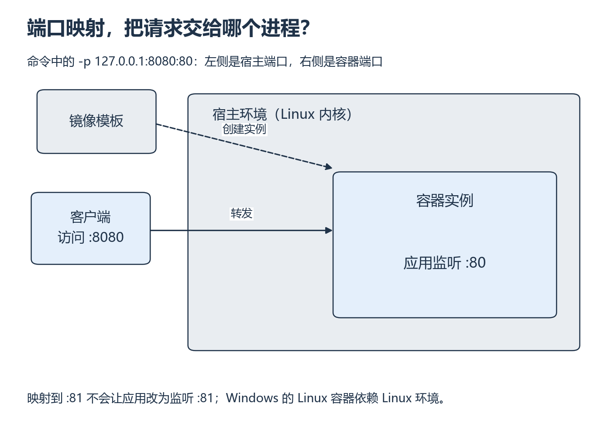

<a id="s3"></a>

# S3：把一个服务装进容器

[系统衔接目录](README.md)

在终端里能跑的服务，换一个环境为什么会缺包、端口不通？容器把运行依赖与启动方式放进可重复创建的环境，但服务仍要真的监听一个端口。先用 CPU 小服务把这层关系观察清楚。

## 从哪里开始

主要阅读本页图解与下列官方正文。容器与端口的视频范围待核验。

**阅读范围：** Docker 官方 [What is a container?](https://docs.docker.com/get-started/docker-concepts/the-basics/what-is-a-container/) 全部正文；[Publishing ports](https://docs.docker.com/get-started/docker-concepts/running-containers/publishing-ports/) 的 Publishing ports 与 Publishing all ports 前的说明。镜像是创建运行环境的模板，容器是运行实例；容器共享宿主内核，不能把镜像当作完整虚拟机或 GPU 驱动。



*先看镜像创建实例，再沿请求箭头看两个端口 [放大查看 SVG](../../assets/figures/s03-container-port.svg)。暂停：只修改宿主端口为 8081，容器里的应用需要改变监听端口吗？*

## 先确认 Docker 可用，再观察一次请求

以下在已安装并可访问 Docker daemon 的环境，由你实际执行。Windows 使用 Linux 容器环境；安装和下载单独计时。先用 CPU 小服务理解交付，不在同一天强行处理 CUDA 镜像。运行记录写入 W8 实验的 `notes.md`。

先运行 `docker version`，确认客户端可以联系负责创建容器的 daemon。接着用 `run -d` 启动后台容器，`ps` 查看状态；只有容器已运行，才继续用 `curl` 检查 HTTP。`logs` 看输出，`inspect` 看实际配置，最后 `stop` 结束这次运行。下面按这个顺序列出命令，逐条执行并记录观察。

```bash
docker version
docker run -d --name infra-http -p 127.0.0.1:8080:80 docker/welcome-to-docker
docker ps
curl -i http://127.0.0.1:8080/
docker logs infra-http
docker inspect infra-http
docker stop infra-http
```

**读例子：** 逐项解释镜像、名字、后台运行、宿主 8080 和容器 80。记录 inspect 中实际镜像 ID/摘要；标签未来可能变化。HTTP 响应体是网页，不是 vLLM JSON。

**补全：** 将宿主端口改为 8081，保持容器端口 80；先预测 curl 应访问哪里。

**自己动手：** 不复制命令，从记录重建一个不同名字的同镜像容器，验证服务可达、日志可读、停止后请求失败。在已确认停止的自己的练习容器上用 `docker rm infra-http` 清理名字后再创建也可以；不执行全局 prune。重复时先查同名对象，避免误删已有容器。

**改变条件再试：** 把容器端口错误地映射为 81，观察失败，再修复。映射是转发规则，不能令应用自动改监听端口。`EXPOSE`/`containerPort` 声明也不能替代监听或端口发布。

**健康与排错：** 进程存在、HTTP 可达、应用就绪、输出正确是不同层次。在 W8 的真实服务启动期间记录“进程已启动但模型未加载完”的现象；按所选版本核实健康/就绪接口，再发一个合法最小推理请求。保存探测方法、状态和超时。容器启动成功不等于模型 ready。

<details>
<summary>展开核对端口与运行结果</summary>

宿主访问 8081，容器内仍监听 80；写成 8081:81 不会使原服务监听 81。停止后连接失败与 HTTP 500 要分开。重建仍可访问说明交付步骤可重做；不证明训练状态持久化，下一段 S5 专门检查。可达性和应用正确性都有证据才通过。Docker 必须实际操作；设备暂不可用时记录待补做，不能以纸面回答代替。

</details>

## 动手材料

[打开本段对应的输入与待补全代码](../../exercises/README.md)。按表选择当前段，把自己的实现与运行记录放到对应 labs 目录。独立实现任务仍从空文件开始。

## 返回当前单元

[返回 W8](../../weeks/week-08-serving-baseline/README.md) · [返回 W10](../../weeks/week-10-serving-benchmark/README.md)
