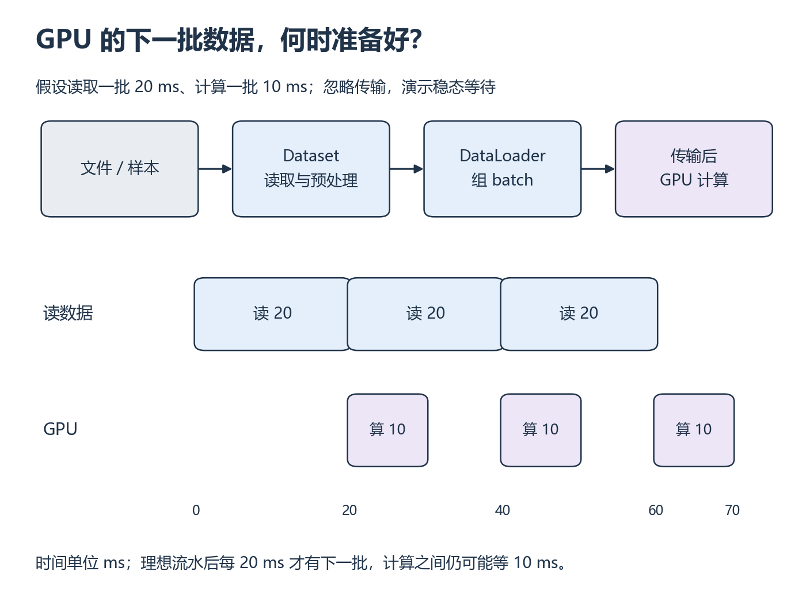

<a id="s4"></a>

# S4：GPU 在等什么数据

[系统衔接目录](README.md)

训练时 GPU 一会儿忙、一会儿闲，未必是模型太小。每次计算前都要取出正确的样本、组成 batch 并搬到设备；其中任何一步没准备好，GPU 都只能等待。

## 从哪里开始

先看 [PyTorch · Training with PyTorch](https://docs.pytorch.org/tutorials/beginner/introyt/trainingyt.html) 页内视频的 Dataset/DataLoader 主题。先修 D 的前向、损失与更新已完成；暂停画出取样、组 batch、交给模型的步骤。这里补输入管线，原文图像下载示例只用于理解，本段运行用本地小数据。

视频分钟位置待核验；下面的正文范围、例子和练习可以独立完成。

**阅读范围：** [PyTorch Datasets & DataLoaders](https://docs.pytorch.org/tutorials/beginner/basics/data_tutorial.html) 的 Creating a Custom Dataset（含三个方法）到 Iterate through the DataLoader 末尾。示例的 pandas、图像解码只用于理解路径；本地用下面的合成数据，不额外要求学图像库。W11 的 [输入优化查阅](../../resources/training.md#r-amp) 只核对 num_workers/pin_memory，AMP 保持选做。

## 中文补充（按需）

李沐《动手学深度学习》中文[§3.2.2 读取数据集](https://zh.d2l.ai/chapter_linear-networks/linear-regression-scratch.html)，选择 PyTorch，看 `data_iter` 怎样打乱索引并取出一批；`yield` 先理解为逐批交回数据。配套[线性回归 P3](https://www.bilibili.com/video/BV1PX4y1g7KC?p=3)仅分集已确认，正文已预读。它帮助理解 batch，不覆盖 DataLoader workers、预取和等待；这些仍用本课输入对照。[范围与版本](../../resources/foundations.md#cn-training)。

## 一个样本怎样变成一批输入？

Dataset 回答“第 index 个样本是什么”，DataLoader 负责迭代、组 batch 和可选并行取数。预处理把原始值变为模型输入；shuffle 改顺序，不能改变 feature/label 的对应。类、继承与特殊方法先做 P8。

```python
from torch.utils.data import Dataset, DataLoader
import torch

class PairDataset(Dataset):
    def __len__(self):
        return 8

    def __getitem__(self, index):
        feature = torch.tensor([float(index)])
        target = 2 * feature + 1
        return index, feature, target

loader = DataLoader(PairDataset(), batch_size=3, shuffle=False, num_workers=0)
```

**先预测，再补上关键一步：** 手写前三个样本；遮住 `target` 补全；解释三个 batch 的样本 ID 和 shape。

**自己动手：** 从空文件写自己的 Dataset，读取 P6 保存的八个数，返回 ID、feature、label；运行完整 epoch，核对无意外丢失/重复。接到先修 D 的小训练循环，分别标记取 batch、CPU 处理、CPU→GPU 搬运、计算、同步的位置。CPU 环境可完成样本与形状检查，GPU 等待证据在 W11 实测。

**改变条件再试：** 先把每样本读取增加固定 10 ms 等待（标注人工模拟 I/O），保持模型/样本不变；再单独比较 num_workers=0 与 2。多进程入口放在 `if __name__ == "__main__":` 中，Dataset 定义在模块顶层。记录首 batch 与稳态、取数等待、端到端步时，不能假定 worker 越多越好。

## 计算变快，为什么整步还可能不变快？



*先看上方数据处理步骤，再按下方毫秒刻度追踪三批的依赖 [放大查看 SVG](../../assets/figures/s04-data-pipeline.svg)。暂停：保持读取 20 ms，只把计算从 10 ms 减到 5 ms，稳态出批间隔会变成 5 ms 吗？*

图中读取与计算理想地重叠，首批仍要先等读取完成。稳态中下一批每 20 ms 才准备好，即使 GPU 更早算完，也不能凭空得到数据。真实系统还有传输和调度开销；用 trace 判断是否重叠，不能由参数名称推断。

**排错：** 为什么只缩短 GPU kernel 仍可能几乎不缩短总训练？为何把每一步都 synchronize 的诊断时间线直接当优化后性能不公平？

<details>
<summary>核对与回看</summary>

ID 分组为 [0,1,2]、[3,4,5]、[6,7]；feature/target shape 分别 [3,1]、[3,1]、[2,1]，最后不足 batch 正常；drop_last 会改变样本集合。无重叠学习例步时 30 ms，理想流水稳态受 20 ms 输入限制；首尾另算。worker 的创建、通信和争用可能抵消收益。同步诊断会破坏重叠，因此诊断运行与自然执行的端到端计时分别保留。只有时间线实际重叠才能声称发生重叠；pin_memory/non_blocking 不是自动保证。卡点依次回 P8、先修 D、W2 异步计时、W11 样本对照。

</details>

## 动手材料

[打开本段对应的输入与待补全代码](../../exercises/README.md)。按表选择当前段，把自己的实现与运行记录放到对应 labs 目录。独立实现任务仍从空文件开始。

## 返回当前单元

[返回 W11](../../weeks/week-11-ddp/README.md)
