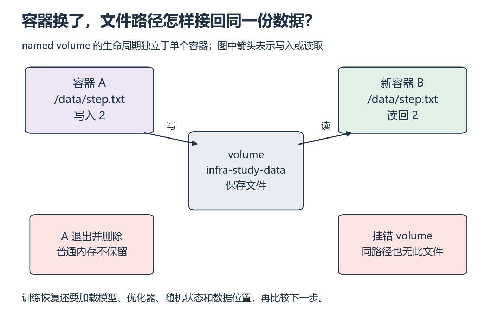

<a id="s5"></a>

# S5：保存下来与恢复正确

[系统衔接目录](README.md)

训练退出后留下了一个文件，重启时也能读到它，这是否就叫恢复成功？这里分两步检查：先找回同一份数据，再证明这些数据足以接着完成原来的计算。

## 从哪里开始

主要阅读本页图解与下列官方正文。存储与恢复的视频范围待核验。

**阅读范围：** 本节状态路径，配 Docker [Volumes](https://docs.docker.com/engine/storage/volumes/) 的 lifecycle、Syntax、Create and manage、Start a container；对象存储只读 AWS [S3 的 Objects、Keys、S3 Versioning](https://docs.aws.amazon.com/AmazonS3/latest/userguide/Welcome.html)。无需云账号或付费资源。

进程内存随退出消失；文件有路径，可被后续进程打开；容器可写层随容器删除而消失，named volume 有独立生命周期。对象存储用 bucket、key、可选版本标识数据，对象 key 中的斜杠不能让它自动拥有本地目录和原子 rename 的语义。



*先追踪写入所到的卷，再检查新容器挂载的是否还是它 [放大查看 SVG](../../assets/figures/s05-persistence.svg)。暂停：如果容器内路径相同，但 volume 名称不同，能否说明旧文件被删除了？*

## 先验证跨进程、跨容器读回

**先预测，再补上关键一步：** 画“训练内存→序列化→存储→重新建对象→加载状态”的路径，补上每步可能失败的位置。先做 P6 的进程重启后 JSON 比较，再做下列 named volume 小练习，保存在 W12 原实验记录。

第一条命令创建专用 volume。第二条命令启动短命容器，把文件写到挂载点 `/data`，退出后 `--rm` 删除该容器。第三条用新容器只读挂载同一 volume，检查数据是否还在；这里保持卷名不变是关键。

```bash
docker volume create infra-study-data
docker run --rm --mount type=volume,src=infra-study-data,dst=/data python:3.12-slim python -c "from pathlib import Path; Path('/data/step.txt').write_text('2', encoding='utf-8')"
docker run --rm --mount type=volume,src=infra-study-data,dst=/data,readonly python:3.12-slim python -c "from pathlib import Path; print(Path('/data/step.txt').read_text(encoding='utf-8'))"
```

使用新的、专属练习 volume；若同名已存在先检查，不覆盖他人数据。记录镜像摘要。第一个容器退出并删除后，第二个应读到 2。这是练习的预期结果，实际输出写在自己的记录里。

**自己动手：** 换成自己 P7 的统计输出，保存后用新进程/容器重读并比较字段。保留 volume，不需要删除它来通过。

## 再检查是否能接着训练

**换个条件，查一次错误：** 第二次改挂另一个空 volume，解释为什么找不到文件；检查 mount 的 source/destination，不能直接判定“磁盘丢数据”。然后回 W12，把 checkpoint 的模型、优化器、scheduler/scaler（若使用）、步数、每 rank RNG 和数据位置填入清单；逐项解释缺失对下一步的影响。

<details>
<summary>核对依据与边界</summary>

读到文件只证明该存储路径跨本次重建仍可访问。训练恢复还需与连续运行比较下一批 ID、loss、参数和优化器状态。分片 checkpoint 要全部必要分片与元数据可用，记录保存完成的条件；中断中的文件不能标成有效 checkpoint。对同一文件系统可讨论临时文件再原子替换，但不能把单文件原子性推广到多文件事务或对象存储。上述小练习不证明断电持久性、跨节点可达性或容灾；这些保留进阶。

</details>

## 动手材料

[打开本段对应的输入与待补全代码](../../exercises/README.md)。按表选择当前段，把自己的实现与运行记录放到对应 labs 目录。独立实现任务仍从空文件开始。

## 返回当前单元

[返回 W12](../../weeks/week-12-fsdp/README.md)
