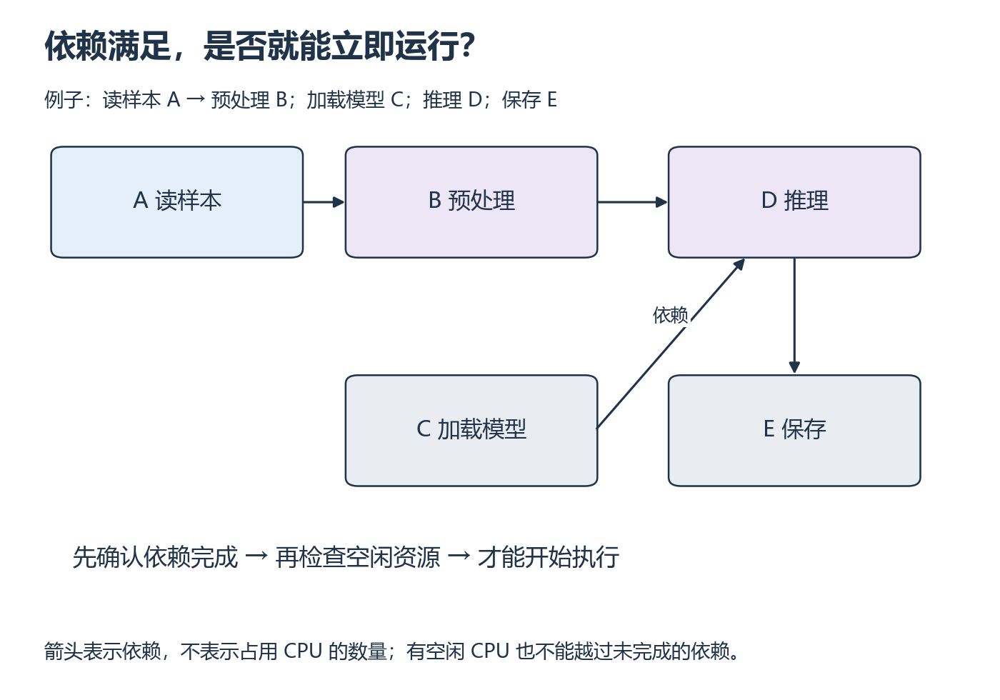
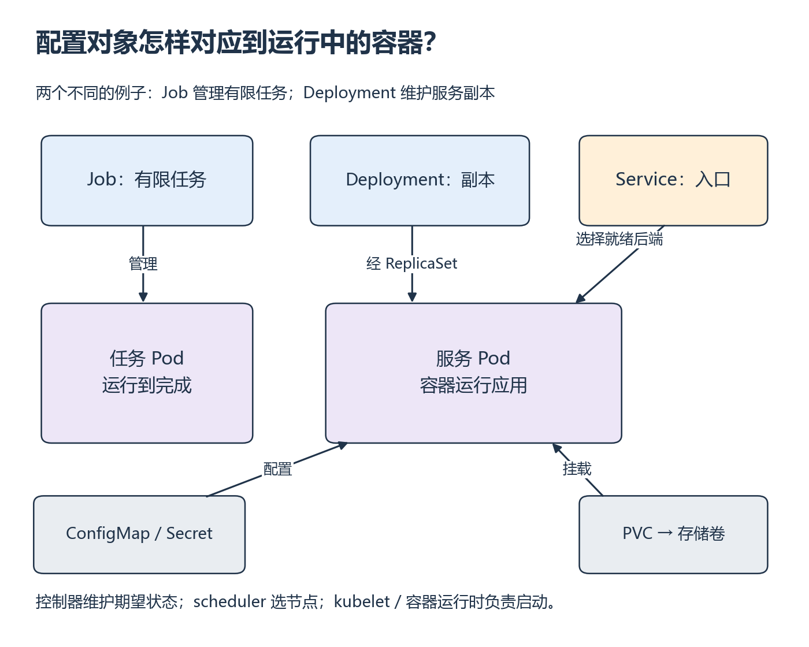

<a id="s6"></a>

# S6：任务依赖、资源准入与 Kubernetes

[系统衔接目录](README.md)

提交任务后没有立刻运行，可能是前面的任务没完成，也可能是资源不够。先把依赖关系与资源判断分开，再用同样的思路阅读 Kubernetes 配置和事件。

## 从哪里开始

主要阅读本页图解与下列官方正文。任务与配置的视频范围待核验。

**阅读范围：** 图和准入先读本节，再接 [Ray Task/资源](../../resources/scheduling.md#r-ray-task)。平台对象读 Kubernetes [Objects](https://kubernetes.io/docs/concepts/overview/working-with-objects/) 的 Understanding、spec/status、Describing、Required fields；[Pods](https://kubernetes.io/docs/concepts/workloads/pods/) 的开头、Using Pods、Workload resources；[资源](https://kubernetes.io/docs/concepts/configuration/manage-resources-containers/) 的 Requests and limits、Resource units、Container resources example、How Pods with resource requests are scheduled；[Debug Pods](https://kubernetes.io/docs/tasks/debug/debug-application/debug-pods/) 的 Debugging Pods 和 Debugging Services。不读高级 feature gates 或集群运维。

有向边 A→B 表示 B 必须等 A 成功。DAG 是无有向环的图；入度是尚未满足的前驱数。每次从入度为 0 的节点中选任务，完成后减少后继入度，就是一种拓扑处理。拓扑关系只约束先后，不规定可同时运行多少任务。



*沿箭头找每个任务必须等待的前驱 [放大查看 SVG](../../assets/figures/s06-task-dependencies.svg)。暂停：若 B 完成但 C 未完成，即使有空闲 GPU，D 能开始吗？*

**先预测，再补上关键一步：** 列出初始 ready 集合；补上 D 的依赖；若 C→A 再加 A→C，说明为何无法启动这两个节点。

**自己动手：** 用 Python 字典保存五个节点及依赖，输出一种合法顺序；再用 W15 的 ObjectRef 表达同一依赖。日志保留 task_id、attempt_id、提交/开始/结束、依赖、结果或错误。控制侧决定可以运行什么、放在哪里；执行侧真正做计算。Ray 的逻辑资源声明不等于内核强制的 CPU/内存隔离。

**改变条件再试：** 假设总共 2 CPU，两个 ready 任务各要 2 CPU，只能同时准入一个；第三个任务始终要求 3 CPU，在这组固定资源上不可行。程序已经启动后抛异常则是执行失败。重试要有限，并让保存操作用 task_id 去重；“加一次”操作重复执行两次可能加两次，不是天然恰好一次。

### 阅读并解释部署配置（必做，不要求创建集群）

YAML 的缩进表示层次，`-` 是列表项，`key: value` 是字段。以下是原创 CPU Job 学习配置，不是训练部署成品：

```yaml
apiVersion: batch/v1
kind: Job
metadata:
  name: infra-check
spec:
  backoffLimit: 1
  template:
    spec:
      restartPolicy: Never
      containers:
        - name: check
          image: python:3.12-slim
          command: ["python", "-c", "print(sum([2, 4, 6]))"]
          resources:
            requests:
              cpu: "500m"
              memory: "128Mi"
            limits:
              cpu: "1"
              memory: "256Mi"
```



*先分清谁管理 Pod，再看请求、配置和存储怎样接入 [放大查看 SVG](../../assets/figures/s06-kubernetes-objects.svg)。暂停：Service 存在但没有就绪后端，是否可以据此认定容器已正常提供服务？*

Pod 是一组共同运行的容器的基本调度单位；Node 是承载它的机器。Job 管理有限任务直至完成；Deployment 管理长期服务副本；Service 为一组匹配标签的 Pod 提供稳定访问入口。ConfigMap 保存非敏感配置，Secret 承载敏感配置，PVC 表达持久存储需求。这里只建立关系，不要求编写全部对象。控制器尝试让实际状态接近期望状态，scheduler 选择节点，节点上的 kubelet/运行时启动容器，职责不能混为一个“调度器”。

**练习：** 逐层解释上面配置；把任务改为输出均值 4；预测如果程序改成 `raise ValueError('bad input')` 会怎样。说明要长期提供 W8 HTTP 服务时，为何应转向 Deployment + Service，并另行安排 readiness 与持久化，而不是盲目复制 Job。

**事件诊断题：** 以下是人工构造的三个独立情况，不是实测日志。

| 观察 | 下一条该取的证据 | 候选解释 |
| --- | --- | --- |
| Pending，事件 FailedScheduling / Insufficient cpu | describe 的事件、各节点 allocatable 与已分配 requests | 准入资源不足，即使瞬时 CPU 使用率很低也可能无法放置 |
| 容器曾运行、退出码非零，日志 ValueError | 容器状态、退出原因和该次 attempt 日志 | 输入或程序错误，增加 CPU 不会修复它 |
| Service 没有可用后端，但 Pod 存在 | selector/labels、EndpointSlice 与 readiness | 标签不匹配或应用未就绪，不能仅凭 Pod 存在断定网络坏了 |

用 `kubectl describe pod NAME`、`kubectl logs NAME`、`kubectl get endpointslices -l kubernetes.io/service-name=NAME` 说明各能取什么证据；没有集群就在笔记中完成配置与事件推理。实际执行这些命令、本地集群搭建和 GPU device plugin 是后续选做，不得把纸面诊断登记成集群运行通过。

<details>
<summary>展开核对依赖、资源与事件判断</summary>

初始 ready={A,C}，D 等 B/C；合法顺序可为 A,B,C,D,E 或 C,A,B,D,E。环导致无合法拓扑顺序。配置请求 0.5 CPU、128 MiB，limit 为 1 CPU、256 MiB；CPU limit 可能节流，内存超限可能 OOM，二者不是相同机制。requests 用于放置，limits 不代表启动时已占满。backoffLimit 约束失败重试，不能修复确定性的坏输入，也不能证明业务副作用恰好一次。Kubernetes 对象保留不代表应用内存被保存。

W16 复用有限任务轨迹改变到达顺序与时长估计，比较平均等待与最长等待；短任务优先可能使长任务等待很久，平均值降低不等于对每个任务公平。有限轨迹不能证明无限到达下无饥饿。卡住先回本节 ready 集合，再回 W16 的事件顺序与 OSTEP 指标。

</details>

## 动手材料

[打开本段对应的输入与待补全代码](../../exercises/README.md)。按表选择当前段，把自己的实现与运行记录放到对应 labs 目录。独立实现任务仍从空文件开始。

## 返回当前单元

[返回 W15](../../weeks/week-15-ray/README.md) · [返回 W16](../../weeks/week-16-scheduling/README.md)
