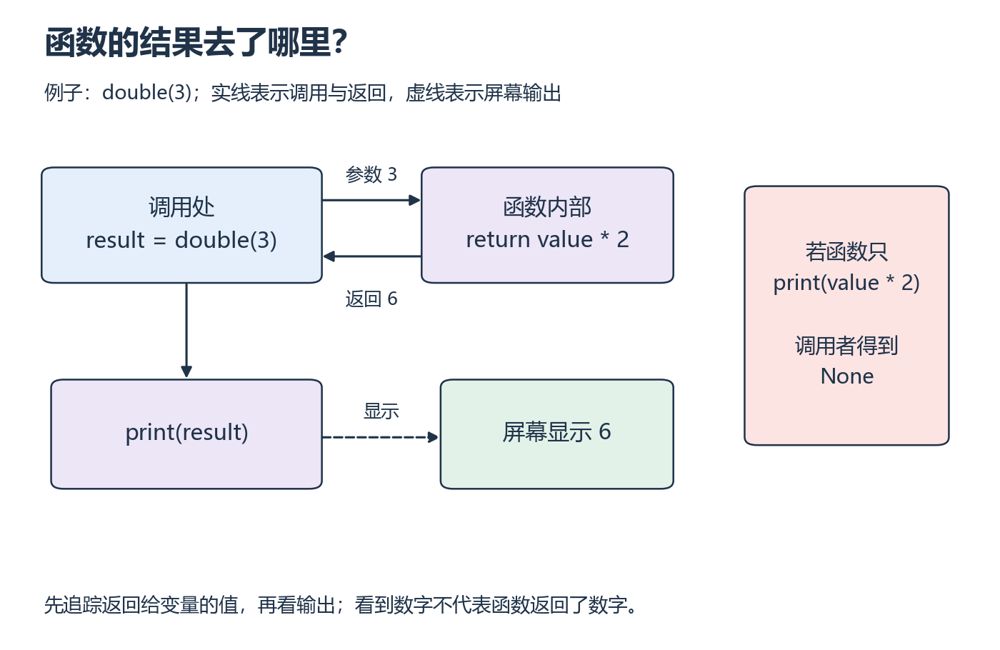

<a id="p1"></a>

# P1：函数算出的值，怎样回到调用处？

[基础目录](README.md) · [我的进度](../progress.md)

一个 Tensor 有多少字节，取决于元素个数和每个元素的宽度。你很容易在纸上做乘法，但写成程序后还有一个问题：计算结果怎样交给下一行代码继续使用？这一节先分清“显示结果”和“返回结果”，再把带单位的计算写成函数。

开始前，确认自己能运行一个 Python 文件；还没有解释器时，先完成[环境与运行自测](../prerequisites.md)。

## 看一段，再亲手试一试

主要讲解：[CS50P 2022 · Lecture 0 · Functions, Variables](https://video.cs50.io/JP7ITIXGpHk)（[官方课页](https://cs50.harvard.edu/python/weeks/0/)）。视频分钟位置待核验；可以直接阅读 [CS50P 0 Notes](https://cs50.harvard.edu/python/notes/0/) 的 Functions、Variables 至 Def、Returning Values，完成相同的练习。

| 看到这里时暂停 | 先做一件小事 |
| --- | --- |
| 输入、变量与类型 | 比较 `input` 得到的文本与数值；说明为什么需要转换 |
| `def`、参数与返回值 | 写下调用的参数和返回给调用者的值，再比较 `print` |

## 中文补充（按需）

廖雪峰的中文原创[定义函数](https://liaoxuefeng.com/books/python/function/define-function/index.html)，从 `def` 读到“空函数”前。遇到 `return` 时，追踪返回值被谁接收，再回本课比较 `print`。其中条件判断留到 P2 理解；CS50P 范围不变。[范围与版本](../../resources/foundations.md#cn-python)。

## 沿着一次调用走一遍

看 `result = double(3)`。等号右边先执行：数字 3 传入函数，成为参数 `value` 的值。函数算出 `value * 2`，`return` 结束本次调用，把 6 交回去；随后等号左边的 `result` 绑定到 6。这时屏幕还没有输出。



*先沿上方的实线看调用和返回，再沿虚线看屏幕输出。[放大查看 SVG](../../assets/figures/p01-function-call.svg)。暂停想一想：删掉外层 `print(result)` 后，变量的值会消失吗？*

不会。变量里有值和屏幕上有文字是两回事。`print` 是输出动作，`return` 决定调用结果。一个函数只打印数字却没有显式返回值时，调用者得到的是 `None`，表示这里没有返回你期待的计算结果。它不是数值 0，不能拿来继续做乘法。

## 把同样的过程用于字节计算

```python
def storage_bytes(element_count, bytes_per_element):
    return element_count * bytes_per_element

result = storage_bytes(6, 4)
print(result)
```

`def` 定义函数，但此时还没有执行乘法。调用 `storage_bytes(6, 4)` 后，两个参数分别得到 6 和 4。缩进表示 `return` 属于函数体；末尾两行没有缩进，属于调用处。单位也要一路保留：元素个数乘 B/元素，结果才是 B。

先在纸上写出 `result`，再运行核对。接着遮住函数体，补回计算；不要只记住屏幕上的数字。

## 换一个问题自己写

从空文件实现 `seconds_to_ms(seconds)`。函数接收秒数，返回毫秒数，由调用处决定是否打印。

1. 先用 0.25 秒测试，再换成 0 和 1.5 秒。分别写出预期值与单位。
2. 把函数中的 `return` 改成 `print`，保留外面的 `print(result)`。预测会出现几行输出，每行从哪里来。
3. 用 `input` 接收 `"0.25"`。检查类型后再转换；说明直接把文本乘 1000 为什么没有得到毫秒数。

<details>
<summary>展开核对；结果不同时，先检查返回值和类型</summary>

字节函数返回 24 B。秒数 0.25、0、1.5 分别对应 250、0、1500 ms，数值显示成浮点形式也可以。用 `print` 替换 `return` 后，内层先打印计算值，外层再打印 `None`。删掉外层打印不会改变计算是否返回。

`input` 返回字符串；`float` 可将合法的小数字符串转换为数值。字符串乘整数会重复文本，不会换算单位。若代码报语法错误，先检查冒号和缩进；若可以运行但值不对，按“输入类型 → 计算 → 返回”追踪。仍分不清时回看 Notes 的 Returning Values。

</details>

保存自己的函数、一次正常结果和一次排错记录。能在不照抄例子的情况下换参数、解释单位，并说清值返回到哪里，再继续下一节。

[上一课](../prerequisites.md) · [下一步](p02.md)
