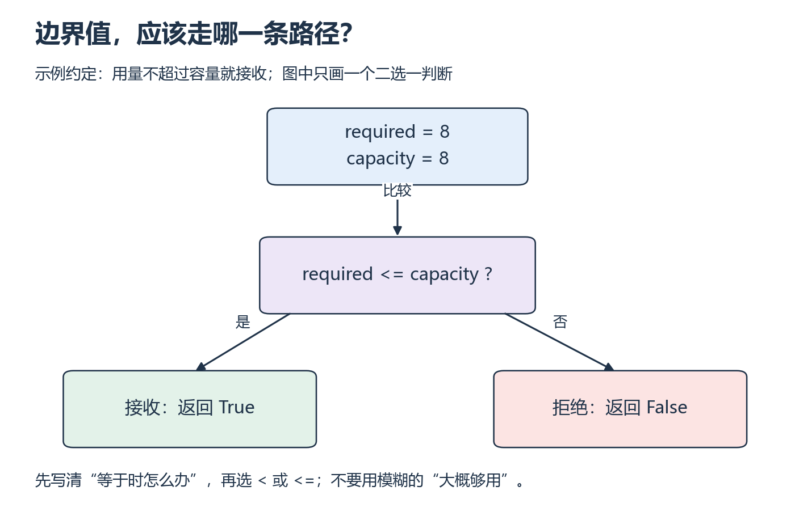

<a id="p2"></a>

# P2：容量刚好够，程序应该接受还是拒绝？

[基础目录](README.md) · [我的进度](../progress.md)

同一段程序遇到不同输入时，不能每次都靠你手动改代码。条件判断把输入分到明确的路径上。这里先约定哪些输入有效、边界属于哪边，再写比较符号。

## 视频与正文怎么配合

主要讲解：[CS50P 2022 · Lecture 1 · Conditionals](https://video.cs50.io/_b6NgY_pMdw)（[官方课页](https://cs50.harvard.edu/python/weeks/1/)）。视频分钟位置待核验；按下面的概念暂停，或直接阅读指定 Notes。

| 观看主题 | 暂停后做什么 |
| --- | --- |
| if / elif / else | 给边界前、边界上、边界后三个输入 |
| Boolean Expressions | 把重复分支简化，说明条件是否覆盖全部输入 |

**读哪里：** [CS50P 1 Notes](https://cs50.harvard.edu/python/notes/1/) 的 Conditionals、if、elif/else、or/and、Modulo 到 Creating Our Own Parity Function；match 留作选读。[Lecture 1](https://cs50.harvard.edu/python/1/)。先修 P1。

## 中文补充（按需）

想换个例子理解分支，可看廖雪峰[条件判断](https://liaoxuefeng.com/books/python/basic/if/index.html)的 `if/elif/else` 和输入转换，到练习前。它是中文原创讲解；把年龄示例换成本课容量条件，尤其检查“恰好相等”走哪条路。[范围与版本](../../resources/foundations.md#cn-python)。

## 从小例子理解

条件表达式会得到真或假，程序据此选择下一步。`if/elif/else` 从上到下检查，找到第一个成立的分支后就跳过其余分支。多个独立的 `if` 则会逐个检查；但如果某个分支执行了 `return`，这次函数调用已经结束，后面的语句也就不会执行。

“容量够用”需要先翻译成精确规则。假设暂不考虑额外开销，所需字节数与容量相等时也能容纳，所以应使用 `<=`。如果改成 `<`，通常的输入可能仍然通过，只有恰好等于容量时才暴露错误。这就是为什么边界输入值得单独测试。



*从上方两个数进入比较，再沿真或假分支向下读 [放大查看 SVG](../../assets/figures/p02-branch-boundary.svg)。暂停：保持容量 8，把用量改为 9，应该在哪一步转向另一条路径？*

接下来给输入大小分四类。先写出每类的取值范围，再看代码；两个范围不能漏掉某个边界，也不能给同一输入相互矛盾的结论。

**按代码追踪：** 给输入大小分组：负数为 invalid，0 为 empty，1～4 为 small，大于 4 为 large。先画四条路径，再补全下面的前两条；暂时用字符串表示分类，P4 再学异常。

```python
def size_group(element_count):
    if element_count < 0:
        return "invalid"
    if element_count == 0:
        return "empty"
    if element_count <= 4:
        return "small"
    return "large"
```

**换个输入自己做：** 遮住例子写 `can_fit(required_bytes, capacity_bytes)`，约定两者非负，所需量等于容量也算可容纳；分别测 3/4、4/4、5/4。诊断把“等于容量”拒绝掉的程序。

<details>
<summary>展开核对；结果不同时，按下面的步骤回看</summary>

分类输入 -1、0、4、5 分别得到 invalid、empty、small、large。容量题分别 True、True、False，核心比较是 `required_bytes <= capacity_bytes`。这是简化账本，不包含框架开销，不能承诺同尺寸模型一定装进 GPU。分支不明时回看 Control Flow，并列输入、条件真值、返回值三列。

</details>

**完成时检查：** 各边界只落入预期分类，能用反例发现边界错误。

## 继续学习

[上一课](p01.md) · [下一步](p03.md)
