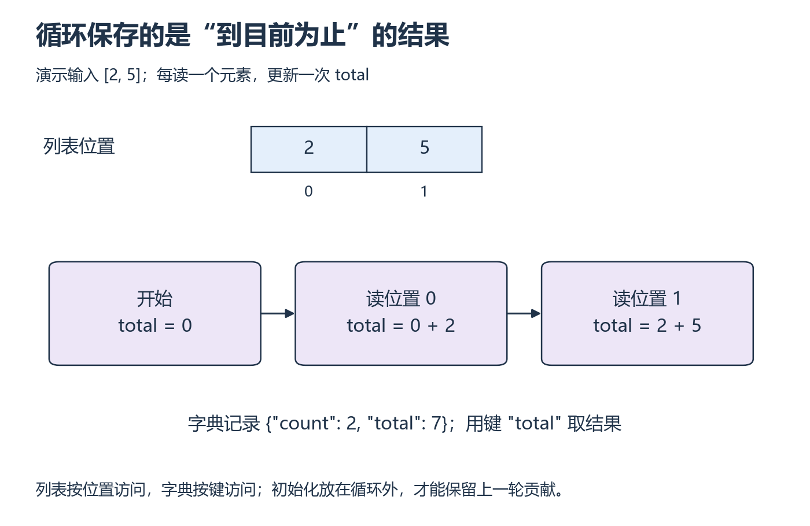

# P3：循环每走一轮，变量发生了什么？

[基础目录](README.md) · [我的进度](../progress.md)

求一组数的均值，可以拆成计数、求和、相除。难点常常不在公式，而在循环中哪些值应该保留、哪些值每轮重新读取。先把两轮变化画清楚，再处理更长的列表。

## 视频与正文怎么配合

主要讲解：[CS50P 2022 · Lecture 2 · Loops](https://video.cs50.io/-7xg8pGcP6w)（[官方课页](https://cs50.harvard.edu/python/weeks/2/)）。视频分钟位置待核验；按下面的概念暂停，或直接阅读指定 Notes。

| 观看主题 | 暂停后做什么 |
| --- | --- |
| while、for 与 range | 逐轮写出索引和累计值 |
| Lists 与 Dictionaries | 用一组新输入完成本段统计，不直接套输出 |

**读哪里：** [CS50P 2 Notes](https://cs50.harvard.edu/python/notes/2/) 的 while、for、Lists、Length、Dictionaries；Mario 的嵌套循环作为 W4 卡点选读。[Lecture 2](https://cs50.harvard.edu/python/2/)。先修 P2。

## 从小例子理解

**列表（list）**按位置保存值，位置索引从 0 开始；**字典（dictionary）**按键保存值，可以用 `"total"` 这样的字段名说明数据含义。`values[0]` 是列表第一个元素，`result["total"]` 是字典里的总和；两种方括号写法相似，但查找的依据不同。

累计量保存“已经读过的元素之和”。例如从 0 开始，读到 2 后变成 2，再读到 5 后变成 7。下一轮必须在上一轮的结果上继续加，所以 `total = 0` 要放在循环外。空列表没有任何一轮循环，此时总和仍是初始值 0。

*先按列表位置找元素，再看下方状态从左向右变化 [放大查看 SVG](../../assets/figures/p03-loop-state.svg)。暂停：如果在每一轮开始都把 total 置零，第二轮结束会留下什么？*

变量名是对象的引用。`copied = original` 只是让两个名字指向同一个列表，没有复制其中的数据。用 `copied.append(...)` 修改它后，`original` 也能看到变化。字典循环默认读到键；想统计值时，要再用键取值，或明确迭代 `values()`。

**先试一试：** 对 `[3, -1, 4]` 写状态表：初始总和 0，三轮后依次为 3、2、6。按“初始化 → 遍历 → 更新 → 返回”补全求和函数；空列表此时返回 0。

**换个输入自己做：** 写 `summarize(values)`，返回 `count`、`total`、`mean` 三个字段。先处理非空列表；加入零、负数与一元素列表。再对请求记录 `[{"ok": True}, {"ok": False}, {"ok": True}]` 统计成功/失败个数。

**排错：** 将 `total = 0` 放进循环会怎样？遍历 `[0, 1, 2]` 时删除元素为何可能漏查？先输出每轮的索引和值再解释，不靠重新运行碰运气。

展开核对；结果不同时，按下面的步骤回看

`[3,-1,4]` 得 count=3、total=6、mean=2；`[0]` 得 1、0、0。请求为成功 2、失败 1。循环内归零只能保留末次贡献。删除列表元素会改变后续位置，先构造新列表或遍历独立副本更容易推理。空输入的 mean 没有定义，P4 明确报错，不能除以零或偷偷填 0。回看 Lists、Dictionaries，用纸面追踪而非只看最终值。

**完成时检查：** 能为两种数据结构选择遍历方式，手推循环，独立写出统计函数。

## 动手材料

[打开本段对应的输入与待补全代码](../../exercises/README.md)。按表选择当前段，把自己的实现与运行记录放到对应 labs 目录。独立实现任务仍从空文件开始。

## 继续学习

[上一课](p02.md) · [下一步](p04.md)
