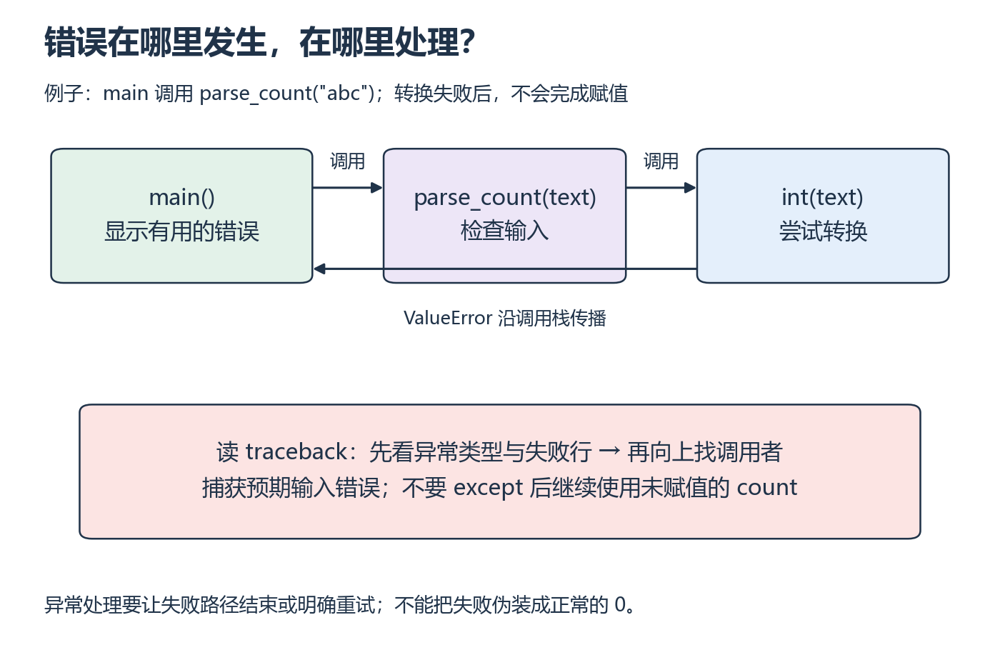

# P4：读报错时，先看哪一行？

[基础目录](README.md) · [我的进度](../progress.md)

`int("8")` 可以得到整数，`int("GPU")` 却无法完成转换。程序遇到坏输入时，应该告诉你失败在哪里，而不是继续算出一个看似正常的结果。

## 视频与正文怎么配合

主要讲解：[CS50P 2022 · Lecture 3 · Exceptions](https://video.cs50.io/LW7g1169v7w)（[官方课页](https://cs50.harvard.edu/python/weeks/3/)）。视频分钟位置待核验；按下面的概念暂停，或直接阅读指定 Notes。

| 观看主题 | 暂停后做什么 |
| --- | --- |
| 异常与 try / except | 先预测非法输入会在哪行失败 |
| else 与重试 | 只捕获预期错误，保留程序错误的堆栈 |

**读哪里：** [CS50P 3 Notes](https://cs50.harvard.edu/python/notes/3/) 的 Runtime Errors、try、else、Creating a Function to Get an Integer；pass 只用来理解“什么也不做”。[Lecture 3](https://cs50.harvard.edu/python/3/)。先修 P3。

## 中文补充（按需）

廖雪峰[错误处理](https://liaoxuefeng.com/books/python/error-debug-test/error/index.html)的 try 与调用栈解释，可帮助你从最后一行异常回到自己的调用位置；读到“记录错误”前。这是中文原创讲解。开头的错误码例子针对系统调用，Python 的 `open` 失败会抛异常；本课仍只捕获能处理的具体错误。[范围与版本](../../resources/foundations.md#cn-python)。

## 从小例子理解

**异常（exception）**表示当前操作无法按正常路径完成。`int("GPU")` 会抛出 `ValueError`；赋值右边失败，左边的变量就没有得到新值。如果捕获错误后仍然返回一个从未赋值的 `count`，你看到的会是第二个错误，真正的输入问题反而被遮住了。

**调用栈回溯（traceback）**保留了怎样走到失败位置。先读末尾的异常类型和消息，再定位最后一处自己的代码，随后沿调用者向上查输入从哪里来。不要一看到长堆栈就重装依赖。

*先沿上方调用箭头向右，再沿异常箭头向左 [放大查看 SVG](../../assets/figures/p04-exception-path.svg)。暂停：若把 except 写在完全无关的打印语句周围，它能处理转换失败吗？*

`try` 应围住你打算处理的操作，`except ValueError` 只接住这种预期错误。内层计算函数可以抛出异常，命令行入口再把它转换成清楚的错误说明。`except: pass` 只是让程序沉默，不能修复数据。

**先试一试：** `int("GPU")` 无法完成数值转换；写出应进入哪条异常路径。给 P3 的函数加空列表检查，明确 `raise ValueError("values must not be empty")`。

**换个输入自己做：** 写 `parse_count(text)`，先转换整数，再拒绝负数。测试 `"8"`、`"0"`、`"-1"`、`"abc"`。增加两端空格的输入，说明解析结果而不是随意吞掉异常。

**排错：** 一个函数捕获转换错误后仍返回尚未赋值的 `count`。逐条写失败输入的执行路线，解释为什么新的错误出现在 return 处。

展开核对；结果不同时，按下面的步骤回看

8、0 有效，负数和非数值输入按约定拒绝。转换失败不会完成赋值；在 except 后继续使用变量会产生另一个错误。应结束失败路径或明确重试。内层计算函数保留异常，命令行入口负责输出有用说明。读 traceback 时从异常类型与最后一条自己的代码定位，再向上查调用来源。

**完成时检查：** 保留一次失败、原因、修复和重跑记录；不会把错误输入当作正常零值。

## 继续学习

[上一课](p03.md) · [下一步](p05.md)
