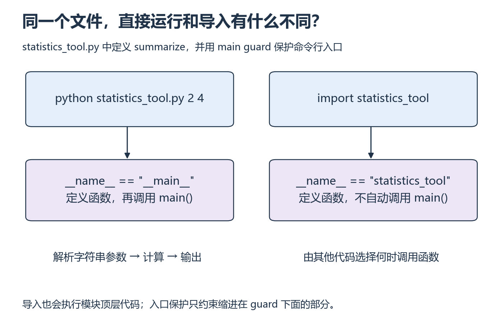

# P5：为什么一导入文件，程序就开始问我要输入？

[基础目录](README.md) · [我的进度](../progress.md)

把统计函数放进一个文件后，你可能既想直接运行它，也想从测试里导入它。两种使用方式共享计算函数，却不应都自动执行命令行交互。关键在模块的顶层代码与程序入口。

## 视频与正文怎么配合

主要讲解：[CS50P 2022 · Lecture 4 · Libraries](https://video.cs50.io/MztLZWibctI)（[官方课页](https://cs50.harvard.edu/python/weeks/4/)）。视频分钟位置待核验；按下面的概念暂停，或直接阅读指定 Notes。

| 观看主题 | 暂停后做什么 |
| --- | --- |
| import 与库函数 | 解释导入和直接执行的差别 |
| Command-Line Arguments 与自建模块 | 把统计函数与入口分开，换参数重跑 |

**读哪里：** [CS50P 4 Notes](https://cs50.harvard.edu/python/notes/4/) 的 Libraries、Random/Statistics、Command-Line Arguments、slice、Packages、Making Your Own Libraries；APIs 作为 W8 卡点选读，必学 HTTP 在 S2 讲解。[Lecture 4](https://cs50.harvard.edu/python/4/)。先修 P4。

## 从小例子理解

**模块（module）**通常对应一个 Python 文件。`import` 查找模块并执行其顶层代码：函数定义会登记函数，裸写在顶层的 `input()` 也会立刻执行。因此，仅仅把函数搬进另一个文件，还没有隔开“可复用的计算”和“启动时的交互”。

Python 用 `__name__` 告诉文件当前如何被使用。直接执行时它是 `"__main__"`，被导入时则是模块名。把启动动作放进 `if __name__ == "__main__":` 的缩进块中，就能让导入方自行选择何时调用函数。

*左右两列比较同一文件的两种入口 [放大查看 SVG](../../assets/figures/p05-module-entry.svg)。暂停：如果 input 写在入口保护的外面，导入时还会等待输入吗？*

命令行参数起初也是文本。例如运行 `python tool.py 2 4`，程序得到脚本名以及 `"2"`、`"4"`，还需要检查数量和转换类型。解析参数属于入口，求和与均值属于计算函数，这样才能不启动命令行也测试计算。

`sys.argv[1:]` 表示从下标 1 到末尾的切片，跳过脚本名；它不是把整串文本自动转换成数字。要逐项做数值转换，并处理失败。

**先试一试：** 把 P3 的纯计算函数放到 `statistics_tool.py`，从另一个文件导入并传 `[2,4,6]`。先画“入口 → 参数解析 → 计算函数”的调用图，再补回导入语句。

**换个输入自己做：** 从命令行接受多个数，输出 count/total/mean；不传参数时给出错误说明。随后将计算函数独立导入测试，不能弹出输入提示。说明 `python -m pip` 和实际解释器的关系，第三方依赖装到自己的环境。

展开核对；结果不同时，按下面的步骤回看

`sys.argv[0]` 是脚本名，后面的参数才是用户值；先检查数量再索引。对 `[2,4,6]` 应得到 3、12、4。导入副作用时回查入口保护；ModuleNotFoundError 时核对工作目录、模块名和解释器，不先重装所有包。种子只能控制相应随机数发生器，不能自动保证 GPU 所有操作确定。

**完成时检查：** 能拆分两个文件，解释函数从哪里导入，复现缺参数和导入失败。

## 继续学习

[上一课](p04.md) · [下一步](p06.md)
