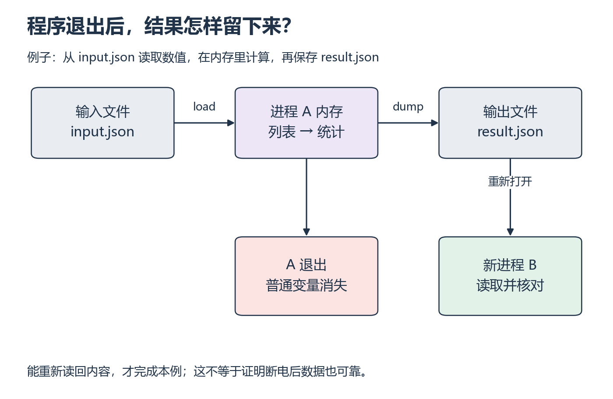

# P6：关掉程序以后，怎样找回刚才的结果？

[基础目录](README.md) · [我的进度](../progress.md)

上一节的变量存在于正在运行的进程中。关闭程序后再打开，不能期待同名变量自动记住旧值。这里把输入和结果放进文件，再用一次新的运行检查自己确实保存了什么。

## 视频与正文怎么配合

主要讲解：[CS50P 2022 · Lecture 6 · File I/O](https://video.cs50.io/KD-Yoel6EVQ)（[官方课页](https://cs50.harvard.edu/python/weeks/6/)）。视频分钟位置待核验；按下面的概念暂停，或直接阅读指定 Notes。

| 观看主题 | 暂停后做什么 |
| --- | --- |
| open 与 with | 解释文件何时关闭，重启进程读回 |
| CSV、DictReader 与 DictWriter | 处理带逗号字段，再做本地 JSON 补充 |

**读哪里：** [CS50P 6 Notes](https://cs50.harvard.edu/python/notes/6/) 的 open、with、CSV，到 csv.DictReader/DictWriter；图像库后置。[Lecture 6](https://cs50.harvard.edu/python/6/)。联读 [Python JSON](https://docs.python.org/3/library/json.html) 页首 Encoding basic Python object hierarchies 与 Decoding JSON 中的 dump/load 小例子；自定义编码后置。先完成 P5；文件读写会用于下一节的综合小工具。

## 中文补充（按需）

Python 官方中文[§7.2 读写文件](https://docs.python.org/zh-cn/3/tutorial/inputoutput.html#reading-and-writing-files)、§7.2.1 到 `write`、§7.2.2 到 `json.load`，适合边写本课脚本边回查；先跳 seek 和 pickle。这是官方译文，使用显式 UTF-8；CSV 继续按原材料，关闭文件也不等于断电后必然持久化。[范围与版本](../../resources/foundations.md#cn-python)。

## 从小例子理解

**文件输入输出（file I/O）**把进程内的值与外部存储连接起来。`json.load` 从文件解析出 Python 对象，统计函数在内存中工作，`json.dump` 再把结果写出。保存动作不是给变量换个名字，而是发生了一次文件写入。

*先从左到右追踪一次计算，再看右侧新进程的读取 [放大查看 SVG](../../assets/figures/p06-file-lifetime.svg)。暂停：如果只计算结果而没有 dump，新进程能从哪个文件找回它？*

**JSON**适合保存字典、列表等结构化值；**CSV**把记录放在表格行里。CSV 字段可能包含逗号，例如带引号的名称，此时 `split(",")` 会拆错列，应使用 `csv` 解析器。

相对路径相对于**当前工作目录**，不一定相对于脚本文件。运行失败时，把最终使用的路径记下来，先分清“文件根本没找到”和“找到文件但内容不合法”。`with open(...)` 会在离开代码块时关闭文件；它不保证内容正确，也不等于已经验证断电后的可靠性。

原文排序例子的 `key=` 接收一个函数，用函数返回值排序；`lambda row: row["name"]` 是只返回名称的短函数，等价于单独定义函数后 `return row["name"]`。先按函数调用理解，不要求使用 lambda 完成文件练习。`with open(...)` 在代码块结束时关闭文件，缩进内才是使用文件的步骤。

**先试一试：** 手工创建 `{"values": [2, 4, 6]}` 的 JSON 输入，画“文件 → 字典 → 列表 → 统计 → 输出文件”。补全读取和写出步骤；分别解释 `r`、`w`、`a` 的意义。

**换个输入自己做：** 让统计程序读输入 JSON、写输出 JSON；退出后重新读取，核对字段。再处理带表头的两行 CSV：`name,latency_ms`，其中一行名称为带逗号的带引号字符串。测试不存在的文件、坏 JSON、缺少 values 和空列表。

展开核对；结果不同时，按下面的步骤回看

统计结果仍是 3、12、4，JSON 读取后可直接核对字段。`w` 可能覆盖已有文件；`a` 追加，但简单连续追加多个 JSON 对象不是单个合法 JSON 文档。带逗号字段应由 csv 模块处理。缺文件、解析失败、缺字段、空列表属于不同失败位置，错误信息需区分。文件存在只能证明存过东西，不能证明内容正确或经历断电后仍可靠。

**完成时检查：** 关闭程序后可重建结果；能解释路径和失败阶段。

## 动手材料

[打开文件练习材料](../../exercises/README.md)。其中 `numbers.json` 的顶层是列表 `[2, 4, 6]`，供 P7 小工具使用；本节的缺字段练习采用顶层字典 `{"values": [2, 4, 6]}`，请另存一个输入文件。先判断顶层类型，再决定直接使用列表还是读取 `values` 字段，不要把两种格式混在一起。自己的实现与输出保存到 `labs/00-foundations/`；独立实现题仍从空文件开始。

## 继续学习

[上一课](p05.md) · [下一步](p07.md)
