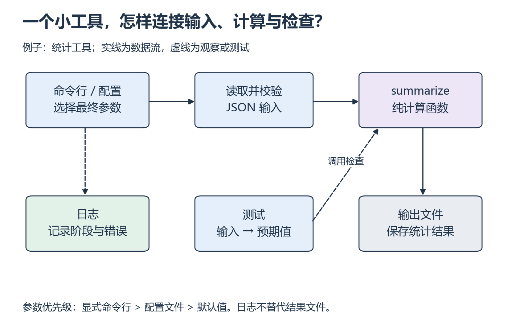

<a id="p7"></a>

# P7：怎样知道小工具没有悄悄算错？

[基础目录](README.md) · [我的进度](../progress.md)

一个程序成功退出，只能说明这次没有以异常结束。它可能用了错误的分母、读错文件，甚至把日志写进了结果。这里把输入、纯计算、输出和观察分开，再用会暴露错误的例子检查它们。

## 视频与正文怎么配合

主要讲解：[CS50P 2022 · Lecture 5 · Unit Tests](https://video.cs50.io/tIrcxwLqzjQ)（[官方课页](https://cs50.harvard.edu/python/weeks/5/)）。视频分钟位置待核验；按下面的概念暂停，或直接阅读指定 Notes。

| 观看主题 | 暂停后做什么 |
| --- | --- |
| assert 与 pytest | 先写能暴露错误的断言 |
| 正常、边界与失败情况 | 给独立小工具写自己的检查，再接参数和日志 |

**读哪里：** [CS50P 5 Notes](https://cs50.harvard.edu/python/notes/5/) 的 Unit Tests、assert、pytest、Testing Strings；Organizing Tests into Folders 按需。[Lecture 5](https://cs50.harvard.edu/python/5/)。接口补读 [argparse 入门](https://docs.python.org/3/howto/argparse.html) 的 The basics、Introducing Positional arguments、Introducing Optional arguments，到 Short options 前；[Logging HOWTO](https://docs.python.org/3/howto/logging.html) 的 A simple example、Logging to a file、Logging variable data、Changing the format、Displaying the date/time。先修 P6。

## 从小例子理解

**测试（test）**把你期待的行为写成可重复执行的检查。先写输入和预期值，再运行实现；这样程序改动后，你仍然知道原来的约定是否成立。只有一个正常输入不够，还要选一元素、空输入和坏文件等会走不同路径的情况。



*沿上排看数据进入计算，再看输出、测试和日志各自的用途 [放大查看 SVG](../../assets/figures/p07-tool-parts.svg)。暂停：若日志出现成功字样，但输出字段不对，应该优先检查哪个函数？*

**日志（log）**回答“程序运行到哪里、用了什么配置”；结果文件回答“算出了什么”。测试则直接比较结果与预期。三者可以相互帮助，不能互相替代。纯计算函数不读取命令行，也不依赖当前目录，因此更容易用小输入定位错误。

原创测试起点（由你实现被测函数，不是课程官方作业答案）：

```python
from statistics_tool import summarize

def test_summary():
    assert summarize([2, 4, 6]) == {"count": 3, "total": 12, "mean": 4}
    assert summarize([-2, 0, 5])["mean"] == 1
```

**先补测试，再独立实现：** 补一元素与空列表测试；再不复制前面整段程序，从空文件实现 `summary_tool.py --input input.json --output result.json`。要求参数帮助、输入校验、纯计算函数、JSON 输出、成功/失败日志、可读错误；使用自己选定的虚拟环境。先独立尝试，卡住按函数返回值 → 循环 → 文件 → 入口顺序回看 P1/P3/P6/P5。

**准备运行环境：** 测试文件与 P5 的 `statistics_tool.py` 放在同一练习目录。先用 `python -m venv .venv` 创建自己的环境，按 [虚拟环境说明](../../resources/foundations.md#p-env) 选择对应 shell 的解释器；用该解释器执行 `python -m pip install pytest` 并记录实际依赖版本。先确认 `sys.executable` 再运行测试。不要把命令写进 Python 文件当作 Python 语句。

下面只演示参数和日志的连接，不包含统计工具答案。先保存为自己的 `cli_practice.py`，比较无参数、有参数和 `--help`：

```python
import argparse
import logging

parser = argparse.ArgumentParser()
parser.add_argument("--unit", default="ms")
options = parser.parse_args()
logging.basicConfig(level=logging.INFO, format="%(levelname)s %(message)s")
logging.info("selected unit: %s", options.unit)
```

配置是运行前选定的值，不应散落为难以找到的常量。再用 P6 的 JSON 读取 `{"unit": "ms"}` 配置，增加可选 `--config` 参数，明确优先级为“显式命令行 → 配置文件 → 默认值”。为区分未传参数与显式参数，合并前保留 `None`，不能让 argparse 的默认 ms 无意盖过配置。日志写最终选择；同一输入/配置重跑应得相同统计结果。删去 basicConfig 后 INFO 默认不可见，这是日志阈值问题，不是计算没执行。

**换一种输入：** 增加单位字段，输入改为带 `latencies_ms` 的请求数据；明确修改数据读取层而不是偷偷改变原接口。**排错：** 故意把均值分母改成 `count + 1`，确认测试失败，修复后再跑。

<details>
<summary>展开核对测试结果</summary>

除数错误会使 `[2,4,6]` 从 4 变成 3，应被测试发现。空输入应抛约定异常；正数、负数、零和坏文件都要检查。可用 `python -m pytest` 执行测试；测试通过只覆盖已有用例，不能宣称任意输入都正确。pytest 是否需要 `__init__.py` 取决于导入布局，不将讲义某个目录范例当作所有项目的强制条件。

</details>

**完成时检查：** 能独立完成、解释调用图、改接口并补测试；保留实际命令与结果。此工具可为后续小型数据整理复用，不预建通用 benchmark 框架。

## 动手材料

[打开本段对应的输入与待补全代码](../../exercises/README.md)。按表选择当前段，把自己的实现与运行记录放到对应 labs 目录。独立实现任务仍从空文件开始。

## 继续学习

[上一课](p06.md) · [下一步](README.md#foundation)
