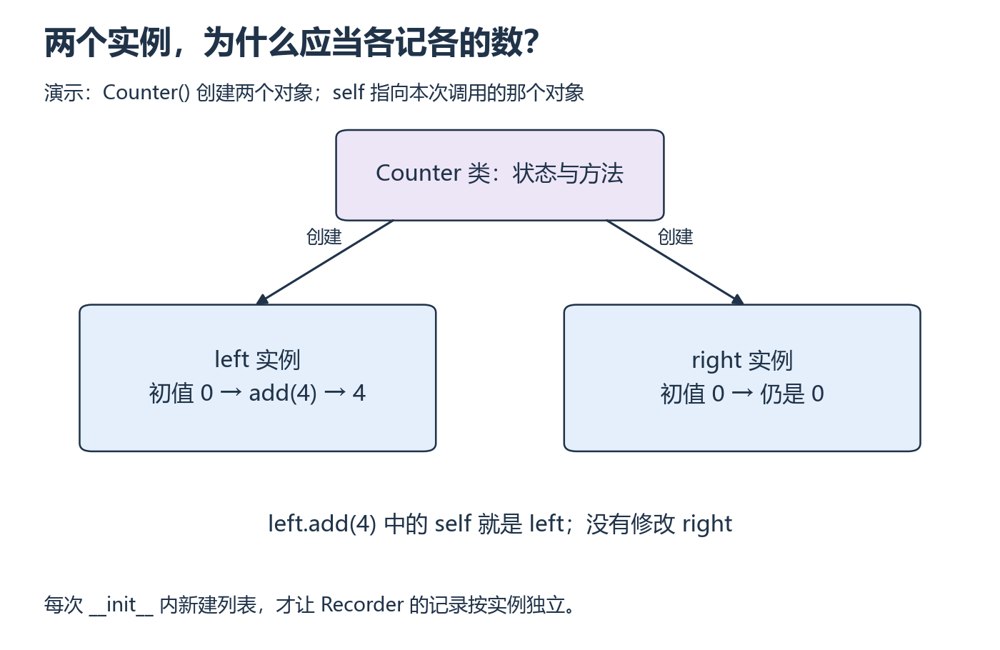

<a id="p8"></a>

# P8：两个对象，为什么会意外共享一份记录？

[基础目录](README.md) · [我的进度](../progress.md)

函数适合完成一次计算；需要连续记录多次测量时，还要保存状态。类把这些状态和操作放在一起。先看两个计数器如何各自变化，再把这个想法用于测量记录与模型模块。

## 视频与正文怎么配合

主要讲解：[CS50P 2022 · Lecture 8 · Object-Oriented Programming](https://video.cs50.io/e4fwY9ZsxPw)（[官方课页](https://cs50.harvard.edu/python/weeks/8/)）。视频分钟位置待核验；按下面的概念暂停，或直接阅读指定 Notes。

| 观看主题 | 暂停后做什么 |
| --- | --- |
| Classes、__init__ 与实例方法 | 追踪两个对象的独立状态 |
| Inheritance 与 super | 解释模型初始化与 forward，properties 等后置 |

**读哪里：** [CS50P 8 Notes](https://cs50.harvard.edu/python/notes/8/) 的 Classes、构造函数、raise 和实例方法，到 Properties 前；后续继承只读一个父类/子类例子，用于理解 nn.Module，不读复杂多继承。[Lecture 8](https://cs50.harvard.edu/python/8/)。联读 [Build the Neural Network](https://docs.pytorch.org/tutorials/beginner/basics/buildmodel_tutorial.html) 的 Define the Class，理解 super、初始化和 forward。

## 从小例子理解

**类（class）**描述对象有哪些状态和方法；**实例（instance）**是按类创建出来的具体对象。调用实例方法时，`self` 指本次调用的对象。`self.value += amount` 修改这个对象的值，并不会自动修改另一个实例。



*从类向下看两个实例，再只追踪 left 的调用 [放大查看 SVG](../../assets/figures/p08-instance-state.svg)。暂停：接着执行 right.add(1)，left 的值应该改变吗？*

`__init__` 在每次构造实例时初始化状态。Recorder 的列表若在这里创建，每个实例得到自己的列表；如果把一个可变列表放在类定义里，实例访问到的可能是同一份列表。检验这一点不需要复杂模型：向第一个对象加记录，观察第二个对象是否也变了。

`nn.Module` 是 PyTorch 的模型模块基类。继承它是为了接入框架的参数和子模块管理；构造网络和执行一次前向计算发生在不同时间，创建对象不会自动开始训练。

`super().__init__()` 调用父类初始化；nn.Module 需要初始化后再登记子层。使用 `model(input)` 会经过框架调用流程并执行 forward。CS50P 实例方法里出现的 `match/case` 是按值选择分支，`case _` 是其余情况，可与 P2 的 if/elif/else 对照；本地 Counter 练习不要求使用这套语法。

```python
class Counter:
    def __init__(self):
        self.value = 0

    def add(self, amount):
        self.value += amount
        return self.value
```

**自己写，再改变条件：** 先追踪同一 Counter 加 2 再加 3；遮住 add 补全；从空文件写保存测量列表的 Recorder，提供 add/mean；创建两实例检查状态独立；诊断把列表写成类属性导致两实例共享记录的错误。

<details>
<summary>展开核对；结果不同时，按下面的步骤回看</summary>

Counter 返回 2、5；新 Counter 仍为 0。Recorder 的列表应在每次 `__init__` 中创建；空记录 mean 仍要明确失败。模型的层在 `__init__` 中定义，forward 用输入调用它们；先预测 shape，再运行。构造模块不会自动训练参数。卡住先回本节实例状态，再读官方 Define the Class。

</details>

**完成时检查：** 独立实现对象，说明调用和状态变化；能读懂小型 nn.Module 后先做单卡训练，再进入模型基础 C。

## 动手材料

[打开本段对应的输入与待补全代码](../../exercises/README.md)。按表选择当前段，把自己的实现与运行记录放到对应 labs 目录。独立实现任务仍从空文件开始。

## 继续学习

[上一课](p07.md) · [下一步：单卡训练](training.md)
