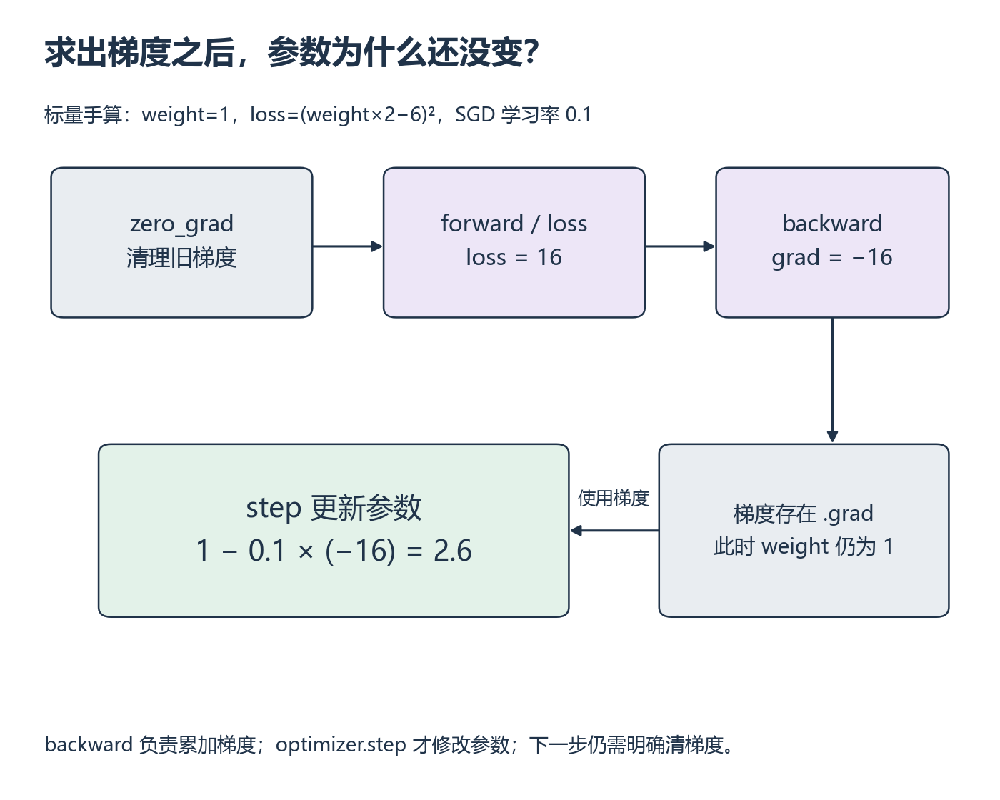

# 单卡训练入门：参数怎样学会一条直线？

[基础目录](README.md) · [先修诊断](../prerequisites.md) · [我的进度](../progress.md)

给程序一些输入和对应结果，它怎样调整参数，逐渐预测出没参与更新的输入？这里用一条直线走完训练、验证、保存和重新加载。先在 CPU 上把每一步解释清楚，再把同一实现搬到单张 GPU；没有 GPU 时仍可完成计算与恢复检查。

开始前完成 [P8](p08.md)、[Tensor 与 M3 导数诊断](../prerequisites.md)。前四节在 W6 前完成，预计 5～8 小时；最后的恢复练习在 W11 前完成，预计 2～4 小时。这两段分别记时，S4 的数据管线练习另计。

## 先看训练做了哪些事

视频入口是 PyTorch 官方 [The Fundamentals of Autograd](https://docs.pytorch.org/tutorials/beginner/introyt/autogradyt_tutorial.html) 的 Simple Example，以及 [Training with PyTorch](https://docs.pytorch.org/tutorials/beginner/introyt/trainingyt.html) 的损失、优化器和训练循环。看到 backward、step 和验证部分时分别暂停，回答“现在改变了什么”。画面与分钟位置待核验；可以直接读下面的小例子，再查 [Quickstart](https://docs.pytorch.org/tutorials/beginner/basics/quickstart_tutorial.html) 的 Optimizing the Model Parameters、Saving Models 和 Loading Models。原文图像分类的数据下载、TensorBoard 和完整模型不要求照搬。

**模型（model）**把输入变为预测；**参数（parameter）**是可以被调整的数；**损失（loss）**衡量预测与目标的差别。**梯度（gradient）**说明参数附近的损失怎样变化；**优化器（optimizer）**根据梯度更新参数。这四个对象不能合并成一句“让模型训练一下”。

### 1. 只用一个参数，区分求导和更新

令预测为 `weight * 2`，目标为 6，损失为 `(weight * 2 - 6) ** 2`。weight=1 时，预测为 2，损失为 16。链式法则给出梯度 `2*(2*weight-6)*2=-16`。SGD 的更新是 `新参数=旧参数−学习率×梯度`，学习率 0.1 时得到 2.6。



*沿上排从左到右，再从右下读到左下。[放大查看 SVG](../../assets/figures/d01-training-step.svg)。暂停：只调用 backward，参数会变成 2.6 吗？*

```python
import torch

weight = torch.tensor(1.0, requires_grad=True)
optimizer = torch.optim.SGD([weight], lr=0.1)
optimizer.zero_grad(set_to_none=True)
loss = (weight * 2 - 6) ** 2
loss.backward()
print(weight.grad)
optimizer.step()
print(weight.detach())
```

`requires_grad=True` 让框架记录求导需要的运算；`.grad` 保存累积的梯度。`backward()` 求导，`step()` 才改参数；`zero_grad(set_to_none=True)` 清掉之前的梯度引用。这里的 `detach()` 仅让查看的值脱离求导关系，并不复制一份独立存储。

遮住 backward 和 step 两行后补写 [标量练习](../../exercises/foundations/train_start.py)。再把学习率改为 0.05；在同一参数值上分别重新计算两次 loss、各做一次 backward，中间不清梯度也不 step。先预测再运行，不能对默认已释放的同一图重复 backward。

<details><summary>核对标量计算</summary>

只 backward 时 weight 仍为 1，grad 为 −16。学习率 0.05 的一步得到 1.8。两次新前向的梯度累加为 −32；这与在参数更新后再求下一步梯度不同。梯度为零也不能单独证明找到了最小值。

</details>

### 2. 把一个样本变成一批数据

接下来预测 `target=2*input+1`。用 `nn.Linear(1, 1)` 表示 `prediction=weight*input+bias`，两个参数都从 0 开始。训练输入为 `[-2,-1,0,1,2]`，目标为 `[-3,-1,1,3,5]`；两者都排成 `[5,1]`，不要让 `[5]` 与 `[5,1]` 意外广播成 `[5,5]`。

**批次（batch）**是一次更新使用的一组样本。这里先每次用全部五个样本，**训练步（step）**是一次参数更新；**轮次（epoch）**表示遍历训练集一次。本例一轮恰好一步，之后分小批时就不再相等。

使用均方误差 `mean((prediction-target)**2)`。从零参数出发，五个残差为 `[3,1,-1,-3,-5]`，初始损失为 9。先分别求 weight 和 bias 的梯度，再算 SGD 学习率 0.1 的更新。这里取 mean；改成 sum 会让本批梯度放大五倍，不能沿用同一更新结论。

补全 [小模型起点](../../exercises/foundations/training_start.py) 的训练步和验证函数；入口已给出固定数据与初始化，不能只打印一个 loss 就算完成。记录每步更新前的 loss、更新后的参数，每 10 步验证一次，共做 50 步。给输入、目标、参数和预测都写出 shape。

<details><summary>核对第一步；后续数值由自己的程序生成</summary>

weight 梯度是 `2*mean(residual*input)=-8`，bias 梯度是 `2*mean(residual)=-2`，更新后为 0.8、0.2。该条件下五点训练损失由 9 降到 3.52。误差的两个分量分别按 0.6 和 0.8 缩小；这解释了此例的收敛，不代表任何模型、学习率下每步 loss 都下降。

</details>

### 3. 验证为什么不应该更新参数？

保留 `[-1.5,0.5,1.5]` 作为验证输入，它们不参与梯度更新，对应目标是 `[-2,2,4]`。**验证（validation）**检查当前模型对另一组输入的表现。训练误差低只能说明拟合了训练样本；本例的验证点很少、规律完全一致，也不能证明真实数据上的泛化能力。

验证时调用 `model.eval()` 并用 `torch.no_grad()` 包住前向和 loss。前者切换 Dropout 等模块行为，后者关闭梯度记录。Linear 本身没有训练/验证两套公式，所以只用本模型观察不出 eval 的全部作用；二者仍需要分开理解。进入下一训练步前再调用 `model.train()`。

验证函数返回 Python 浮点数。运行前后复制参数作比较，参数应完全不变；在已有梯度上检查验证是否意外累加。若在训练前向外层误加 no_grad，再 backward，应沿 `loss.requires_grad` 和 `loss.grad_fn` 找到图未被记录的位置，而不是调整学习率。

### 4. 关掉程序，再用保存的参数预测

用 `torch.save(model.state_dict(), path)` 保存权重；重新创建相同 Linear，使用 `torch.load(path, map_location="cpu", weights_only=True)` 和 `load_state_dict` 加载，再对验证输入预测。**状态字典（state_dict）**保存参数及持久 buffer，不包含模型的 Python 结构；只拿到文件仍需知道模型怎样构造。

从空文件写自己的完整版本，输出包含训练步数、训练/验证 loss、参数、验证预测，以及重载前后的最大绝对差。将参数文件与 JSON 记录放在自己的 `labs/00-foundations/`，显式传入保存路径，不覆盖别的实验。此处相同 CPU、FP32、同模型与输入可先要求预测完全一致；换设备时说明误差与 [容差依据](../../weeks/week-01-foundations/session-04.md)。

**独立检查**：把目标改为 `-3*input+0.5`，先改手算再运行；把 batch 切成 2、2、1 时按样本数汇总 mean loss，不能把三批均值等权平均冒充五个样本的均值。诊断“loss 变了但参数没变”“验证改了参数”“加载后输出不同”时，分别检查 step、验证代码与模型/状态，而不是笼统重跑。

<details><summary>W6 前的完成要求</summary>

独立实现训练、验证、保存与新模型重载，正常和变式输入均通过；能解释第一步梯度，验证不改变参数，重载预测一致。五点回归在上述设置下 50 步的训练/验证 MSE 应低于 `1e-6`，这是此练习的检查阈值，不是普遍的模型质量标准。末批只有一个样本时，汇总损失应按 `2/5、2/5、1/5` 加权。尚未运行 GPU 就只记 CPU 检查通过。

</details>

到这里回 [模型结构 C](../prerequisites.md)，再进入 [W6](../../weeks/week-06-attention/README.md)。后面的恢复部分可以留到 W11 前。

<a id="resume"></a>

## W11 前：保存权重和恢复下一步有什么差别？

预测只依赖模型当前参数；训练下一步还依赖优化器历史、数据位置与随机状态。复用上面的模型和固定五点输入，把优化器改为 Adam（学习率 0.1），先运行一步，再查看 `optimizer.state_dict()`。Adam 通常保存梯度的一阶、二阶移动统计和步数；这些决定下一次更新怎样使用当前梯度。此时画出参数、梯度、两个统计量的 shape/dtype 表。

按 [Saving a General Checkpoint](https://docs.pytorch.org/tutorials/beginner/saving_loading_models.html#saving-loading-a-general-checkpoint-for-inference-and-or-resuming-training) 的保存与恢复示例核对接口。不要复制整套对象序列化；本例只需状态字典和自己的步数/数据位置。CPU 固定数据、无随机层时，在初始化之后无随机消耗，应明确写出这个简化假设。

1. 从相同初值连续训练 3 步，保存第 3 步前的输入、loss，以及更新后的模型和优化器状态。
2. 另一路训练 2 步并写 checkpoint；结束进程，在新进程创建模型与优化器、加载状态，再运行第 3 步。比较下一批输入、更新前 loss、更新后参数和优化器状态；浮点值用预先说明的容差，计数精确一致。
3. 故意只加载模型权重，重新执行第 3 步，找出第一次分歧；恢复 optimizer 后重做。只看加载当时预测一致，不能证明下一步一致。
4. 再完成 [S4](../bridges/s04.md#s4)，接入相同训练循环。加入 shuffle 或随机层后，把采样位置和相应 CPU/CUDA RNG 状态纳入检查；恢复前额外取一批数据也会破坏比较。

<details><summary>恢复检查与回看位置</summary>

完整恢复应与连续路径在声明容差内一致。权重相同但 Adam 统计量/步数不同，下一步可能不同。若下一批已不一致，先回 S4 对齐样本；输入相同而更新不同，先比较 optimizer 和训练模式，再查随机状态与数值设置。状态字典只是当前状态的引用视图之一，做内存中快照需要复制；本题实际写盘后再重启，避免把仍在变化的对象误当冻结快照。

</details>

[上一课](p08.md) · [下一步：模型结构与 W6](../../weeks/week-06-attention/README.md) · [恢复完成后：S4 与 W11](../bridges/s04.md#s4)
