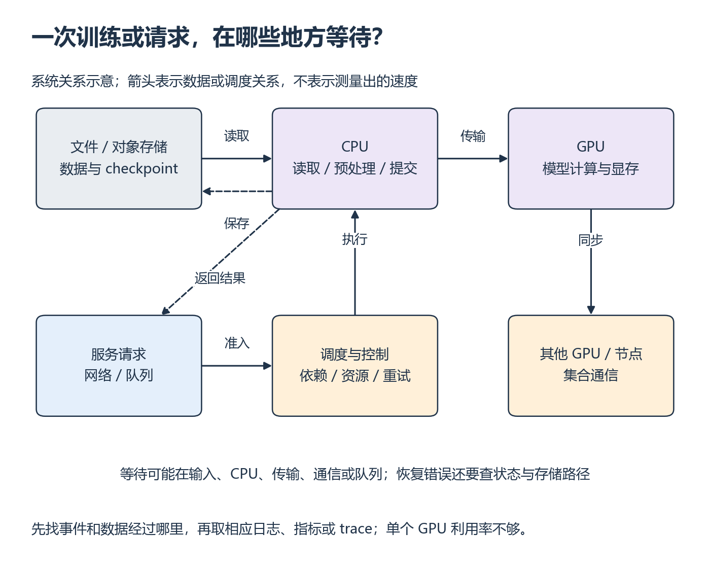

# 阶段复习与综合自查

[课程目录](README.md) · [我的进度](progress.md)

复习时，先合上旧答案，重新解释一个结果，再改输入、重写一小段代码或定位一次错误。直接复用已有实验；需要硬件而尚未运行的部分继续留待补做。

## 四次阶段复习

每次遮住旧答案，复用旧代码与数据，解释连接关系；不再重复读整讲，也不要求新建四个系统。

| 阶段 | 必须重新使用的早期知识 | 复习任务和补做入口 |
| --- | --- | --- |
| W13 后：计算与模型 | W1 字节/FLOPs，W2 异步，W4 复用，W6 模型时间线 | 改 Block 的 sequence；先推测显存/计算，再测整体；对不符之处定位计算、搬运或首次编译，回 W1/W6/W13 |
| W10 后：服务 | W6 模型成本、W7 带宽/延迟、S2/S3 请求/部署 | 重建服务，换一个长度分布，解释 TTFT、KV、队列、失败变化；容器与请求记录必须齐全，回 W8～W10 |
| W14 后：训练 | W7 collective、S4 数据、S5 存储、W11 更新、W12 恢复 | 改输入等待后做训练对照；恢复后比较下一步；在 TP/PP 图上标通信与重叠，回 D/S4/W11/W12/W14 |
| W16 后：执行与调度 | S1 进程、S6 依赖与隔离、W15 日志、W16 等待统计 | 同一任务轨迹重建逻辑准入和实际开始；解释 FailedScheduling 与程序错误，检查长任务等待，回 S6/W15/W16 |

每次复习都要能解释原因、独立实现、换条件验证，并根据日志或数据排错。哪一项还做不到，就回表中的位置补做，不能用其他项做得好来抵消。纸面推演与硬件运行分开记录。

## W16 后综合掌握检查：从现象找到验证路径

整理训练、服务和 Ray/调度实验的入口与记录。先看下面的关系图：训练从数据读取进入计算，并在需要时保存状态；服务从请求进入队列，再安排模型计算；多卡计算还可能等待通信。它们不是必须依次经过的单条流水线。

*从左上追踪训练输入，再从左下追踪请求；虚线分别标出返回结果与保存状态。 [放大查看 SVG](../assets/figures/reviews-system-map.svg)。暂停：GPU 空闲时，图中至少哪些位置可能让它等待？*

再画一张自己的实验关系图，标出哪些路径实际连通过，哪些目前只能解释原理。复习不要求把所有实验拼成生产平台。

1. 不看材料，解释 GPU/CPU 分工、内存层次、训练与推理差异、数据输入、存储、网络、部署、日志/指标/trace 和调度职责；每项指一个自己的例子。
2. 自选旧任务，在空文件独立重写最小核心（如请求明细汇总或 FIFO 事件处理），查接口但不复制旧实现；与旧结果核对。
3. 对下表四种情境均提出至少两个候选原因、一条能区分原因的证据，以及一个只改变一项的小验证。使用可用设备实际完成适用验证；需要 GPU/多卡但设备未就绪的项目保留待补做。

| 情境 | 可区分的候选原因 | 验证与判断依据 | 未通过回哪里 |
| --- | --- | --- | --- |
| GPU 空闲 | 输入等待；CPU 提交不足；慢 rank 同步 | 固定模型与样本，对比预生成输入/原路径，观察取 batch 与 GPU 时间线；再看各 rank 到达同步的时点 | S1/S4、W6/W7/W11 |
| 吞吐下降 | 输入输出长度改变；客户端限流；排队/内存压力 | 固定长度回放并记录实际到达率、失败与等待；只调整一个负载参数；输出 token/s 与成功 req/s 分开 | S2、W8～W10 |
| 显存不足 | KV 随请求增长；激活/临时 buffer 峰值；参数/优化器状态 | 分项账本预测，固定其余条件缩小一个维度；比较峰值与稳态、allocated 与 reserved；失败保留 | W1/W6/W9/W12 |
| 恢复不一致 | 数据/RNG 不同；optimizer 等状态缺失；分片未保存完整 | 从同一保存点比较下一批、随机状态、状态字典和下一步更新；文件能打开不能作为唯一证据 | D、S5、W11/W12 |

怎样判断综合答案可靠

不要求猜中唯一原因，要求说明哪条观察支持什么、还缺什么。若预生成输入缩短等待且计算段不变，支持输入路径瓶颈；若实际到达率先下降，不能先归咎服务端；若 batch 减半只减部分显存，说明有固定项；若下一批已不同，先修数据状态再比较参数。只做相关性观察时不要写成因果证明。

通过标准：九个基础领域都有可解释的例子，必做实验有自己的运行记录，独立实现与变化条件检查通过，四类情境均能提出区分假设的验证并完成适用的小验证。任何关键领域空白则指向上表补学，完成后换题复查；不以总分抵消缺项。生产集群运维、大规模容灾、框架内部开发仍不在基础掌握检查范围。

## 给定资源和目标，自己选择一种方案

前面的故障题从现象找原因；这里从限制出发决定先做什么。用已有 W9/W10 服务实验、W11/W12 训练和 W15/W16 调度记录，不新建系统。先写预测和否定条件，再选一个可运行的最小对照。以下均为题设，不是设备实测。

### 先算容量，别先选框架

假设一张卡可用于此服务的显存为 24 GiB；模型权重 12 GiB，运行时和临时空间预算 4 GiB，另留 2 GiB 余量。模型有 24 层、每层 8 个 KV head、head_dim=128，K/V 都用 2 B；无前缀共享。忽略分页末块浪费时，一个保留 token 的 KV 字节为：

`2 × layers × kv_heads × head_dim × bytes = 2×24×8×128×2 = 98304 B = 96 KiB`。

先独立回答：留给 KV 的容量有多少？若每个在途请求最多保留 4096 个 token（含输入及允许生成的输出），理论上可容纳多少请求？这个数为什么不能直接当服务并发的可靠配置？

再改变负载：80% 请求最多保留 1024 token、20% 最多 8192 token。按平均长度分配，与按实际 token 预算准入，有什么区别？请求的比例描述到达负载，不保证每一时刻的在途比例相同，长请求可能停留更久。

容量核对与限制

KV 预算为 6 GiB，可存 65536 token；4096 token/请求时理论上限 16。实际还要核对分页碎片、临时峰值、引擎开销和动态输出长度。到达分布的平均预算为 2457.6 token，直接除后得到 26 个请求只是平均数计算；如果同时到达的是长请求，最多八个就用完该简化 KV 预算。不能用平均输入或平均输出长度保证不 OOM。

### 把目标写成可以被结果否定的条件

题设要求：成功请求的 p95 TTFT ≤ 500 ms、p95 TPOT ≤ 50 ms，同时记录失败率和两项目标均满足的有效吞吐。目标是练习条件，不是对某个模型的性能承诺。请求时间定义沿用 W8/W10；输出正确性检查在比较前固定。

| 候选调整 | 先预测它可能改变什么 | 用什么结果决定是否继续 |
| --- | --- | --- |
| 调整请求准入/token 预算 | 减少超量在途 KV，但可能延长队列等待 | 同分布回放，比较 OOM/拒绝、队列等待、尾延迟与有效吞吐 |
| 调整 batch 相关配置 | 可能提高计算效率，也可能让单请求等更久 | 单因素扫描，超过延迟目标的吞吐不算有效收益 |
| 前缀复用 | 只有可复用的精确前缀才可能省重复计算/KV | 复用 W9 的冷/热对照，检查命中，不因开关打开就假定收益 |
| 更低精度或较小模型 | 可能减少权重/缓存占用，输出也可能变化 | 精度、质量、后端支持与容量分别验证；缺质量依据时不能宣布替换成功 |

写一段自己的选择：最先试哪项、为何其他项暂不优先、预测哪个指标改变，以及什么观察会推翻判断。若设备仅 8 GiB，不硬跑这个 24 GiB 题设；按真实小模型重算同一账本，保留纸面题与实际模型的区别。

### 再把同一种判断带回训练和调度

训练：先用自己的参数、梯度、Adam 状态与峰值解释 OOM 属于固定状态还是随 microbatch 变化的激活。比较“减小 microbatch”与“W12 分片”的适用条件；前者若改变 global batch，更新语义也随之变化，不能无条件把吞吐和 loss 与原实验直接相比。梯度累积还没实做时，先注明它是候选，不把恢复等价性当作已验证。

调度：复用同一任务轨迹，给 FIFO/SJF 增加“最大等待不能超过题设上限”的检查。SJF 平均等待更低却让长任务违反要求时，说明为什么不能仅凭平均值选择它；不要求另写一种复杂公平调度器。服务准入和任务队列是不同控制点，要在自己的关系图中分别标出。

**完成要求**：容量和单位手算一致；比较至少两个候选方案；完成一个适用的小验证并保留失败；改变显存或长请求比例后重新判断。最终写出“我选择什么、依据什么、在什么条件下会换方案”。缺少硬件或质量证据的结论保持条件式，不能靠总分抵消未完成的数值、恢复或排错检查。

笔记可按 `检查项 | 我的解法与代码 | 变式与排错结果 | 运行环境 | 实际用时 | 还需补做什么` 记录。资料准备情况只在维护区登记，不填成自己的学习完成状态。
