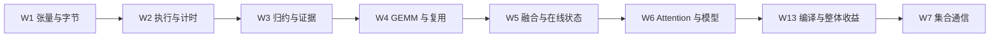

# 前八个学习位置：自学总入口

[总路线](../README.md) · [自学方式](study-guide.md) · [文件管理](repository-layout.md) · [学习进度](progress.md)

指南检查日期：2026-10-01。范围是 **W1 → W2 → W3 → W4 → W5 → W6 → W13 → W7**，共 24 段；W 编号保持稳定。已逐周检查这八个单元是否遵守自学指南编写规则，结果与本次修订见 [逐周检查记录](first-eight-weeks-review.md)。指南整理完成表示材料、问题与检查方法已备齐，实际学习状态以进度表和检查结果为准。

## 按这个顺序开始

这张图表示推荐学习顺序；W7 的通信实验不要求 W13 编译实验通过。硬件条件和模型先修分别按 [先修检查](prerequisites.md) 判断。

| 学习位置 | 单元与范围 | 第一段 | 第二段 | 第三段 | 原文选读 | 本次资料复核 |
| --- | --- | --- | --- | --- | --- | --- |
| 1 | [W1](../weeks/week-01-foundations/README.md) | [类型与地址](../weeks/week-01-foundations/session-01.md) | [布局与视图](../weeks/week-01-foundations/session-02.md) | [Linear 账本](../weeks/week-01-foundations/session-03.md) | 50 + 50 + 50 分钟 | [记录](../weeks/week-01-foundations/refresh-2026-10-01.md) |
| 2 | [W2](../weeks/week-02-cuda-execution/README.md) | [线程映射](../weeks/week-02-cuda-execution/session-01.md) | [内存与错误](../weeks/week-02-cuda-execution/session-02.md) | [可靠计时](../weeks/week-02-cuda-execution/session-03.md) | 60 + 45 + 45 分钟 | [记录](../weeks/week-02-cuda-execution/refresh-2026-10-01.md) |
| 3 | [W3](../weeks/week-03-reduction-profiling/README.md) | [共享内存归约](../weeks/week-03-reduction-profiling/session-01.md) | [warp 归约](../weeks/week-03-reduction-profiling/session-02.md) | [性能证据](../weeks/week-03-reduction-profiling/session-03.md) | 45 + 45 + 60 分钟 | [记录](../weeks/week-03-reduction-profiling/refresh-2026-10-01.md) |
| 4 | [W4](../weeks/week-04-gemm/README.md) | [地址与合并访存](../weeks/week-04-gemm/session-01.md) | [tile 复用](../weeks/week-04-gemm/session-02.md) | [Roofline 预测](../weeks/week-04-gemm/session-03.md) | 45 + 60 + 45 分钟 | [记录](../weeks/week-04-gemm/refresh-2026-10-01.md) |
| 5 | [W5](../weeks/week-05-triton-softmax/README.md) | [Triton 数据块](../weeks/week-05-triton-softmax/session-01.md) | [稳定与融合](../weeks/week-05-triton-softmax/session-02.md) | [在线合并](../weeks/week-05-triton-softmax/session-03.md) | 45 + 60 + 45 分钟 | [记录](../weeks/week-05-triton-softmax/refresh-2026-10-01.md) |
| 6 | [W6](../weeks/week-06-attention/README.md) | [Attention 语义](../weeks/week-06-attention/session-01.md) | [IO 与账本](../weeks/week-06-attention/session-02.md) | [模型时间线](../weeks/week-06-attention/session-03.md) | 40 + 50 + 60 分钟 | [记录](../weeks/week-06-attention/refresh-2026-10-01.md) |
| 7 | [W13](../weeks/week-13-systems/README.md) | [编译正确性](../weeks/week-13-systems/session-01.md) | [首次与稳态](../weeks/week-13-systems/session-02.md) | [形状与图中断](../weeks/week-13-systems/session-03.md) | 45 + 60 + 45 分钟 | [记录](../weeks/week-13-systems/refresh-2026-10-01.md) |
| 8 | [W7](../weeks/week-07-collectives/README.md) | [rank 数据语义](../weeks/week-07-collectives/session-01.md) | [通信计量](../weeks/week-07-collectives/session-02.md) | [拓扑与成本](../weeks/week-07-collectives/session-03.md) | 45 + 60 + 45 分钟 | [记录](../weeks/week-07-collectives/refresh-2026-10-01.md) |

每单元资料合计 150 分钟，八个单元共 20 小时选读。连同图解自查与实践等活动，八个单元按 88 小时起步；环境配置和先修补学另计。这是八个学习位置，不承诺八个日历周内完成；24 段共同组成八个实验。

## 独立自学怎样使用

1. 开始单元时核对实际设备、依赖和先修，按真实开始学习日期复查本次来源。未来单元的提前资料复核不能代替届时的学习前资料复核。
2. 打开当段 `session-XX.md`，先读目标、关键词与指定起止位置。每次只推进一个小块，视频占用相应选读时间。
3. 到暂停题先写自己的预测和理由，再读当段“读图与自查”和折叠核对说明。答错时保留原答案，回看对应原文，再换一个小输入重做。
4. 在该周唯一的 `labs/` 目录完成配套练习，用参考和边界输入核对。未执行的检查继续写“待验证”。
5. 段内检查通过后进入下一段，最终将记录合并为一个周报告。折叠核对提示中的数字是推导值，不是本机测量。

每段都有一条可选的 AI 理解提示词，用于检查自己的解释或请求一个反例。全部跳过也能沿原文、图例、自查和实验完成学习；使用方法见 [独立学习与 AI 辅助约定](study-guide.md)。图解采用 Mermaid、文本示意和数据表，均说明读法；编辑器不显示 Mermaid 时可在 GitHub 查看，并对照文字说明。

学习记录统一用该实验目录的 `notes.md`，按 `WXX-S01` / `WXX-S02` / `WXX-S03` 分节，记录实际阅读位置、预测、运行命令、结果解释和一个未解决问题。教材与学习指南要求修改在 `weeks/`；自己的作答与测量放到 `labs/`。

## 开始运行前检查什么

| 阶段 | 先确认什么 | 当前证据 |
| --- | --- | --- |
| W1 | C++ 与 Python / Tensor 最小运行、编程诊断 | Windows CPU 与 C++ 最小运行检查通过；基础自测待答 |
| W2～W4 | CUDA 编译运行；sanitizer / profiler 可用范围 | 尚未验证 GPU 工具链，学习指南不代替设备验收 |
| W5 | Linux/WSL2、所选 Triton 版本的最小 kernel | 尚未安装或运行 Triton |
| W6 | 模型结构检查 C；Attention mask / shape 对齐 | 模型与 GPU 测量尚未执行 |
| W13 | 沿用 W6 环境，compile 正确性和同步计时可用 | 本机 Windows PyTorch 2.5.1 不代表目标 Linux 编译环境已就绪 |
| W7 | Linux 服务器至少两张可用 GPU、实际拓扑和 NCCL | 服务器权限、卡数与互连尚未实测 |

资料入口已经准备；这些环境检查须在实际学习时逐项完成。遇到环境限制可以先做对应纸面推导，GPU 正确性与性能仍留待补测。

## 为什么同步 GitHub

分段学习指南、来源版本、规则、原创示意图、真实小型数据与报告共同构成可追溯学习材料，适合提交到 GitHub。仓库为 [zixin0v0/infra-weekly-learning](https://github.com/zixin0v0/infra-weekly-learning)，使用现有 `main`。

保留原始课程和论文链接，第三方完整 PDF / 仓库下载放临时目录。设备凭据、环境目录、模型和大型 trace 放在忽略目录或外部存储；归档方式见 [文件管理](repository-layout.md) 与 [推送说明](github-publishing.md)。
