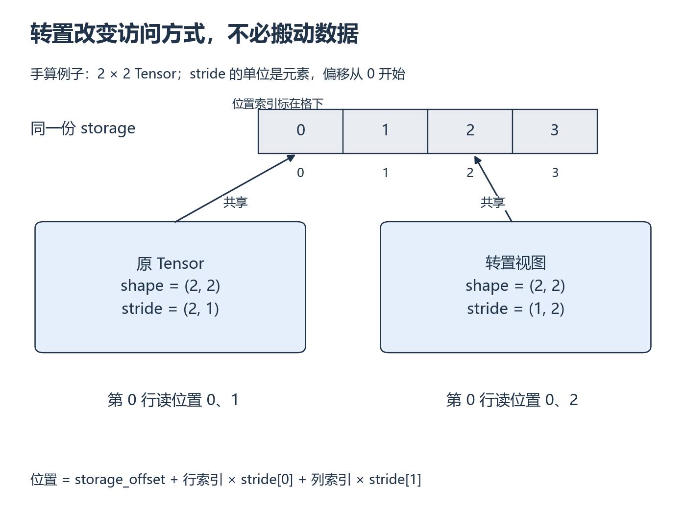
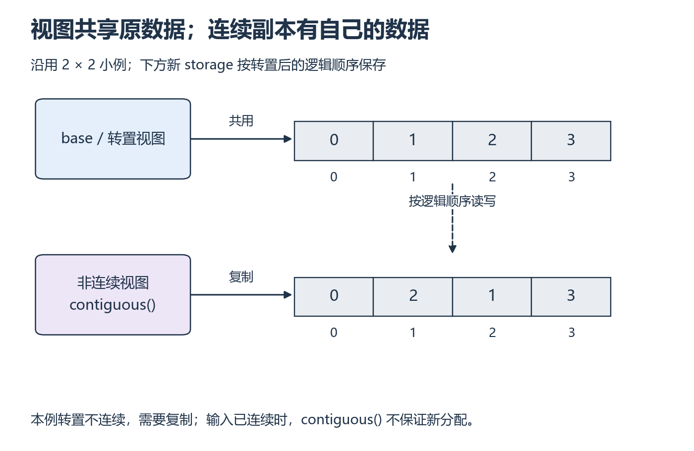

# W1 第 2 段：形状变了，数据搬动了吗？

[本单元](README.md) · [课程目录](../../course/README.md)

这一节用 CPU 就能观察一个容易误判的现象：转置后的 Tensor 看起来变了，原来的数据却可能一项都没移动。弄清它，后面才能判断一次操作是在改变访问方式，还是在分配内存和搬运数据。

主要阅读下列 Tensor Views 正文。视频范围待核验，不影响按本页例子动手。

## 开始前

回答：shape 相同的 Tensor 为什么可能访问不同地址？进入前能计算元素字节数，区分对象身份和数据指针。CPU 可完成本段；沿用第一段环境，不增加依赖。

## 读哪里，在哪里停

| 预算 | 原始来源 | 指定位置与停止点 |
| --- | --- | --- |
| 15 分钟 | [PyTorch 2.14 Tensor Views](../../resources/foundations.md#r-views) | 开头的共享 storage 与 `base` / `view` 示例；停在基本共享关系 |
| 20 分钟 | 同一页面 | `transpose` 导致不连续的例子；画出访问顺序后暂停 |
| 15 分钟 | 同一页面 | 末尾 `reshape`、`flatten`、`contiguous` 的说明；读完三者约定即停 |

## 中文补充（按需）

李沐 2021 中文视频[数据操作](https://www.bilibili.com/video/BV1CV411Y7i4)与作者团队[§2.1.1～2.1.5](https://zh.d2l.ai/chapter_preliminaries/ndarray.html)（PyTorch），适合在 shape、广播、索引不熟时回看；看到 reshape 先预测输出。正文已预读，视频讲次已确认，字幕/画面未检查。它不是 Tensor Views 译文；`id(tensor)` 不是存储指针，stride、共享与复制仍完成原实验。[范围与版本](../../resources/foundations.md#cn-tensor)。

## 用索引找到真正的元素

Tensor 的**形状（shape）**描述有几个维度、每一维多长；**步长（stride）**描述某一维索引增加 1 时，底层位置前进多少个元素。**底层存储（storage）**才是这些元素所在的数据区域。Tensor 对象还保存从哪里开始读，即 `storage_offset`。

先看一个 2×2 的小例子。底层依次保存 0、1、2、3，原 Tensor 的两行是 [0,1] 和 [2,3]。沿行索引走一步要跨 2 个元素，沿列索引走一步只跨 1 个，所以 stride=(2,1)。

*先看上方存储格，再对照两组 stride 和第 0 行的访问位置。[放大查看 SVG](../../assets/figures/w01-tensor-layout.svg)。暂停：转置视图的坐标 (1,0) 应读哪个位置？写出乘加过程。*

对于普通 strided Tensor：

`元素位置 = storage_offset + 行索引 × stride[0] + 列索引 × stride[1]`。

本图的 offset=0。转置后 stride=(1,2)，因此 (1,0) 读位置 1×1+0×2=1。shape 仍是 (2,2)，但访问顺序已经不同：这也解释了为什么只打印 shape 看不出布局差异。公式先算**元素位置**，乘 `element_size()` 才得到相对 storage 起点的字节偏移。

## 视图和副本的差别，靠修改来验证

转置通常产生**视图（view）**：两个 Tensor 对象使用同一份 storage，只是索引规则不同。改视图引用的元素，原 Tensor 相应位置也会变。副本则有自己的数据，受控修改不会影响原数据。

不要从函数名猜测复制行为。`reshape` 在布局允许时返回视图，否则可能复制；`contiguous` 只在需要时整理连续数据，输入已经连续时可能直接返回自身。这些约定见上面的 Tensor Views 原文，必须结合本次输入来判断。

*比较两排 storage 中的元素顺序，再看它们是否属于同一块数据 [放大查看 SVG](../../assets/figures/w01-view-copy.svg)。暂停：修改下排副本中的第一个值，为什么不应改变上排数据？*

## 换成 2×3，先预测再运行

1. 对 `arange(6).reshape(2, 3)` 预测转置后的 shape、stride 与连续性；元素 `(1, 0)` 对应原数组的哪个位置？
2. 修改转置视图一个元素后，原 Tensor 会不会变化？显式生成连续副本后再修改，预测原 Tensor 是否变化。
3. 预测转置结果能否直接 `view(6)`；若 `reshape(6)` 成功，怎样区分共享与复制？

## 核对索引与共享关系

先完成三道预测，再展开。图中的 2×2 用来演示公式，这里的 2×3 需要重新计算，不能直接照抄步长。

写下预测后，再核对本段问题

**题 1**：原 shape=(2,3)、stride=(3,1)；转置后 shape=(3,2)、stride=(1,3)，不连续。坐标 (1,0) 的偏移是 1×1+0×3=1，原值为 1。

**题 2**：修改转置视图会影响原数据。本例对非连续转置调用 contiguous 后得到独立连续数据，再修改副本不会影响原数据。若输入本来连续，contiguous 不保证新分配。

**题 3**：本例直接 view(6) 失败；reshape(6) 可以复制成连续结果。结合受控修改、storage 信息判断共享关系，首元素指针不相等不足以证明不共享。错在地址计算时重看本图，错在复制判断时回 Tensor Views 的末尾。

先保留自己的预测，再用代码验证。算错位置时回到 stride 公式；误判复制时回看 Tensor Views 末尾的接口约定。

## 可选：问 AI

先独立作答和核对，仍有疑问时再使用；跳过本节不影响完成本段。

> 我把 shape、stride 和 storage 的关系解释为【填入解释】，对转置张量坐标 (1,0) 的计算是【填入过程】。请用一个 2×3 小表检查我的推导，再出一道只改变 stride 或 offset 的题。不要直接给代码；等我算完再指出最早出错的一步。

## 动手与检查

入口仍为 `labs/01-foundations/resource-accounting/`，动手时增加 `tensor_layout.py`，不另建视图项目。打印 shape、stride、dtype、连续性、storage offset 和数据指针，先保存预测再运行。

使用原数组值作参考，检查转置元素对应关系、共享修改和连续副本修改。指针相等可以支持本例共享判断，偏移视图的首元素指针不同也可能共享同一 storage；结合受控修改和 storage 信息解释，不能仅以指针不等断言复制。记录预期的 `view` 失败及错误原因，接着比较 `reshape`。

## 结果不对时，从哪里查起

| 具体卡点 | 最小回看位置 | 重新检查 |
| --- | --- | --- |
| 会看 shape，不会算地址 | 本段 stride 公式与第一段地址图 | 列出转置第一行的两个数据位置 |
| 把 reshape 当作必定共享 | Tensor Views 末尾说明 | 修改结果后观察基张量 |
| 将逻辑字节数相加成分配量 | 页面开头共享 storage 说明 | 说明哪些对象引用同一份数据 |

- [ ] 至少解释并验证一个共享和一个复制案例。
- [ ] `view` 失败的布局原因清楚，`reshape` 的实际行为有证据。
- [ ] 知道逻辑元素字节计数与独立分配量的差别。

在实验 `notes.md` 的 `W1-S02` 下保存预测、代码、实际结果，以及它们不一致的原因。

## 完成后

能解释共享修改、复制和地址计算后，继续第三段，计算 Tensor 在模型里占多少资源。

[上一课](session-01.md) · [下一课](session-03.md)
