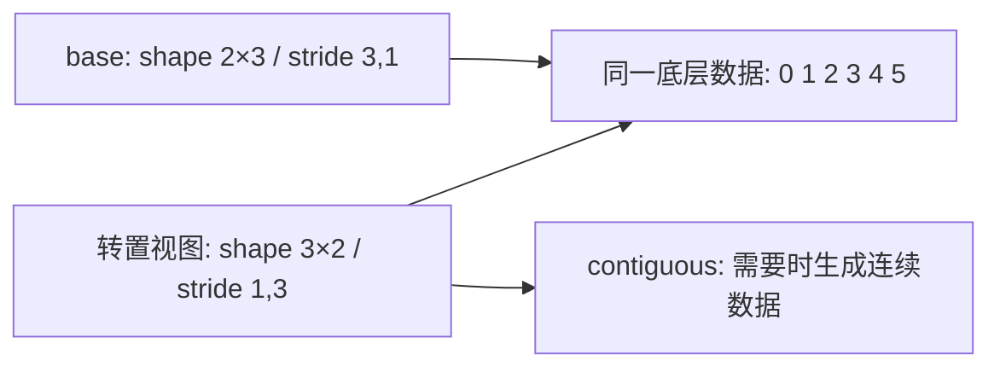

# W1 第二段备课：形状、布局与共享存储

[单元范围](README.md) · [三段导学](study-guide.md) · [资料复核](refresh-2026-10-01.md) · [上一段](session-01.md)

备课日期：2026-10-01。资料预算：50 分钟。状态：备课已准备；预测与学习练习待完成。

## 目标与先修

回答：shape 相同的 Tensor 为什么可能访问不同地址？进入前能计算元素字节数，区分对象身份和数据指针。CPU 可完成本段；沿用第一段环境，不增加依赖。

## 读哪里，在哪里停

| 预算 | 原始来源 | 指定位置与停止点 |
| --- | --- | --- |
| 15 分钟 | [PyTorch 2.14 Tensor Views](https://docs.pytorch.org/docs/2.14/tensor_view.html) | 开头的共享 storage 与 `base` / `view` 示例；停在基本共享关系 |
| 20 分钟 | 同一页面 | `transpose` 导致不连续的例子；画出访问顺序后暂停 |
| 15 分钟 | 同一页面 | 末尾 `reshape`、`flatten`、`contiguous` 的说明；读完三者约定即停 |

访问日为 2026-10-01。网页为 2.14，本机为 2.5.1；本段只使用对应基础接口，自己的运行结果待核对。遇到版本差异先查本机定义，不用另一版本的新接口代替。

## 中文助读

shape 告诉你“逻辑上怎样分组”，stride 告诉你“沿一个维度走一步跨多少元素”。对普通 strided Tensor，元素位置由 `storage_offset + Σ(index × stride)` 给出，再乘 `element_size` 转为字节偏移。

图是机制示意，不是实测地址。转置交换访问规则；`reshape` 是否复制取决于原布局；`contiguous` 对已经连续的输入可直接返回自身。

## 暂停题与预测

1. 对 `arange(6).reshape(2, 3)` 预测转置后的 shape、stride 与连续性；元素 `(1, 0)` 对应原数组的哪个位置？
2. 修改转置视图一个元素后，原 Tensor 会不会变化？显式生成连续副本后再修改，预测原 Tensor 是否变化。
3. 预测转置结果能否直接 `view(6)`；若 `reshape(6)` 成功，怎样区分共享与复制？

## 动手与检查

入口仍为 `labs/01-foundations/resource-accounting/`，动手时增加 `tensor_layout.py`，不另建视图项目。打印 shape、stride、dtype、连续性、storage offset 和数据指针，先保存预测再运行。

使用原数组值作参考，检查转置元素对应关系、共享修改和连续副本修改。指针相等可以支持本例共享判断，偏移视图的首元素指针不同也可能共享同一 storage；结合受控修改和 storage 信息解释，不能仅以指针不等断言复制。记录预期的 `view` 失败及错误原因，接着比较 `reshape`。

## 卡点与过关

| 具体卡点 | 最小回看位置 | 重新检查 |
| --- | --- | --- |
| 会看 shape，不会算地址 | 本段 stride 公式与第一段地址图 | 列出转置第一行的两个数据位置 |
| 把 reshape 当作必定共享 | Tensor Views 末尾说明 | 修改结果后观察基张量 |
| 将逻辑字节数相加成分配量 | 页面开头共享 storage 说明 | 说明哪些对象引用同一份数据 |

- [ ] 至少解释并验证一个共享和一个复制案例。
- [ ] `view` 失败的布局原因清楚，`reshape` 的实际行为有证据。
- [ ] 知道逻辑元素字节计数与独立分配量的差别。

先作答与运行，再展开核对提示

连续 `(2, 3)` 的 stride 为 `(3, 1)`，转置为 `(1, 3)`；转置 `(1, 0)` 指向原值 1。本例转置不连续，直接压为 `view(6)` 不满足布局条件；`reshape(6)` 可通过复制实现。具体错误文本与对象信息记录本机输出。

按 `W1-S02` 在实验 `notes.md` 记录实际位置、预测、代码/命令、差异和一个卡点；通过后进入 [第三段](session-03.md)。
