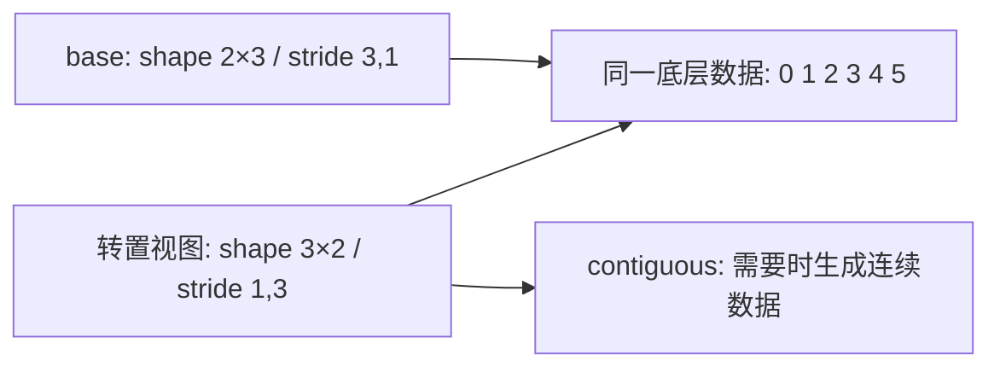

# W1 第二段学习指南：形状、布局与共享存储

[单元范围](README.md) · [三段学习导航](study-guide.md) · [资料复核](refresh-2026-10-01.md) · [上一段](session-01.md)

整理日期：2026-10-01。原文选读预算：50 分钟。状态：学习指南已整理；预测与学习练习待完成。

本地图解、暂停题与核对另计入本单元的自查时段，完整时间见 [分项预算](../../docs/study-guide.md#time-budget)。

## 目标与先修

回答：shape 相同的 Tensor 为什么可能访问不同地址？进入前能计算元素字节数，区分对象身份和数据指针。CPU 可完成本段；沿用第一段环境，不增加依赖。

## 读哪里，在哪里停

| 预算 | 原始来源 | 指定位置与停止点 |
| --- | --- | --- |
| 15 分钟 | [PyTorch 2.14 Tensor Views](../../resources/README.md#r-views) | 开头的共享 storage 与 `base` / `view` 示例；停在基本共享关系 |
| 20 分钟 | 同一页面 | `transpose` 导致不连续的例子；画出访问顺序后暂停 |
| 15 分钟 | 同一页面 | 末尾 `reshape`、`flatten`、`contiguous` 的说明；读完三者约定即停 |

访问日为 2026-10-01。网页为 2.14，本机为 2.5.1；本段只使用对应基础接口，自己的运行结果待核对。遇到版本差异先查本机定义，不用另一版本的新接口代替。

## 概念说明

shape 告诉你“逻辑上怎样分组”，stride 告诉你“沿一个维度走一步跨多少元素”。对普通 strided Tensor，元素位置由 `storage_offset + Σ(index × stride)` 给出，再乘 `element_size` 转为字节偏移。



图是机制示意，不是实测地址。转置交换访问规则；`reshape` 是否复制取决于原布局；`contiguous` 对已经连续的输入可直接返回自身。

## 暂停题与预测

1. 对 `arange(6).reshape(2, 3)` 预测转置后的 shape、stride 与连续性；元素 `(1, 0)` 对应原数组的哪个位置？
2. 修改转置视图一个元素后，原 Tensor 会不会变化？显式生成连续副本后再修改，预测原 Tensor 是否变化。
3. 预测转置结果能否直接 `view(6)`；若 `reshape(6)` 成功，怎样区分共享与复制？

## 读图与自查

```text
底层元素位置：   0  1  2  3  4  5
原张量的两行： [ 0  1  2 ] [ 3  4  5 ]
转置后的三行： [ 0  3 ] [ 1  4 ] [ 2  5 ]
                         ↑
                转置坐标 (1,0) 仍指向位置 1
```

这是同一份数据的两种访问次序，没有搬动元素。沿转置的一行走一步跨 3 个元素，沿第一维走一步跨 1 个元素；对照 stride=(1,3)，不要把“第一维”误读成“一行里的横向移动”。

<details>
<summary>写下预测后，再核对本段问题</summary>

**题 1**：原 shape=(2,3)、stride=(3,1)；转置后 shape=(3,2)、stride=(1,3)，不连续。坐标 (1,0) 的偏移是 1×1+0×3=1，原值为 1。

**题 2**：修改转置视图会影响原数据。本例对非连续转置调用 contiguous 后得到独立连续数据，再修改副本不会影响原数据。若输入本来连续，contiguous 不保证新分配。

**题 3**：本例直接 view(6) 失败；reshape(6) 可以复制成连续结果。结合受控修改、storage 信息判断共享关系，首元素指针不相等不足以证明不共享。错在地址计算时重看本图，错在复制判断时回 Tensor Views 的末尾。

这些说明用于核对推导；运行结果仍需自己验证。答错时保留原答案，回看本段“读哪里”或“卡点”指向的位置，再换一个小输入重做。

</details>

## 可选：问 AI

先独立作答和核对，仍有疑问时再使用；跳过本节不影响完成本段。

> 我把 shape、stride 和 storage 的关系解释为【填入解释】，对转置张量坐标 (1,0) 的计算是【填入过程】。请用一个 2×3 小表检查我的推导，再出一道只改变 stride 或 offset 的题。不要直接给代码；等我算完再指出最早出错的一步。

## 动手与检查

入口仍为 `labs/01-foundations/resource-accounting/`，动手时增加 `tensor_layout.py`，不另建视图项目。打印 shape、stride、dtype、连续性、storage offset 和数据指针，先保存预测再运行。

使用原数组值作参考，检查转置元素对应关系、共享修改和连续副本修改。指针相等可以支持本例共享判断，偏移视图的首元素指针不同也可能共享同一 storage；结合受控修改和 storage 信息解释，不能仅以指针不等断言复制。记录预期的 `view` 失败及错误原因，接着比较 `reshape`。

## 卡点与过关

| 具体卡点 | 最小回看位置 | 重新检查 |
| --- | --- | --- |
| 会看 shape，不会算地址 | 本段 stride 公式与第一段地址图 | 列出转置第一行的两个数据位置 |
| 把 reshape 当作必定共享 | Tensor Views 末尾说明 | 修改结果后观察基张量 |
| 将逻辑字节数相加成分配量 | 页面开头共享 storage 说明 | 说明哪些对象引用同一份数据 |

- [ ] 至少解释并验证一个共享和一个复制案例。
- [ ] `view` 失败的布局原因清楚，`reshape` 的实际行为有证据。
- [ ] 知道逻辑元素字节计数与独立分配量的差别。

按 `W1-S02` 在实验 `notes.md` 记录实际位置、预测、代码/命令、差异和一个卡点；通过后进入 [第三段](session-03.md)。
