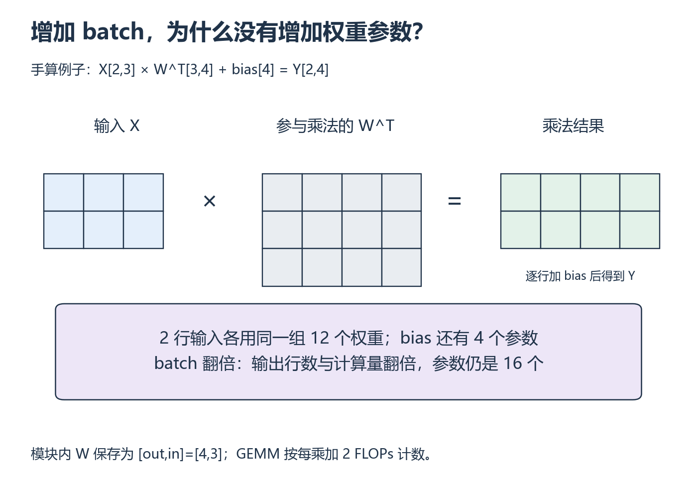

# W1 第 3 段：Linear 多处理一行输入，要多存一份权重吗？

[本单元](README.md) · [课程目录](../../course/README.md)

把 batch 翻倍时，参数未必增加，计算却通常更多。原因是同一组权重被不同输入反复使用。先从小矩阵的行列关系数起，再把结果写成资源计算器。

## 视频与正文

先看 [CS336 2026 Lecture 2](https://www.youtube.com/watch?v=kuYAsz7zspQ)：矩阵乘法 FLOPs 与参数存储；看到一次矩阵乘时暂停，先列维度再算乘加。

视频分钟位置待核验；找不到对应主题时，按下列正文范围阅读。重复内容只需回查。

## 目标与先修

回答：batch、输入/输出维度与 dtype 分别改变 Linear 的哪些资源？需要前两段字节与布局知识，以及矩阵乘法维度推导。CPU 可完成，GPU 测量不计入本段掌握检查。

## 读哪里，在哪里停

| 阅读参考 | 原始来源 | 指定位置与停止点 |
| --- | --- | --- |
| 20 分钟 | [CS336 Lecture 2 固定讲义](../../resources/foundations.md#r-l2) | `tensor_operations_flops` 的 FLOPs / FLOP/s 区分与 Linear model 计数；到 `actual_num_flops` 后暂停 |
| 20 分钟 | 同一函数，配 [官方视频](../../resources/foundations.md#r-l2) | 将矩阵维度、存储与乘加次数联系起来；本段不运行讲义的大矩阵和 GPU benchmark |
| 10 分钟 | 本页下方“数据与元数据”原创算例 | 只做数据区和记录头的分项计数；低精度格式在 context 中选读 |

讲义固定提交，访问日为 2026-10-01。没有已核对的视频分钟数；按函数定位。梯度、优化器、MFU 和完整大模型估算后置。

## 从一个输出元素数到整层

单个输出是输入一行与权重一行的点积：对应元素相乘，再把乘积加起来。所有输出列使用不同权重，但处理下一行输入时仍复用这一组权重。比如输入 [2,3]、权重保存为 [4,3]，乘法中使用转置 [3,4]，输出就是 [2,4]。有 bias 时再给每个输出列加一个共享的偏置，参数总数为 3×4+4=16。

下面按一般维度写公式。先区分“有多少参数”“处理多少输入”“执行多少运算”，再乘各自的单位；这样不会把增加 batch 误算成复制权重。

约定输入为 `(batch, in_features)`，权重为 `(out_features, in_features)`，输出为 `(batch, out_features)`。权重参数数为 `in_features × out_features`；有 bias 时再加 `out_features`。

矩阵乘法使用一次乘加计 2 FLOPs 的常用账本约定，得到 `2 × batch × in_features × out_features`；若另计 bias 加法，再加输出元素数。这个约定与逐个输出恰好 `K` 次乘法、`K−1` 次加法的严格次数分开说明。

| 资源项 | 怎样计算 | 哪些变量影响它 |
| --- | --- | --- |
| 参数元素数 | 权重加可选 bias | 输入/输出维度、bias |
| 参数数据字节 | 参数元素数乘每元素字节数 | 参数 dtype |
| 输入/输出逻辑字节 | 各自元素数乘每元素字节数 | batch、维度、dtype |
| 前向 GEMM FLOPs | 本段 2 乘加约定 | batch、三个矩阵维度 |

这些项不是训练全状态或实测峰值。第二段的共享存储知识帮助判断哪些逻辑 Tensor 可以共用数据。

**数据与元数据：** 假设保存 1024 个 FP32 数，文件还带一个固定 64 B 的记录头（例如记录 shape/dtype）。这里只定义一种学习格式：数据区 4096 B，文件总量 4160 B；真实框架文件还可能有其他结构，需实际核对。元数据是描述数据的信息，不能默认它永远为零。这个概念不依赖量化或前沿硬件。

## 暂停题与预测

1. 对有 bias 的 `Linear(128, 256)` 与输入 `(32, 128)`，分别手算参数元素、FP32 参数字节、输入/输出字节和前向 GEMM FLOPs。
2. batch 翻倍后，哪些项翻倍？参数数量是否改变？参数/输入/输出都改为 FP16 时字节与数学 FLOPs 分别怎样变化？
3. 假设上述文件的数值从 FP32 改为 FP16，固定 64 B 记录头不变，总字节数是多少？为什么文件总量不是恰好减半？

## 读图与自查

*先对齐乘法内侧维度，再追踪多行输入如何共享权重 [放大查看 SVG](../../assets/figures/w01-linear-shapes.svg)。暂停：输入只有 1 行时，权重矩阵需要删掉哪一行吗？*

读图时先划掉矩阵相乘的内侧维度，再写输出 shape。权重在模块中按 [out_features,in_features] 保存，图中表示参与乘法的转置。

写下预测后，再核对本段问题

**题 1**：参数=128×256+256=33,024；FP32 参数数据=132,096 字节。输入=32×128×4=16,384 字节，输出=32×256×4=32,768 字节。GEMM=2×32×128×256=2,097,152 FLOPs；另计 bias 时加 8,192 次加法。

**题 2**：batch 翻倍使输入/输出元素数和前向 FLOPs 翻倍，参数数不变。都改为 FP16 后逻辑字节减半，数学 FLOPs 不变；耗时不能由此推定。

**题 3**：数据区 1024×2=2048 B，加记录头 64 B 为 2112 B；原来 4160 B 的一半是 2080 B，固定开销没有减半。算例只定义学习格式，不能代替真实序列化文件或峰值显存。若结果不同，先逐项写单位。

保留自己的推导，再与实际结果比较。若不一致，按下面的回看位置找出最早出现差异的一步。

## 可选：问 AI

先独立作答和核对，仍有疑问时再使用；跳过本节不影响完成本段。

> 我的 Linear 资源表是【粘贴参数、字节、FLOPs 及公式】。请只检查单位和重复计数，先指出一个问题，再让我重算。接着只改变 batch 或 dtype 出一道迁移题。不要替我写计算器，也不要从字节数推断实际 GPU 加速比。

## 动手与检查

入口为 `labs/01-foundations/resource-accounting/`，动手时建立 `resource_accounting.py` 和一个 `report.md`。计算器支持 batch、输入/输出维度、dtype 字节数和 bias 选项，输出各项单位与计数约定。

用周自测题作参考，另选小型维度、有/无 bias、两种 batch 和两种 dtype 核对；检查参数数不随 batch 变化。可以用小型 PyTorch Linear 的参数 `numel` 验证参数账本，非连续输入的数学语义沿用第二段知识，不能据此宣称没有临时复制。

## 结果不对时，从哪里查起

| 具体卡点 | 最小回看位置 | 重新检查 |
| --- | --- | --- |
| 不知道权重为什么转置 | 原函数 Linear model 的矩阵维度 | 写出单个输出的求和下标 |
| 把 FLOPs 当成速度 | 函数中的两种单位解释 | 区分操作总数与操作/秒 |
| 把账本称作峰值显存 | 第一段逻辑字节和第二段共享关系 | 列出未统计的分配项 |

- [ ] 手算与计算器逐项一致，bias 与乘加约定明确。
- [ ] 能独立解释 batch 和 dtype 对各项的影响。
- [ ] 报告保留数据与元数据的计数假设、未计项，周掌握检查仍需前两段真实检查；context 的量化背景不作为门槛。

在实验 `notes.md` 的 `W1-S03` 下记录实际阅读、预测、代码/命令、核对和卡点，继续 [数值精度](session-04.md)，完成后合并报告并做 [W1 掌握检查](assessment.md)。

## 完成后

把代码、预测与实际结果记在同一份笔记中。完成本段检查后，沿下方链接继续。

[上一课](session-02.md) · [下一课](session-04.md)
