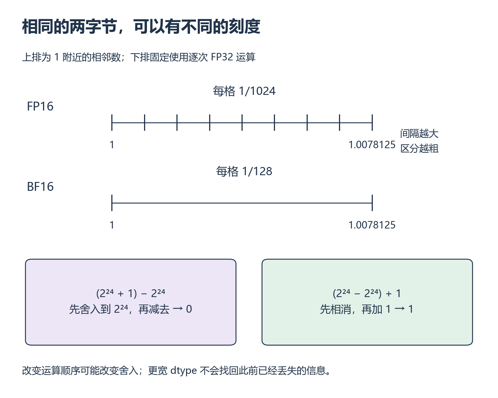

# W1 第 4 段：同样占两字节，为什么算出的数不一样？

[本单元](README.md) · [课程目录](../../course/README.md)

前面把 dtype 换成了字节数。现在再问一步：减少字节以后，哪些数会被舍入，哪些运算会溢出？这决定了后续 Reduce、Softmax 和混合精度实验怎样判断正确。预计 2～4 小时，已包含在 W1 的单元范围内。

先会 Tensor 的创建、dtype 和标量运算即可。主要讲解是本页；看完对应小例子后，读 [Numerical accuracy](https://docs.pytorch.org/docs/2.14/notes/numerical_accuracy.html) 的开头、Batched computations 和 Extremal values，停在 Linear algebra 前。文档例子用于核对机制，不要求先学矩阵分解。[资料卡与接口范围](../../resources/foundations.md#r-numerics) 中保留版本和查询入口，本节不增加一段未经核验的视频。

## 范围决定能否装下，精度决定能分多细

浮点数（floating point）用符号、指数和有效数字表示数值，可以粗略理解成二进制的科学计数法。指数影响数量级范围；有效数字位数影响同一数量级下能区分的间隔。间隔不是全数轴统一的刻度，越大的数附近通常越稀疏。

| dtype | 每元素 | 最大有限正数（约） | 1 上方相邻数的间隔 eps |
| --- | --- | --- | --- |
| FP32 | 4 B | 3.40×10³⁸ | 2⁻²³ ≈ 1.19×10⁻⁷ |
| FP16 | 2 B | 65504 | 2⁻¹⁰ = 0.0009765625 |
| BF16 | 2 B | 3.39×10³⁸ | 2⁻⁷ = 0.0078125 |

用 `torch.finfo(dtype)` 核对 max、eps、tiny。tiny 是最小正规正数，不是所有可表示正数的下界；本节不展开非正规数编码。BF16 比 FP16 容纳更大的数量级，但在 1 附近更粗。因此“都是半精度，所以误差和溢出表现相同”不成立。



*先看上排相邻刻度，再沿下排两条计算路径读；这是精确选定的数值例子。[放大查看 SVG](../../assets/figures/w01-float-spacing.svg)。暂停：把 1.001 转为 FP16 和 BF16，再转回 FP32，会恢复相同的值吗？*

```python
import torch

source = torch.tensor([1.001, 70000.0], dtype=torch.float32)
for dtype in (torch.float16, torch.bfloat16):
    rounded = source.to(dtype)
    print(dtype, rounded.float(), torch.isfinite(rounded))
```

转换回 FP32 可以容纳舍入后的值，却不能恢复已经丢掉的信息。源值有限也不能保证中间运算有限；例如 FP16 的 300 可以表示，但用 FP16 保存 `300*300` 的结果就装不下。排错时同时查输入、关键中间值与输出，不只检查最后一个 loss。

## 加法顺序也会改变结果

在 FP32 中取 `large=2**24`、`small=1`。先算 `large+small` 再减 large，与先算 `large-large` 再加 small，数学上都是 1，逐次 FP32 运算却可能不同。原因是 2²⁴ 上方的相邻 FP32 数相距 2，正中间的 2²⁴+1 舍入到了可表示的邻点。

用独立 Tensor 运算逐步打印，不用 Python 整数计算代替 FP32。再用 FP64 重做。后续 W3 改变归约树，W4 改变矩阵乘法实现时，就可能改变加法顺序；结果不逐位相等需要分析，不能立刻认定算法错，也不能不检查就接受。

<details><summary>核对表示与顺序</summary>

FP16 的 1.001 约为 1.0009765625，BF16 为 1；70000 转 FP16 为 inf，转 BF16 仍有限但会舍入。逐次 FP32 的 `(large+small)-large` 为 0，`(large-large)+small` 为 1；这个例子的 FP64 两路均为 1。FP64 也有有限精度，只是本例数值仍在它能精确表示的范围内。

</details>

## 怎样判断两个结果足够接近？

先检查 shape、dtype 约定和是否包含 NaN/inf，再比较误差。对于有限参考值，`torch.isclose(actual, reference)` 的逐元素规则为：

`abs(actual-reference) <= atol + rtol*abs(reference)`。

**绝对容差 atol**与结果使用相同单位，负责接近零的参考值；**相对容差 rtol**无单位，允许误差随参考值大小增长。参考值固定放在第二个参数，交换两个参数不保证相同判定。容差取值应依据算法、dtype、规模和任务需要，在看最终结果前说明，不能反复放宽到通过为止。

先手算：reference 为 `[0,100]`，actual 为 `[0.0001,100.005]`，atol=0.0002、rtol=0.0001；若第一个 actual 改成 0.001，结论怎样变？

补全 [误差报告起点](../../exercises/foundations/numerics_start.py)，返回 finite、max_abs_error 和 close_count。要求 shape 完全相同，不接受广播蒙混；空 Tensor、负数或非有限容差明确报错。若输入中有 NaN/inf，返回 finite=False、max_abs_error=None、close_count=0；否则计算最大绝对误差与满足不等式的元素数。这样不会让“inf 对 inf 接近”替代本题的有限输出要求。差值用 FP64 计算以免本例报告先在较窄 dtype 中溢出，但这仍不能恢复源 dtype 丢失的信息，也不保证任意 FP64 极值的差值有限。独立实现另从空文件写，交叉核对接口结果。

<details><summary>核对容差与排错</summary>

两个阈值分别为 0.0002 与 0.0102；原例两项都通过。首项改为 0.001 后，第二项仍通过，第一项失败。参考接近零时只检查相对误差很不稳定；宽松容差能隐藏形状错误、漏算和溢出，因此结构与有限性检查先做。出现 inf 时回到第一个产生非有限数的位置，不能只把 atol 改大。

</details>

混合精度（AMP）会按运算选择计算 dtype，某些乘法用低精度、敏感运算使用更高精度；它不等于把参数、梯度、优化器状态全部减半。先保留这个区别，到 [W11 精度段](../week-11-ddp/session-03.md) 再结合已学的训练步理解 autocast 与梯度缩放。

完成时保存 dtype 表、两种加法顺序、容差手算与错误诊断。改用 `large=2**25`、`small=1` 重做并解释；然后用同样方法检查 W3 的归约误差。

[上一课](session-03.md) · [下一课](assessment.md)
