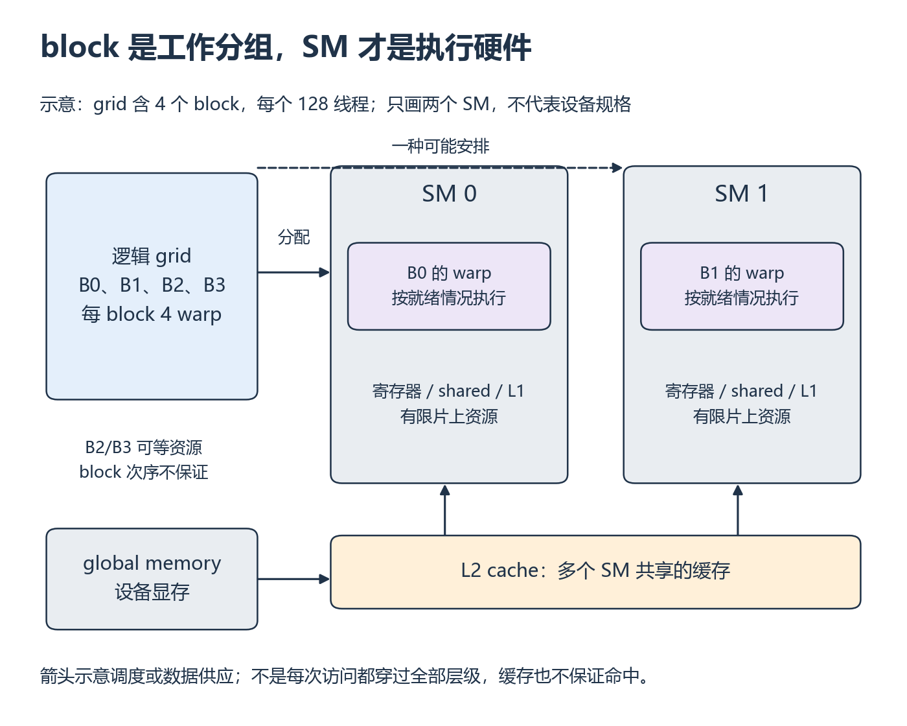
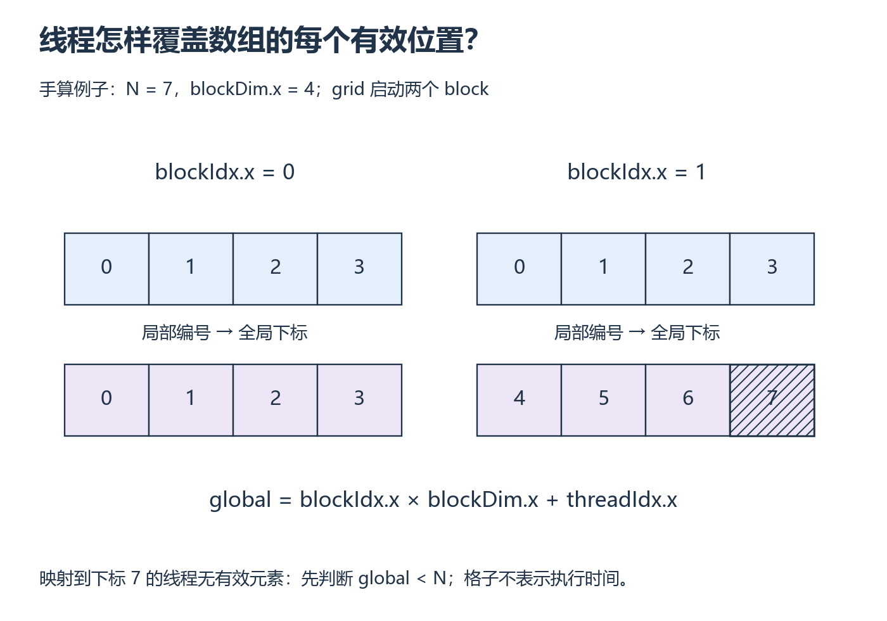

# W2 第 1 段：线程编号，怎样变成数组下标？

[本单元](README.md) · [课程目录](../../course/README.md)

CPU 循环依次处理数组元素；CUDA kernel 则让许多线程各自计算要处理的位置。关键是每个有效位置恰好有人负责，多出来的线程也不会越界。

## 视频与正文

先看 [GPU MODE Lecture 3 · Getting Started With CUDA](https://www.youtube.com/watch?v=nOxKexn3iBo)：从 CPU 循环进入 CUDA kernel 的主题；在灰度映射例子暂停，独立写数组线程覆盖表。

视频分钟位置待核验；找不到对应主题时，按下列正文范围阅读。重复内容只需回查。

## 目标与先修

从线程坐标推导数组下标，解释尾部线程为什么必须检查边界。先通过 W1 的类型、字节与连续布局检查；运行前另行确认 CUDA 编译器、驱动和最小 kernel，学习指南未验证这些条件。

## 读哪里，在哪里停

| 阅读参考 | 原始来源与指定范围 | 停止点 |
| --- | --- | --- |
| 20 分钟 | [Jeremy Howard 视频](../../resources/optional.md#x-cuda)，配 [pmpp.ipynb 固定版本](../../resources/optional.md#x-cuda) 的 rgb_to_grayscale_kernel、rgb_to_grayscale | 只追线程下标、尾部保护和启动配置；后续 CUDA matmul 不读 |
| 20 分钟 | [Programming Model §1.2](../../resources/gpu.md#r-cuda) 与 [Writing SIMT Kernels §2.3.2](../../resources/gpu.md#r-cuda) | 执行层级和 Thread Hierarchy 结束 |
| 20 分钟 | [Intro to CUDA C++ §2.1.2](../../resources/gpu.md#r-cuda) | 启动语法、下标与尾部保护；后续内存管理留到下一段 |

## 线程运行在哪里，数据又放在哪里？

**流式多处理器（Streaming Multiprocessor，SM）**是 GPU 内部执行线程的硬件单元。grid、block、thread 是程序组织工作的方法；SM、寄存器和缓存是实际资源。一个普通 block 被安排到一个 SM，多个 block 可以同时驻留；资源用完后，其余 block 等已有工作结束。不能把“启动了 1000 个 block”理解为“有 1000 个 SM 同时执行”。

*先看左侧逻辑分组，再看右侧硬件容纳与下方存储；图中只有两个 SM 是示意。[放大查看 SVG](../../assets/figures/w02-gpu-hardware.svg)。暂停：如果 grid 的 block 数远大于 SM 数，程序一定启动失败吗？*

NVIDIA 的 **warp** 是 32 个线程组成的执行分组；128 线程的 block 对应 4 个 warp。它不是 128 个 CPU 核，也不能用一个线程对应一个 CUDA core 来推断耗时。同一 warp 的线程遇到不同分支时，可能需要分别执行各条路径，部分线程暂不参与；不能据此假设线程永远逐条锁步，也不能省略需要的同步。

| 对象 | 在程序里怎样理解 | 需要避免的混淆 |
| --- | --- | --- |
| 寄存器 register | 线程用来保存局部计算值，片上空间有限 | C++ 局部变量不保证全部驻留寄存器；溢出可能落到 local memory |
| 共享内存 shared memory | 本节普通 block 内线程显式协作的片上空间 | 不是让所有 block 随意共享的全局数组；读写协作仍需同步 |
| L1 / L2 缓存 cache | 硬件缓存数据；L1 接近 SM，L2 被多个 SM 共享 | 缓存命中不是代码必然保证，也不替代正确性同步 |
| 全局内存 global memory | 普通 device Tensor 的主要数据位于设备显存 | 访问会受缓存和访存组织影响；逻辑读字节不总等于实际 DRAM 流量 |

寄存器/shared 较接近计算单元，容量有限；全局显存容量大，但访问代价通常更高。先用这个关系理解 W3/W4 的复用，再读具体设备指标。更高级的 cluster 共享能力后置，不改变这里普通 block 的范围。

**占用率（occupancy）**是 SM 上活跃 warp 数与硬件允许最大 warp 数之比，回答“能有多少组线程驻留”。某个 warp 等数据时，其他就绪 warp 可能继续执行；但高 occupancy 不保证更快，还需看数据复用、指令、带宽与实际等待。

手算一个虚构资源例子：某 SM 有 64 KiB shared、最多 32 个 warp；每 block 为 128 线程、用 32 KiB shared，假设其他限制均不约束。最多能驻留几个 block、几个 warp？把 shared 降到 16 KiB 后重算。这个例子只检查容量约束，不是你的 GPU 参数。

核对硬件关系

原来 shared 最多容纳 2 个 block，即 8 warp，按给定上限为 25%；改后最多 4 block、16 warp，为 50%。若为了降低 shared 引入更多显存读写，程序仍可能变慢。真实设备还受寄存器、线程数、block 上限和分配粒度限制；不能拿这两个比例当速度比。

接着读 [Writing SIMT Kernels 的 Kernel Launch and Occupancy](https://docs.nvidia.com/cuda/cuda-programming-guide/02-basics/writing-cuda-kernels.html#kernel-launch-and-occupancy) 从分配 block 到资源列表，以及 [Best Practices 的 Occupancy](https://docs.nvidia.com/cuda/cuda-c-best-practices-guide/index.html#occupancy) 开头与 Calculating Occupancy 的寄存器约束说明。先停在特定架构的数字例子之前，约 20 分钟；本地推演与核对另留 40～100 分钟，已计入单元估计。现在再回到下标公式，就能分清“由哪个线程负责”与“什么时候实际执行”。

## 局部编号为什么还不够？

每个 block 里的线程编号都从 0 开始。若只用 `threadIdx.x`，第二个 block 会再次访问数组开头。`blockIdx.x × blockDim.x` 先找到这一组线程负责的起点，再加局部编号，才得到整个数组中的位置。

启动数量要向上取整，因为数组长度未必是 block 大小的倍数。覆盖与安全因此是两件事：向上取整确保没有漏项，`global < N` 确保多出的线程不访问数据。一个线程不访问数组，并不表示它没有被启动。

host 提交 kernel；一个 grid 含多个 block，每个 block 含线程。1D 下标是 block 编号乘 block 大小，再加线程局部编号。warp 是硬件执行分组，不能把一个 block 永远当成一个 warp。

对长度 10、block 大小 4，启动 3 个 block，共 12 个线程；下标 10、11 不访问数组。启动足够多线程解决覆盖，边界判断解决多出来的线程。

## 暂停题与预测

1. 不看示例，列出三个 block 的全部下标；为什么不能直接用 `threadIdx.x` 索引全数组？
2. 输入改成 9 或 12 个元素，分别预测启动数量和无效线程数量。改 block 大小会改变数学输出吗？

卡住时先解释“局部编号”和“全局编号”，再手画两个 block，最后回 §2.3.2 核对。

## 读图与自查

*先看 block 编号，再从局部编号算全局下标 [放大查看 SVG](../../assets/figures/w02-thread-coverage.svg)。暂停：把本图 N 改为 6、block 大小不变，需要保护几个线程？*

这是索引示意，block=4 用于手算，不是性能推荐值。沿任意一列验证“全局下标=blockIdx.x×blockDim.x+threadIdx.x”。

写下预测后，再核对本段问题

**题 1**：只用 threadIdx.x 时，三个 block 会重复处理 0～3，漏掉后面的元素。正确下标加上各 block 的起始位置。

**题 2**：每 block 4 线程，长度 9 启动 3 个 block，有 3 个无效线程；长度 12 同样启动 3 个 block，没有无效线程。换 block 大小会改变覆盖分组，正确保护边界后数学输出不变。用 CPU 模拟逐项标记访问次数，有效下标应各为 1，越界下标应为 0。

保留自己的推导，再与实际结果比较。若不一致，按下面的回看位置找出最早出现差异的一步。

## 可选：问 AI

先独立作答和核对，仍有疑问时再使用；跳过本节不影响完成本段。

> 我为长度【N】、block 大小【数值】画了索引表：【粘贴】。请检查漏算、重复和越界，先让我解释一个可疑格子。再给一个非整除长度让我重画。不要提供完整 CUDA 程序，也不要把 block 和 warp 当成同一个概念。

## 动手与检查

实验目录：`labs/02-cuda/vector-add/`。先用 CPU 循环模拟线程编号，检查长度 1、10、12、257 的覆盖，再写 CPU 逐元素参考和 `vector_add.cu` 中的 kernel、启动配置草稿。输入包含正负数，逐元素比较，不能只比较总和。

固定输入和 FP32，暂只选择一种 block 大小。打印小输入及索引表，检查有效下标恰好覆盖一次。第一段先完成索引练习；第二段学完分配、拷贝与同步后，再把草稿接成完整 GPU 程序并验证输出，第三段学习计时。

## 结果不对时，从哪里查起

| 卡点 | 最小回看位置 | 重新检查 |
| --- | --- | --- |
| 漏掉最后一段 | §2.1.2 启动与边界 | 257 个元素全部覆盖 |
| 混淆 block/warp | §1.2 与 §2.3.2 | 用自己的 block 大小说明执行层级 |

- [ ] 独立推导下标与启动数量。
- [ ] CPU 索引模拟覆盖小数组与非整除输入，没有遗漏或重复。
- [ ] GPU 环境与未验证项如实记录。

在实验 `notes.md` 的 `W2-S01` 保存实际阅读位置、预测、完整命令、结果解释和一个未解决问题；通过后进入 [第二段](session-02.md)。

## 完成后

把代码、预测与实际结果记在同一份笔记中。完成本段检查后，沿下方链接继续。

[上一课](README.md) · [下一课](session-02.md)
