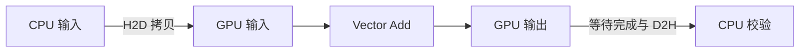

# W2 第二段学习指南：内存路径、同步与错误

[单元范围](README.md) · [三段学习导航](study-guide.md) · [资料复核](refresh-2026-10-01.md) · [上一段](session-01.md)

整理日期：2026-10-01。原文选读预算：45 分钟。状态：学习指南已整理；实际运行与检查待完成。

本地图解、暂停题与核对另计入本单元的自查时段，完整时间见 [分项预算](../../docs/study-guide.md#time-budget)。

## 目标与先修

沿着输入到输出追踪内存所有权，区分启动错误与异步执行错误。先能解释第一段的边界保护；运行需要可用 CUDA 环境，Compute Sanitizer 的可用范围另行记录。

## 读哪里，在哪里停

| 预算 | 原始来源与指定范围 | 停止点 |
| --- | --- | --- |
| 15 分钟 | [Intro to CUDA C++ §2.1.3.2](../../resources/README.md#r-cuda) Explicit Memory Management | 显式分配、复制、释放流程结束 |
| 15 分钟 | 同页 §2.1.4 Synchronizing CPU and GPU、§2.1.7 Error Checking | 同步与两类错误检查；不扩展多 stream |
| 15 分钟 | [Compute Sanitizer](../../resources/README.md#r-sanitizer) 的 Using Memcheck | 启动方法与首个错误报告；其他工具留 W3 |

访问日：2026-10-01。显式错误检查小节替换泛读错误处理，仍保持 45 分钟。

## 概念说明



图是显式管理的依赖示意，具体复制 API 是否阻塞还要看所用形式。kernel 启动返回只代表提交；立即检查启动配置错误，再在适当完成点检查运行错误。memcheck 用于定位非法访问，不参与性能计时。

## 暂停题与预测

1. 为什么启动后立即读 CPU 输出可能读到旧数据？在流程图标出必须完成的依赖。
2. 固定每 block 256 个线程并向上取整启动数量，去掉尾部保护后，长度 257 与 256 哪个会越界？即使碰巧没崩溃，能否判定正确？

卡住时先问自己：“谁拥有这块内存”，再逐条写出读写依赖，最后回同步与错误检查小节。

## 读图与自查

在上面的内存路径图中给三条边编号：① H2D 完成，② kernel 完成，③ D2H 完成。CPU 只有在③之后才核对输出；释放设备输入前，必须确认使用它的 kernel 已结束。图中的箭头表示先后依赖，不能据此判断所有 memcpy API 都以同样方式阻塞。

<details>
<summary>写下预测后，再核对本段问题</summary>

**题 1**：启动 kernel 只提交 GPU 工作。CPU 输出尚未经过 D2H 更新时，仍是旧值；只等待 kernel 结束也不会自动把数据复制回 CPU。需要依次保证输入可用、kernel 完成、D2H 完成，再核对。

**题 2**：block=256 时，N=256 启动 256 线程，N=257 启动 512 线程，后者下标 257～511 越界。没崩溃不等于合法；用数值检查和 memcheck 分别核对结果与非法访问。启动配置错误通常在启动后检查，异步执行错误还要在完成点检查。

这些说明用于核对推导；运行结果仍需自己验证。答错时保留原答案，回看本段“读哪里”或“卡点”指向的位置，再换一个小输入重做。

</details>

## 可选：问 AI

先独立作答和核对，仍有疑问时再使用；跳过本节不影响完成本段。

> 我的 Vector Add 内存流程是【列出分配、拷贝、启动、同步、校验、释放】。请沿着一个输出元素追踪依赖，找出最早可能读到旧值或释放过早的位置，一次只问一个问题。先解释执行顺序，不直接改写整段程序；API 行为请以我提供的 CUDA 版本文档为准。

## 动手与检查

继续 `labs/02-cuda/vector-add/` 的同一实现。按本段官方示例补齐 host 输入、三块 device buffer、H2D 拷贝、kernel 启动、完成检查、D2H 拷贝、CPU 核对和释放。每块 FP32 buffer 分配 `N × sizeof(float)` 字节；所有 CUDA 调用检查返回值，启动与完成点分开检查。

源文件写好后，在已经配置 CUDA 的 Linux/WSL 终端，从该实验目录执行以下命令。`-lineinfo` 用于让检查报告对应到源码；本段不做性能比较。

```bash
nvcc -std=c++17 -lineinfo vector_add.cu -o vector_add
./vector_add
compute-sanitizer --tool memcheck ./vector_add
```

复用长度 1、10、257，并选一个较大输入；先数值对齐，再对小输入用 `compute-sanitizer --tool memcheck` 检查所编译程序。若为理解错误而临时去掉保护，只在单独诊断运行中使用，恢复正确版本再计时。

保存工具版本、完整命令与首个错误/通过记录。原始 `.log` 默认被忽略，可将小型必要诊断摘录为 `checks.txt`；大型日志放 `artifacts/`。工具不可用时记“待补测”，不能写已通过。

## 卡点与过关

| 卡点 | 最小回看位置 | 重新检查 |
| --- | --- | --- |
| 输出不稳定 | §2.1.4 同步 | 校验是否在完成之后 |
| 错误只在后面出现 | §2.1.7、Memcheck 错误报告 | 找最早出错操作与源码位置 |

- [ ] 解释所有拷贝方向和生命周期。
- [ ] 输出对齐，启动/完成错误均被检查。
- [ ] sanitizer 结果与可用性分别记录。

在 `notes.md` 的 `W2-S02` 保存预测、命令、结果与未解决问题；通过后进入 [第三段](session-03.md)。
