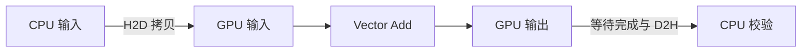

# W2 第二段备课：内存路径、同步与错误

[单元范围](README.md) · [三段导学](study-guide.md) · [资料复核](refresh-2026-10-01.md) · [上一段](session-01.md)

备课日期：2026-10-01。资料预算：45 分钟。状态：备课已准备；实际运行与检查待完成。

## 目标与先修

沿着输入到输出追踪内存所有权，区分启动错误与异步执行错误。先能解释第一段的边界保护；运行需要可用 CUDA 环境，Compute Sanitizer 的可用范围另行记录。

## 读哪里，在哪里停

| 预算 | 原始来源与指定范围 | 停止点 |
| --- | --- | --- |
| 15 分钟 | [Intro to CUDA C++ §2.1.3.2](https://docs.nvidia.com/cuda/cuda-programming-guide/02-basics/intro-to-cuda-cpp.html) Explicit Memory Management | 显式分配、复制、释放流程结束 |
| 15 分钟 | 同页 §2.1.4 Synchronizing CPU and GPU、§2.1.7 Error Checking | 同步与两类错误检查；不扩展多 stream |
| 15 分钟 | [Compute Sanitizer](https://docs.nvidia.com/compute-sanitizer/ComputeSanitizer/index.html) 的 Using Memcheck | 启动方法与首个错误报告；其他工具留 W3 |

访问日：2026-10-01。显式错误检查小节替换泛读错误处理，仍保持 45 分钟。

## 中文助读

图是显式管理的依赖示意，具体复制 API 是否阻塞还要看所用形式。kernel 启动返回只代表提交；立即检查启动配置错误，再在适当完成点检查运行错误。memcheck 用于定位非法访问，不参与性能计时。

## 暂停题与预测

1. 为什么启动后立即读 CPU 输出可能读到旧数据？在流程图标出必须完成的依赖。
2. 去掉尾部保护后，长度 257 与 256 哪个更容易暴露越界？即使碰巧没崩溃，能否判定正确？

先提示“谁拥有这块内存”，再逐条写出读写依赖，最后回同步与错误检查小节。

## 动手与检查

继续 `labs/02-cuda/vector-add/` 的同一实现。记录三块 device buffer 的分配字节数、每次拷贝方向和释放时机；所有 CUDA 调用检查返回值，启动与完成点分开检查。

复用长度 1、10、257，并选一个较大输入；先数值对齐，再对小输入用 `compute-sanitizer --tool memcheck` 检查所编译程序。若为理解错误而临时去掉保护，只在单独诊断运行中使用，恢复正确版本再计时。

保存工具版本、完整命令与首个错误/通过记录。原始 `.log` 默认被忽略，可将小型必要诊断摘录为 `checks.txt`；大型日志放 `artifacts/`。工具不可用时记“待补测”，不能写已通过。

## 卡点与过关

| 卡点 | 最小回看位置 | 重新检查 |
| --- | --- | --- |
| 输出不稳定 | §2.1.4 同步 | 校验是否在完成之后 |
| 错误只在后面出现 | §2.1.7、Memcheck 错误报告 | 找最早出错操作与源码位置 |

- [ ] 解释所有拷贝方向和生命周期。
- [ ] 输出对齐，启动/完成错误均被检查。
- [ ] sanitizer 结果与可用性分别记录。

在 `notes.md` 的 `W2-S02` 保存预测、命令、结果与未解决问题；通过后进入 [第三段](session-03.md)。
