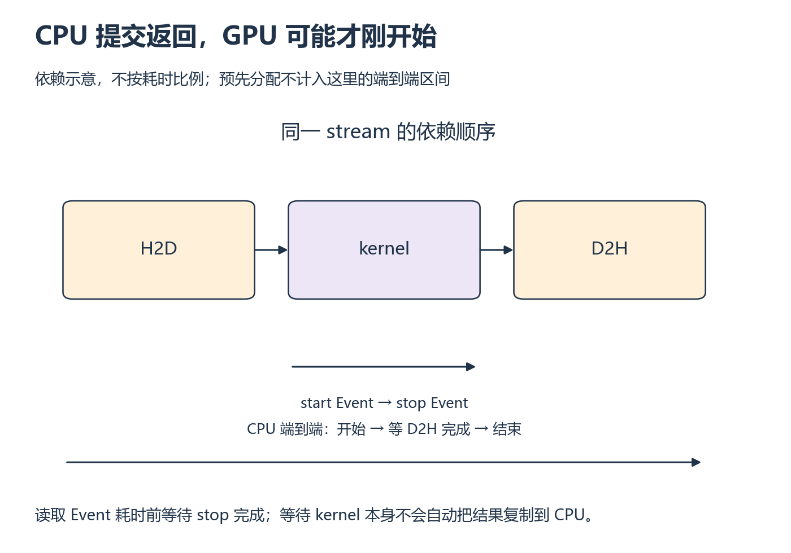

# W2 第 3 段：你计到的是提交时间，还是完成时间？

[本单元](README.md) · [课程目录](../../course/README.md)

异步 kernel 的调用很快返回，CPU 秒表却可能因此提前停下。一个很小的数字并不一定说明程序很快；先画清计时的两端，再把字节数除以这个区间。

## 视频与正文

主要阅读下列正文与图解；视频范围待核验。读到暂停题时，先预测再运行。

## 目标与先修

让时间对应明确的工作区间，计算带单位的有效带宽。先通过前两段正确性和内存检查；工具缺失项须保留，不能用计时掩盖错误。

## 读哪里，在哪里停

| 阅读参考 | 原始来源与指定范围 | 停止点 |
| --- | --- | --- |
| 20 分钟 | [CUDA Best Practices §9.1.2](../../resources/gpu.md#r-best) Using CUDA GPU Timers | Event 创建、记录、完成与 elapsed time 示例结束 |
| 15 分钟 | 同页 §9.2 Bandwidth，重点 Effective Bandwidth Calculation | 读写字节与时间的单位换算结束 |
| 10 分钟 | [Intro to CUDA C++ §2.1.4](../../resources/gpu.md#r-cuda) | 回看异步完成，画两种计时区间后停 |

访问日：2026-10-01。Best Practices 页标 13.4；这是阅读版本，实际 CUDA 版本待记录。

## 先给时间命名，再计算带宽

设备 Event 可以在同一 stream 中标记 kernel 前后的顺序。CPU 读时间前仍要等待结束 Event 完成，才能确定被标记的工作已经结束。端到端时间则覆盖输入搬运、计算与输出搬运；它回答的是“拿到结果花多久”。

例如计算两个数组的和，每个 FP32 元素要读两个 4 B 输入、写一个 4 B 输出，总计 12 B。这里统计的是算法需要完成的逻辑读写，缓存可能让真实设备访问量不同。先写 B 与 s，再换成 GB/s，能避免毫秒和微秒带来的千倍误差。

FP32 Vector Add 每元素逻辑上读两次、写一次，有效字节数为 12N。若只计 kernel，`GB/s = 12N / 秒 / 10^9`。这衡量完成这些逻辑读写的速度；缓存与实际事务会让它不同于 DRAM 硬件计数器值。

kernel 区间使用同 stream 的 Event 并等结束事件完成；端到端区间覆盖约定的拷贝和 kernel，CPU 计时必须等 GPU 完成。预先分配还是把分配计入，要在两组分别说明。

## 暂停题与预测

1. N=1000、FP32、kernel 时间为 10 微秒，理论换算得到多少 GB/s？如果误把毫秒直接当秒，结果错多少倍？
2. 小输入 kernel 很短，为什么端到端可能依然慢？若反复复用同一输入，能直接称为冷缓存 DRAM 带宽吗？

先写单位链，再区分“提交”和“完成”，最后回 §9.1.2 与 §9.2。

## 读图与自查

*先追踪上排数据依赖，再比较两条计时范围 [放大查看 SVG](../../assets/figures/w02-timing-boundaries.svg)。暂停：如果只缩短 H2D，哪一种计时可能改善、哪一种不一定变化？*

这是依赖和计时范围示意，不按耗时比例绘制。读取 Event 耗时前要等 stop 完成；此处端到端约定不含预先分配。

写下预测后，再核对本段问题

**题 1**：逻辑读写=3×1000×4=12,000 字节；10 微秒=0.00001 秒，带宽=1.2 GB/s。若把以毫秒表示的时间数值直接当秒代入，带宽会小 1000 倍。

**题 2**：小输入仍有提交、同步、拷贝等成本，kernel 很快并不意味着整个调用很快。反复使用相同数据可能命中缓存，有效带宽不是冷缓存 DRAM 计数。先在图上标清区间，再解释两条曲线，不能混合单位或删除慢的一组。

保留自己的推导，再与实际结果比较。若不一致，按下面的回看位置找出最早出现差异的一步。

## 可选：问 AI

先独立作答和核对，仍有疑问时再使用；跳过本节不影响完成本段。

> 我的 kernel 和端到端计时图是【粘贴】，带宽计算为【带单位的公式】。请先检查异步完成点与单位，再让我解释两组数据为什么不同。不要假设我的 GPU 带宽，也不要用教程数字替代测量。

## 动手与检查

继续 `labs/02-cuda/vector-add/`。固定 dtype、block 大小和输入内容；至少四个规模，例如 257、4096、65536、1048576，先确认实际显存可容纳。完成正确性后预热，按 [测量约定](../../course/guide.md) 至少三组独立测量，组内重复数与同步方法写进配置。

分别保存 kernel 与端到端每次原始时间、有效字节数、汇总方式与曲线。短 kernel 可重复启动后除以次数，同时说明该平均包含的开销。sanitizer/profiler 采样独立运行；不把工具耗时混进正式数据。

## 结果不对时，从哪里查起

| 卡点 | 最小回看位置 | 重新检查 |
| --- | --- | --- |
| 看似不随规模增长 | §9.1.2 | 是否只计 CPU 提交 |
| 两张曲线矛盾 | §9.2、自己的计时边界 | 是否比较同一工作与单位 |

- [ ] 正确性、工具检查和计时分开。
- [ ] 至少四个规模与原始重复数据可追溯。
- [ ] 独立计算带宽并说明缓存与计时边界。

在 `notes.md` 的 `W2-S03` 整理预测与结果；合并为 [周报告](README.md)，掌握检查通过后进入 [W3](../week-03-reduction-profiling/session-01.md)。

## 完成后

把代码、预测与实际结果记在同一份笔记中。完成本段检查后，沿下方链接继续。

[上一课](session-02.md) · [下一课](assessment.md)
