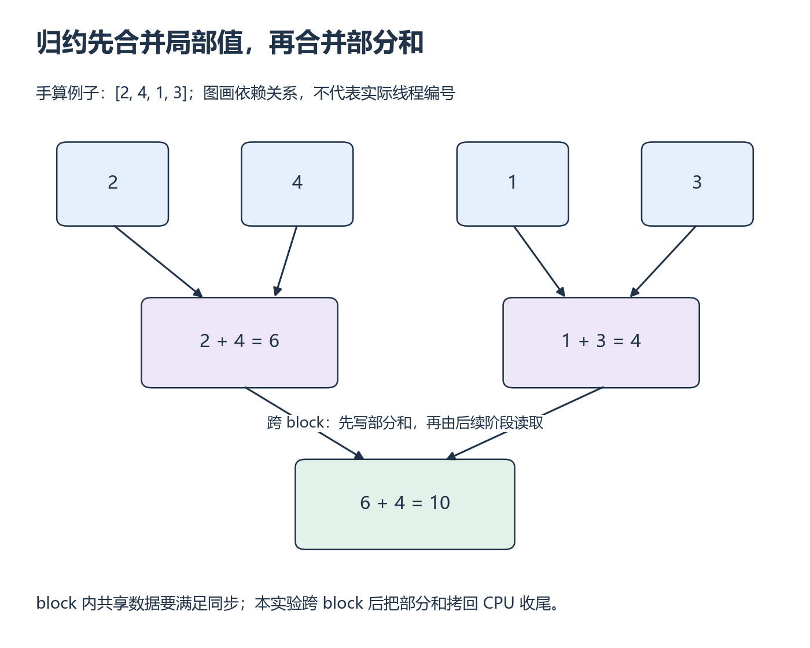

# W3 第 1 段：很多线程的结果，怎样合成一个数？

[本单元](README.md) · [课程目录](../../course/README.md)

归约树改变加法顺序，先用 [W1 浮点数例子](../week-01-foundations/session-04.md) 回看舍入和容差；正确性检查同时覆盖有限性与边界。

Vector Add 的输出互不依赖，求和却需要把许多线程的结果合在一起。归约把这个过程拆成几轮，每轮只依赖上一轮的一小部分结果；同步要保护的正是这些读写关系。

## 视频与正文

主要阅读下列正文与图解；视频范围待核验。读到暂停题时，先预测再运行。

## 目标与先修

解释每轮谁写、谁读以及何时需要同步。先通过 W2 的边界、错误与计时；这一段开始处理多个值合成一个值的归约，继续同一 CUDA 环境。

## 读哪里，在哪里停

| 阅读参考 | 原始来源与指定范围 | 停止点 |
| --- | --- | --- |
| 25 分钟 | [shared_reduce.cu 固定版本](../../resources/gpu.md#r-reduce) 的 SharedMemoryReduction | 加载、stride 循环、同步与输出；核对固定启动条件后停 |
| 20 分钟 | [Writing SIMT Kernels §2.3.2.1](../../resources/gpu.md#r-cuda) | block 同步语义结束，画自己的读写依赖 |

访问日：2026-10-01。源码固定 BLOCK_DIM=1024、单 block 处理 2048 个元素，不是通用多 block 实现。树仍不直观时用 [Reduction #3](../../resources/gpu.md#r-reduce) 阅读器第 14～15 页替换前 15 分钟；旧隐式 warp 同步不作现代模板。

## 中文补充（按需）

谭升[避免分支分化](https://face2ai.com/CUDA-F-3-4-避免分支分化/)中“并行规约问题”的相邻/交错配对说明，能帮助你先画归约树；在“首先是 CPU 版本”代码前停止。中文原文的限定文字已预读，配图与旧 kernel 不作为正确性依据。把配对写到本课小输入上，尾部置零、完整收尾和同步仍按原实验。[范围与版本](../../resources/gpu.md#cn-reduce)。

## 先画配对，再分配线程

**归约（reduction）**将一组值合并为更少的值，最终得到一个结果。用 [2,4,1,3] 演示相邻配对：第一轮产生 6 和 4，第二轮得到 10。真实 kernel 可能采用前后半区配对，中间值会不同，所以必须按自己的索引映射画树。

在一个 block 内，某线程读取另一个线程刚写的共享数据前，要满足同步条件。跨 block 时不能直接把普通 block barrier 当全局屏障。本实验让每个 block 输出部分和，再复制回 CPU 完成最后合并；第一阶段时间因此不是完整归约时间。

SUM 的空位填 0。每个 block 先归约自己的数据，本实验将部分和拷回 CPU，用同一个 FP64 求和函数得到最终值。这样先学清 block 内同步，多级 GPU 归约留作扩展。线程即使没有有效输入，也要参与该 block 所需的 barrier，不能提前退出而留下其他线程等待。

*从输入向下看每个结果依赖谁 [放大查看 SVG](../../assets/figures/w03-reduction-stages.svg)。暂停：如果两个中间结果来自不同 block，单个 block 的 barrier 能保证它们都完成吗？*

这是逻辑归约树，实际线程和地址需另列映射；树形相同不代表两种实现访存相同。

## 暂停题与预测

1. 对 [1,-2,3,4,-5,6,7,-8] 逐轮画树并算最终值；改变配对顺序会影响 FP32 舍入吗？
2. 最后一个 block 不满时，哪些线程仍要走到 barrier？为何不能只对有效线程调用同步？

卡住时先问自己：“本轮读上一轮谁的值”，再用四元素例子画依赖，最后回同步小节。

## 读图与自查

用不同输入重画这一步，逐项写出中间值和依赖。

上图的四元素例子画相邻配对。这里换成八个数，按自己的配对顺序重画；中间值比只核对最终的和更能帮助定位索引错误。

写下预测后，再核对本段问题

**题 1**：整数小例的和为 6。FP32 的加法不满足严格结合律，换配对顺序可能改变舍入；本例小整数恰好可精确表示，不能证明任意浮点输入都一样。

**题 2**：尾 block 的所有线程仍执行约定的 block barrier，无效加载用 0。若只有有效线程进入 barrier，其余线程绕过，程序不满足本段同步条件。N=513、每 block 512 元素时应输出两个部分和：第一个覆盖 0～511，第二个只包含索引 512 的值，再由 CPU 收尾。

保留自己的推导，再与实际结果比较。若不一致，按下面的回看位置找出最早出现差异的一步。

## 可选：问 AI

先独立作答和核对，仍有疑问时再使用；跳过本节不影响完成本段。

> 这是我的八元素归约树和每轮读写表：【粘贴】。请先检查某一轮是否读取了尚未写完的数据，再给一个尾 block 只有一个有效元素的情况让我解释。不要代写 kernel；请区分 block 内同步与 block 间收尾。

## 动手与检查

实验目录：`labs/02-cuda/reduction/`。先手算，再写 shared-memory 版本，每 block 输出一个部分和。起步固定 256 线程，每线程加载最多两个值，一个 block 覆盖 512 个元素；两次读取分别做边界检查，越界值用 0。修改阅读示例的固定配置，补上 block offset；测试 1、8、257、511、512、513 个元素。先逐 block 对照 FP64 区间和，再用共同的 CPU 收尾核对整数组结果。

两版性能主表只计 GPU 第一阶段，部分和的 D2H 与 CPU 收尾不计入该列；若测完整流程，另列包含它们的端到端时间。不能将第一阶段时间称为完整 Reduce 延迟。

输入含负数，固定 FP32 输入与累加策略，用 FP64 sum 或可靠库参考检查绝对/相对误差；接近零的结果不能只看相对误差。先 memcheck 再计时，保存大小、容差、实际误差与命令；无需一开始优化多个配置。

## 结果不对时，从哪里查起

| 卡点 | 最小回看位置 | 重新检查 |
| --- | --- | --- |
| 小输入对、大输入错 | 源码加载与输出、自己的 block offset | 各部分和是否覆盖独立区间 |
| 卡住或不稳定 | §2.3.2.1 | 同一 block 的 barrier 参与是否一致 |

- [ ] 逐轮解释依赖和 SUM 的填充值。
- [ ] 多 block 与尾部输入通过参考检查。
- [ ] 部分和、第二阶段与工具限制有记录。

在 `notes.md` 的 `W3-S01` 留下预测、命令和未解决问题；通过后进入 [第二段](session-02.md)。

## 完成后

把代码、预测与实际结果记在同一份笔记中。完成本段检查后，沿下方链接继续。

[上一课](README.md) · [下一课](session-02.md)
