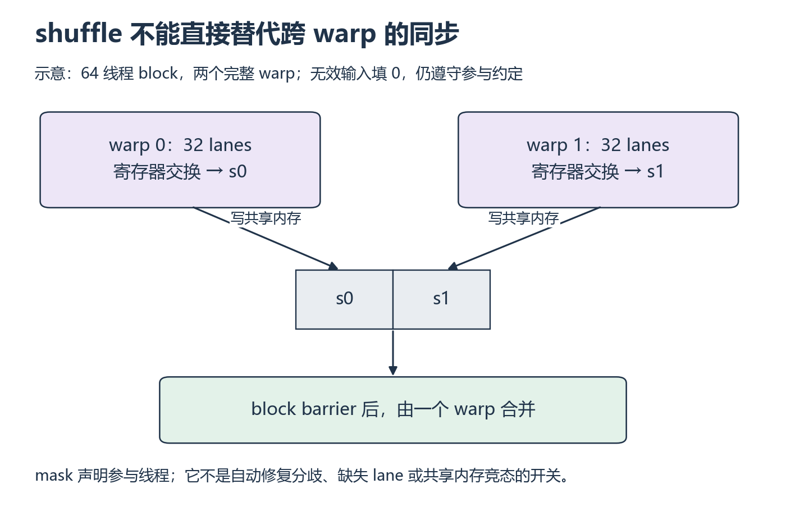

# W3 第 2 段：warp 内能交换，为什么还需要共享内存？

[本单元](README.md) · [课程目录](../../course/README.md)

shuffle 可以减少 warp 内通过共享内存交换数据的步骤。但一个 block 有多个 warp 时，它们的部分和仍要相遇。这一节追踪一个值怎样跨过 warp 边界。

## 视频与正文

主要阅读下列正文与图解；视频范围待核验。读到暂停题时，先预测再运行。

## 目标与先修

将 warp 内交换、warp 间组合、block 间收尾分清。先通过共享内存版本的边界与 memcheck；本实验使用完整 warp 组成的 block。

## 读哪里，在哪里停

| 阅读参考 | 原始来源与指定范围 | 停止点 |
| --- | --- | --- |
| 30 分钟 | [NVIDIA Warp-Level Primitives](../../resources/gpu.md#r-warp) 的 Synchronized Data Exchange、Active Mask Query、Warp Synchronization | 每节对应示例结束；只追踪 shuffle、mask、同步 |
| 15 分钟 | [Compute Sanitizer](../../resources/gpu.md#r-sanitizer) 的 Using Racecheck、Using Synccheck | 启动与首个报告解释结束；先保证 memcheck 已通过 |

访问日：2026-10-01。博客用于同步语义，旧性能数字不作本机预测。

## 中文补充（按需）

树形合并还不直观时，只回看谭升[并行规约问题](https://face2ai.com/CUDA-F-3-4-避免分支分化/)的两种配对文字，到 CPU 代码前。它是中文概念补充，**不讲当前 warp 的参与 mask 与同步保证**；后文旧式隐式同步代码不要照搬。现代 `_sync`、Racecheck/Synccheck 的合适中文对应暂缺，本页推演与英文原文继续作为依据。[范围与版本](../../resources/gpu.md#cn-reduce)。

## 把两种交换分开

**lane** 是线程在 warp 内的位置；**shuffle** 让参与线程读取该 warp 中另一个 lane 的寄存器值。它不直接读取另一 warp 的寄存器。要合并不同 warp 的结果，先由各 warp 写入共享数组，再等 block 内的相关写入完成，最后读取这些部分和。

最后一次合并可能只有少量有效值，仍可让完整 warp 参与，其余值填 0。参与掩码（mask）表达参与约定，不会自动把未执行指令的线程带回来。先说明谁执行、读谁，再选掩码；不要从一个常量倒推安全性。

shuffle 交换 warp 中线程的寄存器值，不能直接跨 warp。常用分工是每 warp 得到一个部分和，写共享内存，完成 block 同步后再组合。共享内存减少了，仍要说明剩余跨 warp 依赖。

mask 描述参与约定；这次练习让 block 大小为 warp 大小的整数倍，无效输入填零，所需线程均执行同一交换。不是“写 full mask 就自动安全”；warp 内分歧与读非参与 lane 的值会破坏假设。

## 暂停题与预测

1. 128 线程的 block 最先产生几个 warp 部分和？它们放在哪里，下一步谁读？
2. 一个线程没有有效输入，填 0 但参与交换，与直接跳过交换有什么不同？仅调用 `__activemask()` 能自动解决所有分歧吗？

先画 warp 边界，再标参与线程，最后回三个指定标题；不要直接抄 mask 常量。

## 读图与自查

*先看两个独立 warp，再找唯一跨 warp 的共享内存步骤 [放大查看 SVG](../../assets/figures/w03-warp-combine.svg)。暂停：删掉 block barrier 后，合并者可能读到什么状态？*

箭头跨 warp 的位置经过共享内存。图中用 64 线程展示两个 warp。后面的题改成 128 线程，本实验使用 256 线程；分别重算 warp 数量，其余跨 warp 依赖仍需保留。

写下预测后，再核对本段问题

**题 1**：128/32=4 个 warp 部分和。每 warp 的一个线程写入共享数组，同步后再由一个 warp 合并。最后一次合并只有 4 个有效值，也可以让完整 warp 参与，其他 lane 置 0。

**题 2**：填 0 仍参与交换保留了同一参与约定；直接跳过可能导致其他 lane 读到未参与者的未定义值。activemask 只反映执行当时活跃线程，不能自动修复此前的分歧、缺少的参与者或跨 warp 共享内存依赖。错在最后合并时先检查填零与 barrier，再检查 mask。

保留自己的推导，再与实际结果比较。若不一致，按下面的回看位置找出最早出现差异的一步。

## 可选：问 AI

先独立作答和核对，仍有疑问时再使用；跳过本节不影响完成本段。

> 我认为 shuffle 的 mask 表示【自己的解释】，跨 warp 的合并过程是【列步骤】。请给一个能检验这段解释的四 warp 小例子，先让我标参与 lane，再指出遗漏的同步。不要只给 full mask 常量或完整实现。

## 动手与检查

继续 `labs/02-cuda/reduction/`，新增 warp 版本。固定输入、累加 dtype、block 大小、第二阶段和计时边界，仅改变第一阶段归约方式；沿用上一段的尾部与近零测试。

顺序运行 memcheck、racecheck、synccheck，工具检查不参与计时。保存各工具命令与结果；racecheck 主要检查共享内存访问危险，零报告不能证明全部竞态不存在。当前不支持部分 warp 的实现明确写出约束，不把未覆盖输入写已通过。

## 结果不对时，从哪里查起

| 卡点 | 最小回看位置 | 重新检查 |
| --- | --- | --- |
| 非整齐长度错 | Synchronized Data Exchange | 尾部线程是否填零并参与 |
| warp 内正确、全 block 错 | Warp Synchronization、跨 warp 共享读写 | 写完部分和后谁等待谁 |

- [ ] 解释参与 mask 的条件。
- [ ] 两个版本用同一参考、尾部和收尾检查。
- [ ] 记录省去的操作与剩余同步，不以工具结果代替语义证明。

在 `notes.md` 的 `W3-S02` 留下预测、命令和限制；通过后进入 [第三段](session-03.md)。

## 完成后

把代码、预测与实际结果记在同一份笔记中。完成本段检查后，沿下方链接继续。

[上一课](session-01.md) · [下一课](session-03.md)
