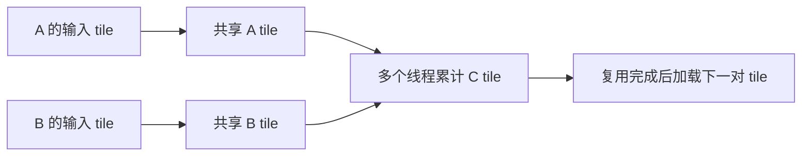

# W4 第二段学习指南：tile 复用与两次同步

[单元范围](README.md) · [三段学习导航](study-guide.md) · [资料复核](refresh-2026-10-01.md) · [上一段](session-01.md)

整理日期：2026-10-01。原文选读预算：60 分钟。状态：学习指南已整理；实现与工具检查待完成。

本地图解、暂停题与核对另计入本单元的自查时段，完整时间见 [分项预算](../../docs/study-guide.md#time-budget)。

## 目标与先修

解释一个 tile 的 global load 怎样服务多个输出，并保证下一轮加载不会覆盖仍被使用的数据。先通过朴素 GEMM 的参考与地址检查。

## 读哪里，在哪里停

| 预算 | 原始来源与指定范围 | 停止点 |
| --- | --- | --- |
| 20 分钟 | [CUDA Best Practices §10.2.3.1](../../resources/README.md#r-best) | Shared Memory and Memory Banks 说明结束 |
| 30 分钟 | 同页 §10.2.3.2 | C=AB 加载、同步、计算示例；多 tile 和边界自己补 |
| 10 分钟 | 重画本段输入—共享 tile—输出关系 | 能标出加载结束与复用结束依赖即停 |

访问日：2026-10-01。padding 卡点可用 §10.2.3.3 或 [转置博客](../../resources/README.md#x-cuda) 的额外一列示例替换 15 分钟，二选一，不另写转置项目。

## 概念说明



图是数据复用示意。加载后的同步确保读取前数据齐备；计算后的同步确保下轮覆盖前没人还在读旧 tile。尾部输入填 0，但相关线程继续参与 block 同步；最终 C 的写回才按输出边界保护。

两个 T×T FP32 输入 tile 的逻辑共享内存需求为 2T²×4 字节，不含 padding 等附加项。增大 T 可能增加复用，也增加线程、共享内存和寄存器压力。

## 暂停题与预测

1. 16×16 tile 的两块 FP32 共享数组占多少字节？一份 A 元素可服务该 tile 中多少个输出列？
2. M=17、N=19、K=23 时，最后一个 K tile 怎么填？只给有效输出线程做 barrier 会怎样？

先画被复用的数据，再标“读完”和“可覆盖”，最后对照两处同步。

## 读图与自查

```text
K 方向第 k 轮：加载 A/B tile → 同步① → 读取 tile 并累加 C → 同步②
                                                              ↓
K 方向第 k+1 轮：                       复用同一共享数组，加载新 tile
```

沿一块共享数组追踪：同步①之前不能读新数据，同步②之前不能覆盖旧数据。遮住两处编号，分别说出“哪个写操作必须等哪些读操作结束”。

<details>
<summary>写下预测后，再核对本段问题</summary>

**题 1**：两块 16×16 FP32 tile 占 2×16×16×4=2048 字节。完整输出 tile 中，一个 A 值在该轮可服务 16 个输出列；尾 tile 的有效复用次数可能较少。

**题 2**：T=16、K=23 时最后一轮只有 7 个有效 K 位置，其余填 0；M=17、N=19 的最后输出 tile 只有 1 行、3 列有效。不能只让这三个输出对应线程做 barrier，其他线程仍可能负责加载且必须遵守同步。输出写回保护与 tile 加载保护分别处理。

这些说明用于核对推导；运行结果仍需自己验证。答错时保留原答案，回看本段“读哪里”或“卡点”指向的位置，再换一个小输入重做。

</details>

## 可选：问 AI

先独立作答和核对，仍有疑问时再使用；跳过本节不影响完成本段。

> 我在 tile GEMM 中为两次同步写的理由是【粘贴】。请用 M=17、N=19、K=23、T=16 的最后一轮检查我的解释，让我标出有效加载、填零和有效写回。先追问一个遗漏点，不要直接补全代码。

## 动手与检查

继续 `labs/02-cuda/gemm/`，新增一个固定 tile 大小的 shared-memory 版本。复用朴素版本的输入、布局与容差，测试小矩形、整 tile 与 M/N/K 都非整除的形状。

逐轮验证 K 累加，先通过参考和 memcheck，再按可用条件运行 racecheck/synccheck；保存未测项。固定一组 tile 参数，第二个 tile 大小是通过后扩展。正式计时保持两版本相同输入与边界，采样另行运行。

## 卡点与过关

| 卡点 | 最小回看位置 | 重新检查 |
| --- | --- | --- |
| 多轮 K 结果错 | §10.2.3.2 与自己的覆盖点 | 第二次同步是否保护旧 tile |
| 尾块挂住 | W3 block 同步说明 | 无效线程是否仍参与 barrier |

- [ ] 画出复用关系和两次同步职责。
- [ ] 三维尾部输入对齐且检查记录可追溯。
- [ ] 资源需求与支持范围明确。

在 `notes.md` 的 `W4-S02` 留下预测、命令与限制；通过后进入 [第三段](session-03.md)。
