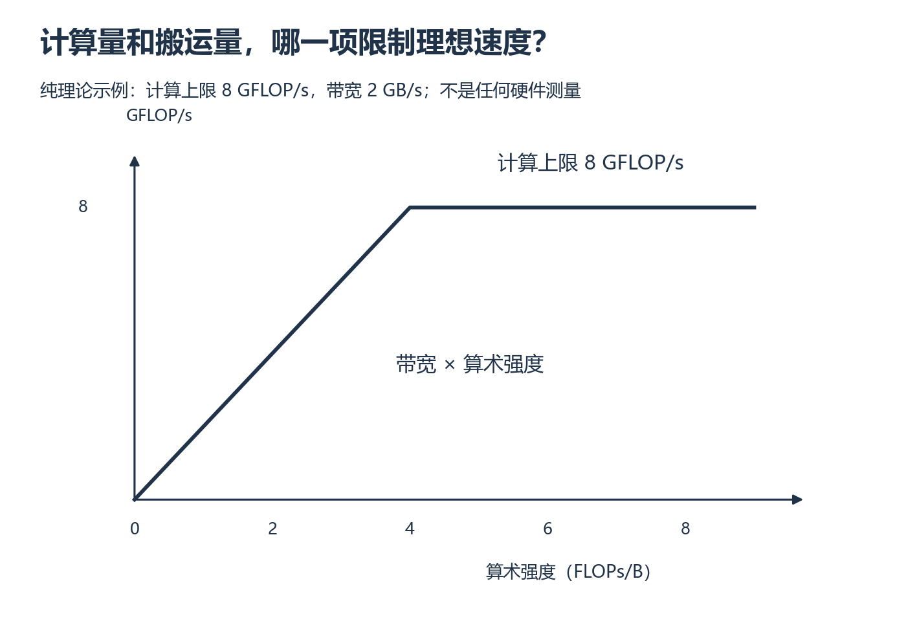

# W4 第 3 段：计算更少，为什么不一定更快？

[本单元](README.md) · [课程目录](../../course/README.md)

同样的运算量，数据搬得多可能更慢；同样的数据量，计算更多又可能受计算单元限制。Roofline 用两个上限帮你提出假设，随后仍要靠同条件测量判断实际瓶颈。

## 视频与正文

先看 [CS336 2026 Lecture 2](https://www.youtube.com/watch?v=kuYAsz7zspQ)：arithmetic intensity 与 Roofline；暂停区分计算量、搬运量和带宽上界。

视频分钟位置待核验；找不到对应主题时，按下列正文范围阅读。重复内容只需回查。

## 目标与先修

先写计算与搬运假设，再用同精度的三组实现检查预测。先通过朴素/tile GEMM 的正确性与边界。

## 读哪里，在哪里停

| 阅读参考 | 原始来源与指定范围 | 停止点 |
| --- | --- | --- |
| 15 分钟 | [CS336 L2 视频](../../resources/foundations.md#r-l2)，配 [固定讲义](../../resources/foundations.md#r-l2) 的 arithmetic_intensity_matmul、roofline_plots | 两个定位函数结束 |
| 20 分钟 | [Scaling Book Roofline](../../resources/gpu.md#r-roofline) 的 Visualizing rooflines、Matrix multiplication | 矩阵计算模型结束；不照搬书中设备数字 |
| 10 分钟 | 用当前 GEMM 写 FLOPs、字节、算术强度 | 各量单位和搬运假设完整即停 |

来源查阅日期：2026-10-01；函数名用于定位讲义正文。

## 先求两个上限，再取较小的一个

**算术强度（arithmetic intensity）**是每搬运 1 B 数据对应多少次浮点运算，单位 FLOPs/B。带宽乘算术强度，得到数据供应速度所允许的计算吞吐；硬件计算能力给出另一上限。理想吞吐不超过两者中较小的值。

假设计算上限为 8 GFLOP/s、带宽为 2 GB/s，当算术强度为 1 FLOP/B 时，供数只能支持 2 GFLOP/s；增加到 4 FLOPs/B 后两条上限相遇。再增加复用，模型中的带宽上限继续升高，计算上限却不变。这些只是说明模型的假设数字。

采用每乘加 2 FLOPs 的约定，GEMM 为 2MNK FLOPs。若每个输入只读一次、输出写一次、C 不需要先读，理想搬运下界为元素字节数×(MK+KN+MN)。这是假设下界，不是实际 DRAM 计数。

算术强度 AI=FLOPs/字节；理想吞吐上界为 min(同精度计算上限, 带宽×AI)。练习中的朴素实现的逻辑重复加载和缓存实际事务不同，需分别说明。设备峰值、持续带宽与 TF32/FP32 路径不能混用。

## 暂停题与预测

1. M=N=K=16、FP32 时，按上述下界计算 FLOPs、字节与 AI。改变 batch 或 reuse 假设为什么会改变 AI？
2. tile 版本没有比库快，是否说明复用原理错误？如果库允许 TF32，而手写使用 FP32，能否把全部速度差归因于 tile？

先写量纲，再区分模型下界与实测事务，最后回 Roofline 两标题。

## 读图与自查

*沿横轴增加算术强度，观察斜线何时变成水平线 [放大查看 SVG](../../assets/figures/w04-roofline-model.svg)。暂停：如果带宽翻倍但计算上限不变，两条限制相遇的位置向哪边移动？*

图中只有假设的模型数值，不代表实测设备。对自己的点先说明字节取自理想下界还是实际搬运估计；二者不能混画成同一种观测。

写下预测后，再核对本段问题

**题 1**：FLOPs=2×16³=8192，理想字节=4×(256+256+256)=3072，AI=8/3≈2.67 FLOPs/B。复用越多，执行同样计算需要搬运的字节可能越少。若 batch 只是复制独立 GEMM 且没有跨批复用，FLOPs 和字节同比增长，AI 未必变化；只有明确共享/搬运假设后才能判断。

**题 2**：库还可能采用更好的调度、指令和资源利用，tile 复用原理正确不保证练习实现胜出。TF32 与 FP32 策略不同，不能把差异全归因于 tile；先固定可比精度并检查误差，再解释性能。

保留自己的推导，再与实际结果比较。若不一致，按下面的回看位置找出最早出现差异的一步。

## 可选：问 AI

先独立作答和核对，仍有疑问时再使用；跳过本节不影响完成本段。

> 我的 Roofline 估算是【FLOPs、字节公式、精度与复用假设】。请先核对单位，再用一个只改变复用假设的反例检查我是否混淆理论下界与实际搬运。不要替我选硬件峰值，也不要把库更快归因于一个未经验证的机制。

## 动手与检查

继续 `labs/02-cuda/gemm/`，加入同输入的 `torch.matmul` 基线。记录实际 dtype、TF32/精度策略、布局、输出分配与同步范围；可比较的数值语义先通过误差检查。

选小/中/大方阵和一个长方形，提前检查显存容量；三组无 profiler 预热、重复测量，保留原始延迟与由同一 FLOPs 计数方法计算的吞吐。分别列理想下界和实现搬运估计，未知缓存或 Tensor Core 路径写待验证。只对一个代表形状采样已有 W3 sections。

## 结果不对时，从哪里查起

| 卡点 | 最小回看位置 | 重新检查 |
| --- | --- | --- |
| AI 与图差很大 | Matrix multiplication 与自己的字节公式 | 是否重复读、是否计 C 初值 |
| 速度与误差同时变 | 自己的精度配置 | 是否改变了计算模式 |

- [ ] 三组正确性与计时条件可比较。
- [ ] 原始数据、预测与实测图可追溯。
- [ ] 区分模型、观察和机制推断。

在 `notes.md` 的 `W4-S03` 整理 [周报告](README.md)，通过后进入 [W5](../week-05-triton-softmax/session-01.md)。

## 完成后

把代码、预测与实际结果记在同一份笔记中。完成本段检查后，沿下方链接继续。

[上一课](session-02.md) · [下一课](assessment.md)
