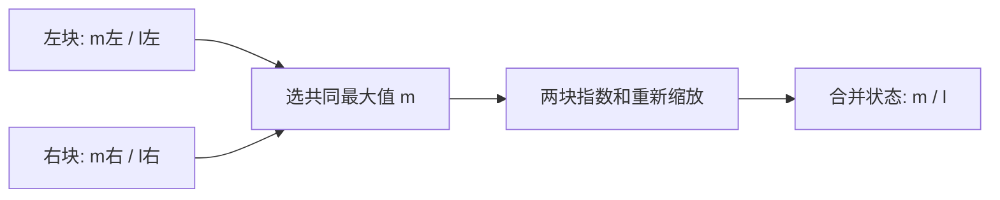

# W5 第三段学习指南：在线归一化状态合并

[单元范围](README.md) · [三段学习导航](study-guide.md) · [资料复核](refresh-2026-10-01.md) · [上一段](session-02.md)

整理日期：2026-10-01。原文选读预算：45 分钟。状态：学习指南已整理；手算与 CPU 验证待完成。

本地图解、暂停题与核对另计入本单元的自查时段，完整时间见 [分项预算](../../docs/study-guide.md#time-budget)。

## 目标与先修

不保留全部指数值也能合并归一化因子，解释为什么旧状态要重新缩放。先理解上一段减最大值，本段 CPU 即可，不要求新增分块 GPU Softmax。

## 读哪里，在哪里停

| 预算 | 原始来源与指定范围 | 停止点 |
| --- | --- | --- |
| 10 分钟 | [Online normalizer v2](../../resources/README.md#r-online) §2 Algorithm 2，阅读器第 2 页 | safe softmax 算法结束 |
| 20 分钟 | 同 PDF §3 Algorithm 3，第 3 页 | 在线最大值与指数和更新结束 |
| 15 分钟 | 同 PDF §3.1，第 4 页 | 两个状态的并行合并；Top-k 后置 |

访问日：2026-10-01。页码指阅读器页序，固定 v2；纸面数字不是运行结果。

## 概念说明

每块保存最大值 m 与相对该最大值的指数和 l。两块合并时，先取新最大值 m=max(m左,m右)，再算 l=l左×exp(m左−m)+l右×exp(m右−m)。直接加两个旧 l 错在使用了不同基准。

示意图表达状态依赖。此状态只解决归一化因子；要输出所有概率或 Attention 加权和，还需要相应数据或累计状态，留到 W6 理解。

## 暂停题与预测

1. [1,2] 与 [3,4] 各自的 m、l 是什么？合并时左块乘哪个缩放因子？
2. 交换两块顺序，数学结果会变吗？浮点计算能保证每一位相同吗？

卡住时先问自己：“指数和相对哪个最大值”，再只合并两个元素，最后回 §3.1 公式。

## 读图与自查

沿上面的合并图追踪 [1,2] 与 [3,4]：分别在两个输入框写最大值 2、4，再在左侧缩放箭头写 exp(2−4)。共同最大值改变时，两个指数和必须换到同一基准；不是只更新框中的 m。

写下预测后，再核对本段问题

**题 1**：左块 m=2、l=1+exp(-1)，右块 m=4、l=1+exp(-1)。合并后 m=4，左块的 l 乘 exp(-2)，右块乘 1，得到 l=1+exp(-1)+exp(-2)+exp(-3)≈1.553002。

**题 2**：实数运算下交换块顺序不改变结果，浮点的舍入顺序可能不同，比较应使用容差。每个元素最终概率仍需 exp(x−4)/l；只有 m、l 不能恢复原来的所有 x。若直接相加旧 l，重看图中“共同基准”这一步。

这些说明用于核对推导；运行结果仍需自己验证。答错时保留原答案，回看本段“读哪里”或“卡点”指向的位置，再换一个小输入重做。

## 可选：问 AI

先独立作答和核对，仍有疑问时再使用；跳过本节不影响完成本段。

> 我推导的两块在线归一化合并式是【公式和变量含义】。请先检查是否使用共同最大值，再给一组最大值相差较大的两块让我验证。只指出最早错误，不替我写验证脚本；帮我区分分母状态和完整 Softmax 输出。

## 动手与检查

继续 `labs/03-triton-attention/softmax/`，保存小型 `online_state.py`；CPU/PyTorch FP64 参考验证 [1,2,3,4] 的两块状态。再测负值、大幅值、不同切块位置，固定同一输入，与整行稳定 max/sum 对齐。

记录 m/l 误差与容差。主线每块非空；若以后支持空块，明确 identity 和 −∞−(−∞) 的处理，不直接套非空公式。该验证没有 GPU 性能含义，也不增加完整 FlashAttention 实现。

## 卡点与过关

| 卡点 | 最小回看位置 | 重新检查 |
| --- | --- | --- |
| 合并后分母过大 | §3 Algorithm 3、§3.1 | 两块是否用了同一指数基准 |
| 误以为已完成输出 | §2 与 §3 的职责 | 状态与每个元素概率分别需要什么 |

- [ ] 不看原文能推导合并式。
- [ ] 不同切块与幅值通过参考检查。
- [ ] CPU 验证、GPU 融合与未覆盖语义分开记录。

在 `notes.md` 的 `W5-S03` 合并 [周报告](README.md)，验收后进入 [W6](../week-06-attention/session-01.md)。
