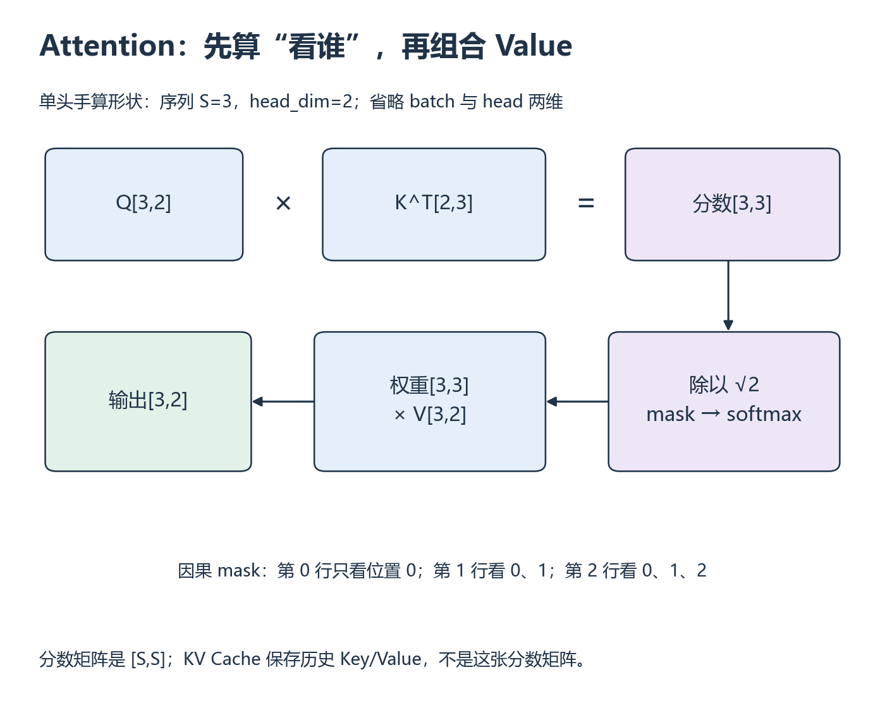

# W6 第 1 段：每个 query，究竟可以读哪些 key？

[本单元](README.md) · [课程目录](../../course/README.md)

比较 Attention 实现之前，要先让它们计算同一个问题。形状正确还不够：mask 的真假含义、dropout 和实际后端都会改变结果或可比条件。

## 视频与正文

主要阅读下列正文与图解；视频范围待核验。读到暂停题时，先预测再运行。

## 目标与先修

让显式 Attention 和 SDPA 在相同条件下计算同一输出。先通过 W5，以及 [模型结构检查 C](../../course/prerequisites.md)；shape 和 mask 可先纸面分析，GPU 后端需实际证据。

## 读哪里，在哪里停

| 阅读参考 | 原始来源与指定范围 | 停止点 |
| --- | --- | --- |
| 15 分钟 | [SDPA 教程](../../resources/models.md#r-sdpa) 的开头接口示例 | Q/K/V 调用结束；不运行整篇模型示例 |
| 15 分钟 | 同页 Explicit Dispatcher Control | SDPBackend、sdpa_kernel 的选择与限制结束 |
| 10 分钟 | [PyTorch 2.14 SDPA API](../../resources/models.md#r-sdpa) 的 dropout 警告、布尔 mask、shape | 三项要求核对完成即停 |

访问日：2026-10-01。API 页标 beta；网页 2.14 不代表本机 2.5.1 或目标 GPU 环境版本。

## 先用一个 head 看清三次形状变化

**Query（查询）**与 **Key（键）**做点积，得到“每个位置对每个位置”的分数；按行归一化后，再对 **Value（值）**加权。S 个 query 对 S 个 key 会形成 S×S 分数，最后乘 Value 又回到每个位置一个向量。

下图用 S=3、D=2，省去 batch 与 head 维。除以 √D 控制分数尺度；因果掩码禁止 query 读取未来位置。query 0 只允许 key 0，query 1 允许 key 0、1。真正调用接口时，必须查清 True 表示允许还是屏蔽，不能靠名称猜测。

这里的自注意力 Q/K/V 为 [B,H,S,D]，score 为 [B,H,S,S]；除以 sqrt(D)，施加 mask，沿最后一维 Softmax，再乘 V 得到 [B,H,S,D]。

SDPA 布尔 mask 的 True 表示允许参与，不能直接套用其他接口“True 表示屏蔽”的约定。模块 eval 并不会自动覆盖传给函数的 dropout_p；本段显式设 0。调用 SDPA 只说明接口，实际 fused/math 路径受设备、dtype、shape 等条件影响。

## 暂停题与预测

1. B=1、H=2、S=3、D=4 时，score 和输出各有多少元素？causal 下第一个 query 能看到哪些 key？
2. 只把模块设 eval，却传 dropout_p=0.1，会保证重复输出一致吗？若强制 fused 后端失败，应记录什么？

先按维度写矩阵乘法，再用三位置 mask 表，最后回 API 说明。

## 读图与自查

*从上排矩阵乘法开始，顺箭头看 mask 和 Value 加权 [放大查看 SVG](../../assets/figures/w06-attention-shapes.svg)。暂停：保持 S=3，只把 D 改成 4，分数矩阵的形状会改变吗？*

每行是一位 query 能读取的 key，不能把行列倒置。本图采用本段 SDPA 的布尔约定，其他接口需各自核对。

写下预测后，再核对本段问题

**题 1**：score 为 [1,2,3,3]，共 18 个元素；输出为 [1,2,3,4]，共 24 个元素。causal 下 query 0 只看 key 0，query 1 看 key 0、1。

**题 2**：函数使用实际传入的 dropout_p，eval 不会替你把 0.1 改成 0；重复输出不保证一致。本段显式传 0。强制 fused 失败应保存警告、版本、设备、dtype、shape、mask 与所请求后端，随后单独记录可运行的 math 对照，不能将回退结果标为 fused。

保留自己的推导，再与实际结果比较。若不一致，按下面的回看位置找出最早出现差异的一步。

## 可选：问 AI

先独立作答和核对，仍有疑问时再使用；跳过本节不影响完成本段。

> 我的 Q/K/V shape 和 causal 可见表是【粘贴】，我对 SDPA dropout 和后端的理解是【解释】。请先检查维度与一行 mask，再用一个小反例检验我是否混淆 eval 和 dropout_p。不要写完整 Block；只依据我贴的版本文档讨论后端支持。

## 动手与检查

实验目录：`labs/03-triton-attention/decoder-profiling/`。动手时先写显式参考与 SDPA 路径；核对通过后，按 [第二段的结构图](session-02.md) 将它们接入同一个小 Block；先使用小 shape、FP32、dropout=0，固定输入与 seed、eval/autograd 条件。

测试 causal 开/关以及一组明确布尔 mask，本例限定每个 query 至少有一个有效 key；逐元素误差和容差记录。选择 math 作为可解释对照，另检查当前设备支持的 fused 路径；不支持时保留警告与回退，不能把两次不同语义当加速。

## 结果不对时，从哪里查起

| 卡点 | 最小回看位置 | 重新检查 |
| --- | --- | --- |
| mask 后输出反了 | API 布尔 mask Note | True 的含义 |
| 同一输入重复不同 | dropout Warning | 实际传入值和随机状态 |
| 后端身份不明 | Explicit Dispatcher Control | 请求后端与实际可用性证据 |

- [ ] shape、缩放、mask、dropout 与 autograd 对齐。
- [ ] 参考误差和后端限制有实际记录。
- [ ] 未覆盖功能单列，SDPA 不直接标作 FA4。

在 `notes.md` 的 `W6-S01` 留下预测、命令和限制；通过后进入 [第二段](session-02.md)。

## 完成后

把代码、预测与实际结果记在同一份笔记中。完成本段检查后，沿下方链接继续。

[上一课](README.md) · [下一课](session-02.md)
