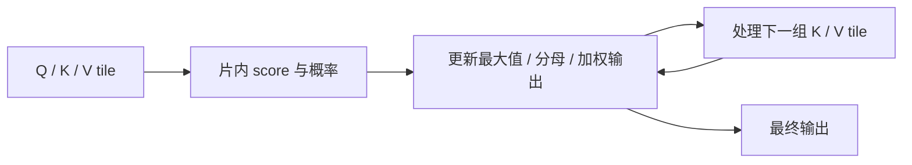
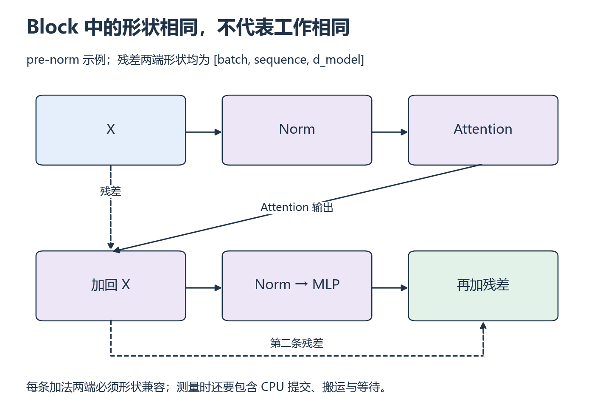

# W6 第 2 段：没有完整存下分数矩阵，还能算出 Attention 吗？

[本单元](README.md) · [课程目录](../../course/README.md)

W5 说明了分块后如何维护分母。Attention 还要把每块概率对应的 Value 累加起来：既更新归一化基准，也更新加权结果，才能避免把完整中间矩阵来回写入显存。

## 视频与正文

主要阅读下列正文与图解；视频范围待核验。读到暂停题时，先预测再运行。

## 目标与先修

用 W4 的 tile 和 W5 的在线状态解释哪些中间矩阵可以不完整写回显存。先通过 Attention 语义，接下来的实验固定一个小 Block 的前向。

## 读哪里，在哪里停

| 阅读参考 | 原始来源与指定范围 | 停止点 |
| --- | --- | --- |
| 15 分钟 | [FlashAttention 原论文的 arXiv v2](../../resources/models.md#r-flash) §2.1～2.2 | Attention 与硬件存储层次结束 |
| 25 分钟 | 同 PDF §3.1、Algorithm 1 | 前向 tile、最大值、归一化与输出状态；反向后置 |
| 10 分钟 | 同 PDF §3.2 | IO 复杂度结论；证明与稀疏扩展后置 |

访问日：2026-10-01；v2 提交于 2022-06-23，表示原论文的修订版本，不是 FlashAttention-2。论文 HBM/SRAM 是分析层次，本机消费级显存介质不同，不照搬带宽数字。

## 中文补充（按需）

Bowen Zhou 中文原创[图解 FlashAttention](https://bowenzhou.top/posts/2024/illustrated-flash-attention)，读“Softmax Tiling”及其用于 FlashAttention 的状态更新公式，到完整输出合并为止。指定文字/公式已预读，动画未检查；用本课图追踪 Q/K/V。原文口头省略的指数重缩放不能省，复杂度段的 d 名称也不作为本课维度定义。它补机制直觉，不替代 SDPA 正确性与 IO 实验。[范围与版本](../../resources/models.md#cn-flash)。

## 省去中间写回，仍然要完成相同的加权计算

显式实现先保存 S×S 分数，再保存概率，最后乘 Value。分块实现把一部分 Q/K/V 放到更近的存储中，逐块更新最大值、分母与输出累加状态。共同最大值变化时，旧的加权输出也需要相应重缩放；只有分母状态，无法知道每个 Value 的贡献。

这里的核心是改变数据安排和执行顺序，而非删去某些注意力项。浮点运算顺序不同可能出现容差内差异，所以仍先做逐元素正确性检查，再分析 IO。下面的 Block 把 Attention 放回归一化、残差和 MLP 之间，帮助你判断局部改进是否重要。

图是前向依赖示意。经典显式路径存放完整 S×S score/概率；分块算法维护状态，避免把这两张矩阵完整写回显存。W5 的分母状态还需配合加权输出状态，不能只合并分母就得到 Attention。

设模型宽度 W=H×D，MLP 中间宽度 F。忽略 bias/LayerNorm，QKV 与输出投影参数共 4W²，两层 MLP 参数 2WF；前向线性层 FLOPs 为 8BSW²+4BSWF，QKᵀ 和 PV 为 4BHS²D。Softmax、激活、归一化另列，不藏入“全模型精确 FLOPs”。

## 暂停题与预测

1. 固定 B/H/D，S 翻倍时 score 存储与 Attention 矩阵乘 FLOPs 各变几倍？投影与 MLP 呢？
2. 省去完整 score 写回是否代表数学注意力近似化？为何不同浮点顺序仍可能有误差？

先列 shape，再分线性/S² 项，最后回 Algorithm 1 的状态。

## 读图与自查

*先走计算路径，再沿虚线检查两条残差从哪里来 [放大查看 SVG](../../assets/figures/w06-block-flow.svg)。暂停：把 MLP 中间宽度加倍，会改变残差两端的最终模型宽度吗？*

这是要实现的小型 pre-norm Block 的结构图：Q/K/V、输出投影和 MLP 的两个 Linear 均不使用 bias，dropout=0，不加 KV Cache；两处 LayerNorm 的可学习参数单列。先按图逐项核对 shape，再汇总资源，W=H×D。

写下预测后，再核对本段问题

**题 1**：B/H/D 固定时，score 元素数 BHS² 与 Attention 两次矩阵乘 FLOPs 都变为 4 倍；投影和 MLP 随 token 数 S 线性增长，变为 2 倍；参数数不变。

**题 2**：分块重排计算与存储，并不自动把精确 Attention 改成近似算法。浮点舍入仍可能使结果有小差别，要按设定容差检查。

**账本参照**：W=128、F=512 时，投影参数=65,536，MLP 参数=131,072，共 196,608（未计 LayerNorm）。B=1、S=128 的线性层为 50,331,648 FLOPs，Attention 两次矩阵乘为 8,388,608 FLOPs；单张 FP32 score 为 262,144 字节。两处标准 LayerNorm 若各含 weight 与 bias，共另加 4W=512 个参数。先核对层定义，再用这些推导值检查程序，不把它们称为峰值显存。

保留自己的推导，再与实际结果比较。若不一致，按下面的回看位置找出最早出现差异的一步。

## 可选：问 AI

先独立作答和核对，仍有疑问时再使用；跳过本节不影响完成本段。

> 我根据这个小型 pre-norm Block 画了形状和资源表：【粘贴】。请先找一项线性随 S 增长和一项随 S² 增长的量，让我解释原因；再追问在线 Attention 为什么连加权输出也要重新缩放。不要替我实现 FlashAttention，也不要把理论字节相加成实测峰值。

## 动手与检查

继续 `labs/03-triton-attention/decoder-profiling/`。可选固定 B=1、S=128、H=4、D=32、F=512 的小 Block，按本段结构图固定层定义。保存参数表、激活形状表、FLOPs 表，bias/残差/归一化按实际实现单列。

FP32 下单张 score 的理论字节为 1×4×128²×4=262144；概率矩阵另列。账本不等于峰值分配，不能把所有生命周期不同的 Tensor 简单相加。先与真实 shape、numel 核对，S 翻倍只作纸面预测，可选实测另安排；不新增手写 FlashAttention。

## 结果不对时，从哪里查起

| 卡点 | 最小回看位置 | 重新检查 |
| --- | --- | --- |
| 分块输出解释不清 | Algorithm 1、W5 在线状态 | 加权输出为什么也重缩放 |
| 账本与峰值不符 | 自己的 Tensor 生命周期 | 分配、共享与临时工作区 |

- [ ] 参数、激活和 FLOPs 有明确的计数范围。
- [ ] 区分 IO 改善、数学语义和浮点误差。
- [ ] 理论存储与实际分配分别记录。

在 `notes.md` 的 `W6-S02` 保存推导和未验证项；通过后进入 [第三段](session-03.md)。

## 完成后

把代码、预测与实际结果记在同一份笔记中。完成本段检查后，沿下方链接继续。

[上一课](session-01.md) · [下一课](session-03.md)
