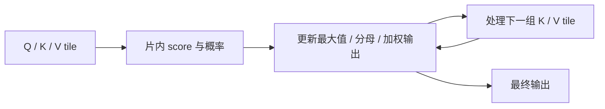

# W6 第二段备课：FlashAttention 的 IO 与资源账本

[单元范围](README.md) · [三段导学](study-guide.md) · [资料复核](refresh-2026-10-01.md) · [上一段](session-01.md)

备课日期：2026-10-01。资料预算：50 分钟。状态：备课已准备；账本与实现核对待完成。

## 目标与先修

用 W4 的 tile 和 W5 的在线状态解释哪些中间矩阵可以不完整写回显存。先通过 Attention 语义，主线固定一个小 Block 的前向。

## 读哪里，在哪里停

| 预算 | 原始来源与指定范围 | 停止点 |
| --- | --- | --- |
| 15 分钟 | [FlashAttention v2](https://arxiv.org/pdf/2205.14135v2) §2.1～2.2 | Attention 与硬件存储层次结束 |
| 25 分钟 | 同 PDF §3.1、Algorithm 1 | 前向 tile、最大值、归一化与输出状态；反向后置 |
| 10 分钟 | 同 PDF §3.2 | IO 复杂度结论；证明与稀疏扩展后置 |

访问日：2026-10-01；v2 提交于 2022-06-23。论文 HBM/SRAM 是分析层次，本机消费级显存介质不同，不照搬带宽数字。

## 中文助读

图是前向依赖示意。经典显式路径存放完整 S×S score/概率；分块算法维护状态，避免把这两张矩阵完整写回显存。W5 的分母状态还需配合加权输出状态，不能只合并分母就得到 Attention。

设模型宽度 W=H×D，MLP 中间宽度 F。忽略 bias/LayerNorm，QKV 与输出投影参数共 4W²，两层 MLP 参数 2WF；前向线性层 FLOPs 为 8BSW²+4BSWF，QKᵀ 和 PV 为 4BHS²D。Softmax、激活、归一化另列，不藏入“全模型精确 FLOPs”。

## 暂停题与预测

1. 固定 B/H/D，S 翻倍时 score 存储与 Attention 矩阵乘 FLOPs 各变几倍？投影与 MLP 呢？
2. 省去完整 score 写回是否代表数学注意力近似化？为何不同浮点顺序仍可能有误差？

先列 shape，再分线性/S² 项，最后回 Algorithm 1 的状态。

## 动手与检查

继续 `labs/03-triton-attention/decoder-profiling/`。可选固定 B=1、S=128、H=4、D=32、F=512 的小 Block，先确认自己实现的层定义。保存参数表、激活形状表、FLOPs 表，bias/残差/归一化按实际实现单列。

FP32 下单张 score 的理论字节为 1×4×128²×4=262144；概率矩阵另列。账本不等于峰值分配，不能把所有生命周期不同的 Tensor 简单相加。先与真实 shape、numel 核对，S 翻倍只作纸面预测，可选实测另安排；不新增手写 FlashAttention。

## 卡点与过关

| 卡点 | 最小回看位置 | 重新检查 |
| --- | --- | --- |
| 分块输出解释不清 | Algorithm 1、W5 在线状态 | 加权输出为什么也重缩放 |
| 账本与峰值不符 | 自己的 Tensor 生命周期 | 分配、共享与临时工作区 |

- [ ] 参数、激活和 FLOPs 有明确口径。
- [ ] 区分 IO 改善、数学语义和浮点误差。
- [ ] 理论存储与实际分配分别记录。

在 `notes.md` 的 `W6-S02` 保存推导和未验证项；通过后进入 [第三段](session-03.md)。
