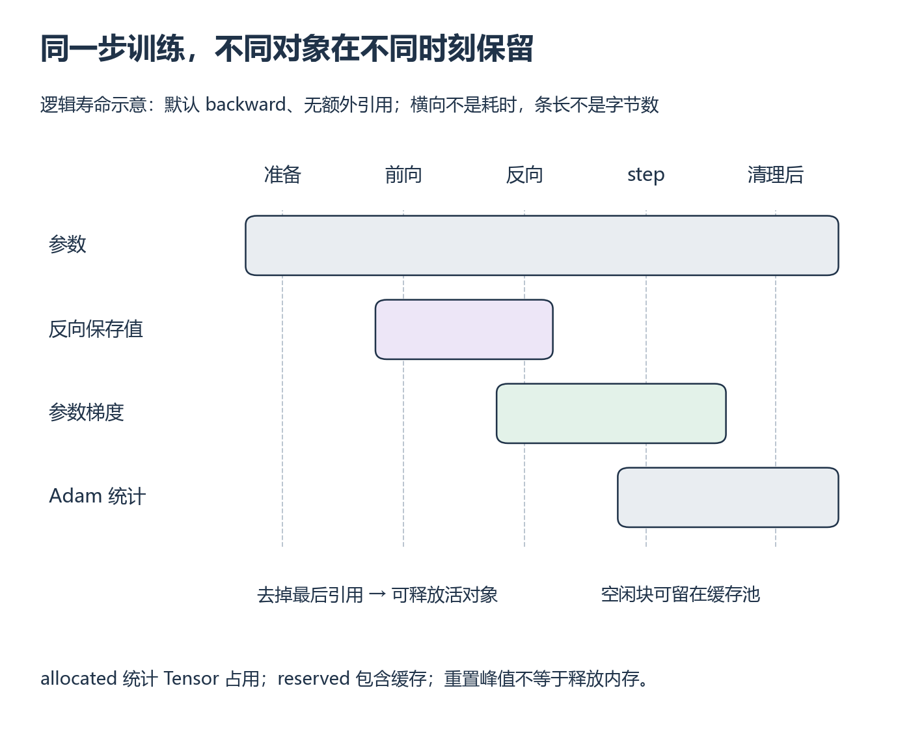

# W6 第 4 段：一轮计算结束了，显存为什么没有降回去？

[本单元](README.md) · [课程目录](../../course/README.md)

参数字节数固定，运行时显存却会随前向、反向和更新变化。要解释这一点，需要追踪“哪些对象仍被使用”，再区分框架正在用的显存与缓存池。这里复用 [单卡训练小模型](../../course/foundations/training.md)，不要求给前面的 Decoder Block 增加完整训练实验。预计 2～4 小时，已计入 W6 范围。

主要阅读本页和 [PyTorch CUDA semantics 的 Memory management](https://docs.pytorch.org/docs/2.14/notes/cuda.html#memory-management) 开头两段，停在高级分配器配置之前。接口范围见 [显存资料卡](../../resources/models.md#r-memory-lifetime)。没有 GPU 时先完成对象与状态表，真实显存曲线留待运行；CPU 字节统计不代替 CUDA 指标。

## 中文补充（按需）

李沐中文[自动求导](https://www.bilibili.com/video/BV1KA411N7Px)及作者[§2.5.3 分离计算](https://zh.d2l.ai/chapter_preliminaries/autograd.html)可回看 detach 怎样截断求导路径。正文已预读，视频仅讲次确认。它没有说明 allocated/reserved/peak，也没有保证 detach 复制存储；对象引用与峰值检查仍按本页完成。[范围与版本](../../resources/models.md#cn-memory)。

## 对象的寿命，并不都在函数返回时结束

参数在训练期间一直存在。前向为反向保留必要的中间结果，反向计算参数梯度；通常 backward 会释放已用完的中间保存值，但参数的 `.grad` 还在。SGD 无动量时状态少，Adam 通常到第一次 step 才建立动量统计。变量、列表、闭包或视图仍引用一个 Tensor 时，它的存储可能继续存活。

*先按时间从左到右，再逐行看对象何时需要保留；长度只表示阶段，不是测量曲线。[放大查看 SVG](../../assets/figures/w06-memory-lifetime.svg)。暂停：清理梯度后，Adam 的两个统计量也应一起消失吗？*

以 `nn.Linear(1,1)` 为例，weight 和 bias 共两个 FP32 数，数据区共 8 B；两个梯度也是 8 B。Adam 的两个逐参数统计合计再加 16 B，还要另算步数等小状态。这张逻辑账不能直接等同于 CUDA 分配量：分配粒度、临时张量和运行库都有影响，小模型中差别尤其明显。

| 采样时点 | 应重点寻找的对象 |
| --- | --- |
| 创建模型与输入后 | 参数、输入，Adam 的逐参数状态尚未建立 |
| 前向与 loss 后 | 输出、loss、反向需要的中间结果 |
| backward 后 | 参数梯度；默认已消费的中间保存值通常释放 |
| 第一次 Adam step 后 | 参数、梯度、Adam 统计量与步数 |
| 清梯度、删本轮引用后 | 参数与优化器状态；输入若复用也保留 |

`detach()` 切断求导关系，但通常仍共享存储；`del tensor` 只去掉一个引用，另一个 view 或列表还在就可能继续占用。把 `prediction.detach()` 收集到 GPU 列表，仍然会留住每次预测的数据；若只要记录标量 loss，使用 `.item()`。在 GPU 上 `.item()` 可能同步，适合这里的诊断，不要逐步插入性能计时循环后宣称自然吞吐。

## 三个数字分别回答什么？

`memory_allocated()` 统计当前 Tensor 占用；`memory_reserved()` 是 PyTorch 分配器管理的总量，包含正在用和可复用的缓存，二者不能相加。`max_memory_allocated()` 是自上次重置以来的峰值，不是当前值。`nvidia-smi` 还可能计入上下文或其他非 PyTorch 分配，不能直接拿它减参数账本当作泄漏。

对象释放后 allocated 可以下降，reserved 可能保留以供下次复用。`empty_cache()` 只能释放当前未被使用的缓存块，不能释放仍被引用的 Tensor，也不是修复所有 OOM 的办法。先找到持续增长的对象，再考虑缓存行为。

## 做一个能结束、能比较的小实验

将 [显存观察起点](../../exercises/foundations/memory_start.py) 复制到自己的训练练习目录。它默认只用 CPU；显式传 `--device cuda` 才使用 GPU。使用现成的阶段采样函数，补全一个训练步，前向/反向/更新使用相同模型与输入。Adam 先只理解它额外保存两份统计，具体恢复在训练课后半段完成。采样点的 CUDA 同步只用于读阶段结果；这些记录不用于性能比较。

1. 在小 Linear 上填上表，记录参数、梯度、optimizer state 的 dtype/shape，先证明对象关系。
2. GPU 上先做一次不计入稳态的更新以建立 Adam 状态，再清理本轮引用、重置峰值，测后续同 shape 的一步；冷启动峰值另列。重置 peak 不会释放显存，测量段已经存在的参数仍计入峰值。
3. 用起点的 `retained_outputs` 示例复现列表留存：每次在 GPU 分配 `[256,256]` FP32（逻辑上 256 KiB），仅保留 detach 后的值，共八次。比较 retain、clear、empty_cache 三个时点；其中没有求导图，增长来自数据被引用。
4. 独立增加“只保留 CPU 标量”的对照；若要保存整个预测，比较有界保存和清空列表。不能为了看增长写无限循环或故意耗尽显存。

先预测：八份逻辑数据一共多少 MiB？清空列表前调用 empty_cache，哪类占用不应消失？把维度改成 `[512,256]`，逻辑量应怎样变化？

核对与常见误判

八份共 `8*256*256*4=2 MiB`；维度加倍后为 4 MiB。实际 allocator 增量不要求逐字节等于逻辑量。仍被列表引用时，empty_cache 不会释放这些活对象；清空所有引用后 allocated 应反映释放，reserved 是否下降取决于缓存和分配器。图中 Adam 状态持续存在并非泄漏。

如果反复保存未 backward 的 loss，会同时留住它所连接的求导图；正常 backward 后保存值通常已被释放，不能把所有 loss 列表一律描述成“留住完整激活”。先问是否求导、是否 retain_graph、是否还有数据引用，再看测量。

完成时解释至少一次“reserved 不降但 allocated 稳定”以及一次“活对象越来越多”的差别。回到 Block 报告，把参数、临时中间值、当前值和峰值分开；W11 的状态表和 W12 的分片分析继续复用这套口径。

[上一课](session-03.md) · [下一课](assessment.md)
