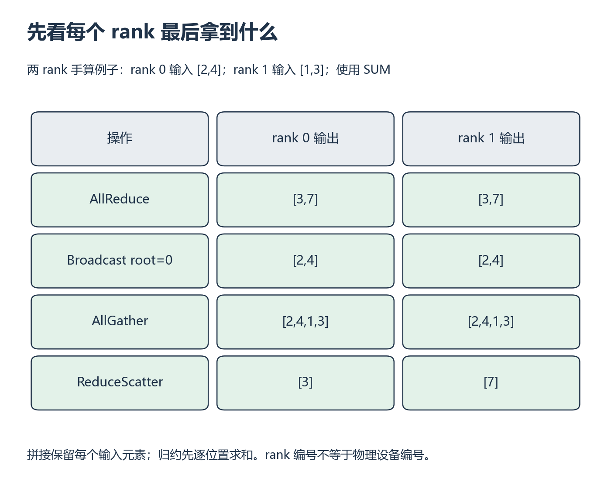
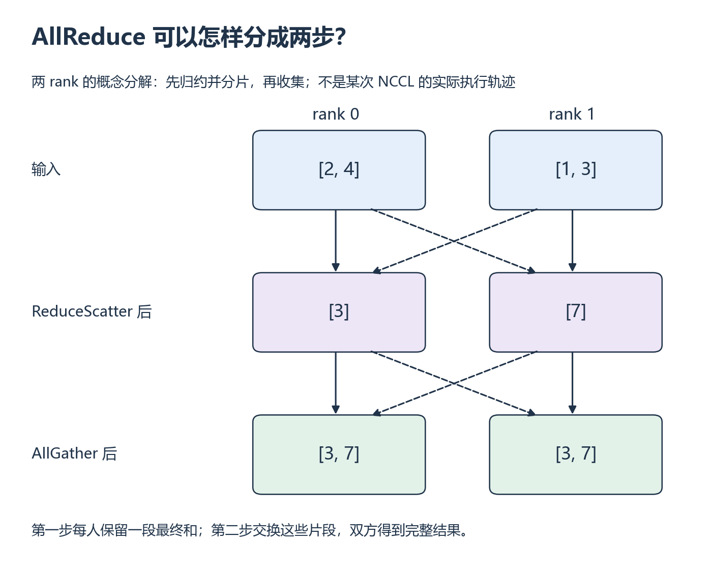

# W7 第 1 段：集合通信结束后，每个进程拿到什么？

[本单元](README.md) · [课程目录](../../course/README.md)

AllReduce、AllGather 都带有 All，但它们并不做相同的运算。先用两个小数组画清元素来源与输出长度，之后才值得在两张 GPU 上测通信速度。

## 视频与正文

先看 [CS336 2026 Lecture 7 · Parallelism](https://cs336.stanford.edu/)：从课表 Recordings 打开对应讲次；讲到 collective 时暂停，画每个 rank 的输入和输出。

视频分钟位置待核验；找不到对应主题时，按下列正文范围阅读。重复内容只需回查。

## 目标与先修

手算四种 collective，明确 shape、rank 顺序和操作语义。需要 W1～W6 的张量与测量知识，以及运行时可用的至少两张 GPU；W13 不是通信的硬性前置。

## 读哪里，在哪里停

| 阅读参考 | 原始来源与指定范围 | 停止点 |
| --- | --- | --- |
| 25 分钟 | [NCCL Collective Operations](../../resources/training.md#r-collective) 的 AllReduce、Broadcast、AllGather、ReduceScatter | 四类输入输出图结束 |
| 20 分钟 | [CS336 L7 固定讲义](../../resources/training.md#r-l7) 的 torch_distributed、collective_operations_main，配 [官方视频列表](../../resources/optional.md#x-navigation) 第 7 讲 | collective 例子结束，不进入数据并行训练 |

访问日：2026-10-01；NCCL 文档标 2.32.3，运行版本待选。函数名用于定位讲义正文。

## 中文补充（按需）

李沐中文[多 GPU 训练](https://www.bilibili.com/video/BV1vU4y1V7rd/)可先形成数据分配直觉；正文只看作者[§12.5.4](https://zh.d2l.ai/chapter_computational-performance/multiple-gpus.html)的 PyTorch `allreduce` 函数与两张卡的输入输出。该函数先求和再分发，便于核对每个参与者拿到什么；不是 NCCL 或 DDP 实现。正文已预读，视频仅讲次确认；其余 collective 继续按原文画表。[范围与版本](../../resources/training.md#cn-data-parallel)。

## 把进程编号与设备编号分开

**rank** 是进程在通信组中的编号。实验可以把一个 rank 绑定到一张 GPU，但换设备映射不会自动改变 rank 顺序。**集合通信（collective）**要求组内各进程按约定共同参与，而不是一个进程单独发起就能完成的普通函数调用。

下面用 [2,4] 与 [1,3] 区分求和与拼接。AllReduce 的对应位置求和得到 [3,7]，每个 rank 都取得它；AllGather 保留两份原数据，得到四个元素。ReduceScatter 对归约后的结果分段，Broadcast 则只传播指定 root 的输入。

通信各端需遵守一致操作、dtype、数量和调用顺序；不能只检查某个 rank 的一次调用。下面的图先用两个元素讲解，暂停题再换成四个元素。



*逐行先说是否进行了计算，再比较每个输出的长度和归属 [放大查看 SVG](../../assets/figures/w07-collective-values.svg)。暂停：若改为三 rank，AllGather 的输出长度怎样变化，输入的拼接顺序由什么决定？*

把 SUM AllReduce 看成“ReduceScatter 得到各段最终和，再 AllGather 收齐”，可以解释为什么同一个最终结果可能经过多个通信阶段。这个分解只说明数据语义，不断言 NCCL 在当前消息和拓扑下必然采用哪种算法。



*先沿两列从上到下读；实线跟踪本 rank 的结果，虚线提示跨 rank 数据依赖。 [放大查看 SVG](../../assets/figures/w07-allreduce-steps.svg)。暂停：ReduceScatter 后，为什么任意一个 rank 都还没有完整的 [3,7]？*

## 暂停题与预测

1. 换成 rank 0=[1,2,3,4]、rank 1=[10,20,30,40]，写四类操作的全部输出；Broadcast 指定 root=0，AllGather 的输出有几个元素？
2. 两 rank 用不同 collective 顺序，可能产生什么行为？改变卡号是否会自动改变拼接顺序？

先画 rank 输入，再用颜色标来自谁的数据，最后回四类操作图。

## 读图与自查

<details>
<summary>先填四种输出，再展开完整对照表</summary>

| 操作 | rank 0 的输出 | rank 1 的输出 |
| --- | --- | --- |
| SUM AllReduce | [11,22,33,44] | [11,22,33,44] |
| Broadcast，root=0 | [1,2,3,4] | [1,2,3,4] |
| AllGather | [1,2,3,4,10,20,30,40] | [1,2,3,4,10,20,30,40] |
| SUM ReduceScatter | [11,22] | [33,44] |

这是题中两个输入的手算数据流表，不是 NCCL 实测。先遮住输出列自己填写，再用两种标记区分“来自某个 rank 的原数据”与“逐位置相加的数据”。

</details>

<details>
<summary>写下预测后，再核对本段问题</summary>

**题 1**：AllGather 每个 rank 获得 8 个元素；ReduceScatter 每个 rank 获得归约结果的一半。Broadcast 只复制 root 的数据，AllReduce 才做逐位置求和。

**题 2**：不同调用顺序可能造成等待、超时或错误。rank 顺序决定拼接/切片顺序，物理 GPU 号要通过映射解释；换设备不自动更改进程组编号。出现挂起时，先逐 rank 列出 collective、dtype、count、root 和调用序号，不通过反复随机换卡猜测原因。

保留自己的推导，再与实际结果比较。若不一致，按下面的回看位置找出最早出现差异的一步。

</details>

## 可选：问 AI

先独立作答和核对，仍有疑问时再使用；跳过本节不影响完成本段。

> 这是我手算的四类 collective 输出和 rank 到设备的映射：【粘贴】。请先检查一处元素来源或 shape，再给一个三 rank 的小题让我画。不要把 rank 直接当物理 GPU 号，也不要代写完整分布式程序。

## 动手与检查

实验目录：`labs/04-collectives/allreduce/`。先保存纸面语义表；实际 Linux 两卡环境就绪后，写小型 `collective_semantics.py`，设置进程组、rank 与设备映射，所有 rank 按同序运行。

使用整数可精确表示的小输入或 FP32，逐 rank 核对值和 shape；保存 world size、root、归约类型、版本、完整命令与输出。不直接运行讲义全部大型 launcher。CPU 手算或单进程模拟只证明代数理解，不能标 NCCL 通信通过。

脚本按讲义读取启动器提供的 rank、world size 和 local rank，用 local rank 选择当前可见设备，初始化 NCCL 进程组；各 rank 执行同样的四次 collective 后销毁进程组。在已确认两张可用 GPU 的 Linux 环境，从实验目录启动已写好的脚本：

```bash
torchrun --standalone --nnodes=1 --nproc-per-node=2 collective_semantics.py
```

先让每个进程打印 rank、local rank 和设备，确认映射再检查输出。首次调试只使用本段的小数组，不进入性能扫描；启动参数依据 [PyTorch torchrun 文档](../../resources/training.md#r-collective) 的单机用法。

## 结果不对时，从哪里查起

| 卡点 | 最小回看位置 | 重新检查 |
| --- | --- | --- |
| 把 gather 当求和 | AllGather 与 AllReduce | 元素数与来源 |
| 运行卡住 | 自己的进程组/调用序列 | 每 rank 操作、数量与设备是否匹配 |

- [ ] 四类语义与 rank 顺序独立解释。
- [ ] 实际两卡输出与纸面参考一致。
- [ ] 环境未就绪项不写通过。

在 `notes.md` 的 `W7-S01` 留下预测、命令与限制；通过后进入 [第二段](session-02.md)。

## 完成后

把代码、预测与实际结果记在同一份笔记中。完成本段检查后，沿下方链接继续。

[上一课](README.md) · [下一课](session-02.md)
