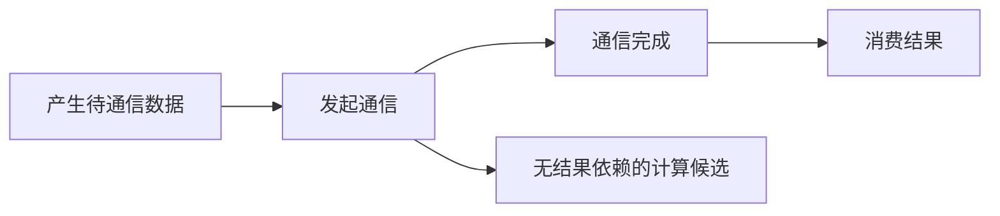

# W7 第三段备课：拓扑、消息曲线与依赖

[单元范围](README.md) · [三段导学](study-guide.md) · [资料复核](refresh-2026-10-01.md) · [上一段](session-02.md)

备课日期：2026-10-01。资料预算：45 分钟。状态：备课已准备；真实拓扑与性能分析待完成。

## 目标与先修

用真实消息曲线描述开销，按证据讨论互连与重叠条件。先有两卡正确性、原始计时和带宽口径；四张 4090 的规划不代表拓扑或 P2P 已验证。

## 读哪里，在哪里停

| 预算 | 原始来源与指定范围 | 停止点 |
| --- | --- | --- |
| 20 分钟 | [CS336 L7 固定讲义](https://github.com/stanford-cs336/lectures/blob/de53a9f979a6ee35f7d13a5e1aadee5ea1afc58e/lecture_07.py) 的 hardware | 拓扑与通信路径示例结束，不套用讲义机器 |
| 15 分钟 | 同文件 benchmarking、all_reduce | 消息规模与计时方法结束 |
| 10 分钟 | 对照自己的消息大小—延迟/带宽图，画消费依赖 | 能区分实测观察与机制推断后停 |

访问日：2026-10-01。Device API 的新能力在 [资料复核](refresh-2026-10-01.md) 中观察，不增加自定义通信 kernel。

## 中文助读

简化模型 T(n)≈α+βn，其中 α 是固定开销，β 是单位字节相关成本；它只描述指定配置与区间，不保证整条曲线线性。小消息可能主要受固定成本影响，大消息才更接近持续搬运区间。

这是依赖示意；能否实际重叠还要看资源、执行路径和测量。存在可并行计算不等于已证实重叠。

## 暂停题与预测

1. 小消息的 GB/s 很低但时间变化很小，更可能体现哪类成本？能凭曲线断言一定使用了某种算法吗？
2. 改两卡选卡组合后性能变化，你需保存哪些拓扑与负载证据？四 GPU 数量能证明 NVLink 或 P2P 存在吗？

先区分曲线形状与机制，再找真实拓扑，最后回 hardware 示例。

## 动手与检查

继续 `labs/04-collectives/allreduce/`。在实际服务器保存 `nvidia-smi topo -m`、所用 GPU 映射、CUDA/NCCL/nccl-tests 版本、其他负载；若需要判断 P2P，另记录相应可用性查询，不把“同机”当证明。

从上段真实原始数据画延迟/带宽与消息大小图，注明对数轴、单位、重复离散与报表组别；选小/大消息区间解释趋势。基础两卡通过后可选四卡，保持同消息定义和dtype，不能只看归一化 busbw 比例。

在报告标出产生—发起—完成—消费顺序和一个可重叠候选；没有时间线或受控实验的重叠写待验证。给 W11 留一条已测消息规模，未来梯度通信估算仍需对应训练语义。

## 卡点与过关

| 卡点 | 最小回看位置 | 重新检查 |
| --- | --- | --- |
| 想从曲线断言算法 | benchmarking、自己的观测 | 是否缺实际通信路径证据 |
| 四卡结果难比较 | hardware、W7-S02 指标定义 | 选卡、rank、消息与归一化因素 |

- [ ] 拓扑和实际运行条件可追溯。
- [ ] 真实曲线与假设模型分别标注。
- [ ] 两卡基础和四卡扩展状态分开。

在 `notes.md` 的 `W7-S03` 整理 [周验收](README.md)。前八个学习位置到此结束，下一单元是 [W8](../week-08-serving-baseline/study-guide.md)，仍按实际开课日期更新。
