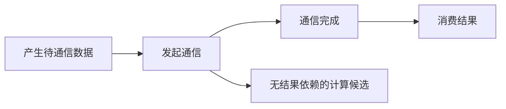
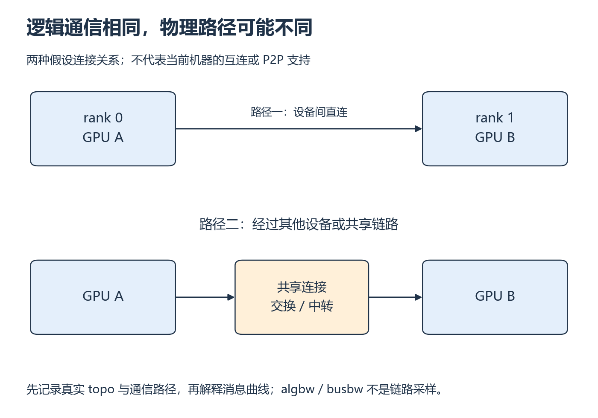

# W7 第 3 段：同一段通信代码，换两张卡为什么会变慢？

[本单元](README.md) · [课程目录](../../course/README.md)

代码规定了进程交换什么数据，硬件连接决定了数据可以沿哪些路径走。看消息曲线之前，先保留选卡、互连和其他负载，避免把设备数量当成拓扑证据。

## 视频与正文

主要阅读下列正文与图解；视频范围待核验。读到暂停题时，先预测再运行。

## 目标与先修

用真实消息曲线描述开销，按证据讨论互连与重叠条件。先有两卡正确性、原始计时和带宽定义；四张 4090 的规划不代表拓扑或 P2P 已验证。

## 读哪里，在哪里停

| 阅读参考 | 原始来源与指定范围 | 停止点 |
| --- | --- | --- |
| 20 分钟 | [CS336 L7 固定讲义](../../resources/training.md#r-l7) 的 hardware | 拓扑与通信路径示例结束，不套用讲义机器 |
| 15 分钟 | 同文件 benchmarking、all_reduce | 消息规模与计时方法结束 |
| 10 分钟 | 对照自己的消息大小—延迟/带宽图，画消费依赖 | 能区分实测观察与机制推断后停 |

访问日：2026-10-01。Device API 的新能力在 [资料复核](../../docs/audits/2026-10-01-week-07.md) 中观察，不增加自定义通信 kernel。

## 中文补充（按需）

李沐 2021 中文[硬件：CPU 和 GPU](https://www.bilibili.com/video/BV1TU4y1j7Wd/)及作者[§12.4.6](https://zh.d2l.ai/chapter_computational-performance/hardware.html)，只用来理解 PCIe、网络和 NVLink 连接哪些设备。正文已预读，视频讲次已确认但未检查画面；旧规格不代表本机拓扑。真实路径、错误日志与通信顺序仍按原课观察。[范围与版本](../../resources/gpu.md#cn-hardware)。

## 逻辑数据流，要经过真实的物理路径

两个 rank 的 AllReduce 语义不随选卡变化，但可用链路、共享瓶颈和软件选择的路径可能变化。下图画两种假设连接，只帮助你知道应去检查什么；当前机器的连接必须用实际 topo 输出确认，P2P 支持还需独立查询。

数据产生后才能发起通信，通信完成后才能消费其结果。中间可以安排不依赖结果的计算，但“依赖允许并行”与“实际发生重叠”不同：它们还可能争用资源。用真实 trace 或受控对照验证，不用流程图代替测量。

简化模型 T(n)≈α+βn，其中 α 是固定开销，β 是单位字节相关成本；它只描述指定配置与区间，不保证整条曲线线性。小消息可能主要受固定成本影响，大消息才更接近持续搬运区间。



这是依赖示意；能否实际重叠还要看资源、执行路径和测量。存在可并行计算不等于已证实重叠。



*比较上下两条路径，找可能被其他流量共享的部分 [放大查看 SVG](../../assets/figures/w07-topology.svg)。暂停：只知道机器有四张 GPU，能否据此选定图中任何一种路径？*

## 暂停题与预测

1. 小消息的 GB/s 很低但时间变化很小，更可能体现哪类成本？能凭曲线断言一定使用了某种算法吗？
2. 改两卡选卡组合后性能变化，你需保存哪些拓扑与负载证据？四 GPU 数量能证明 NVLink 或 P2P 存在吗？

先区分曲线形状与机制，再找真实拓扑，最后回 hardware 示例。

## 读图与自查

```text
简化趋势（示意，无实测值）
小消息：α 占主要部分 → 字节数变了，延迟变化不大 → GB/s 仍可能很低
大消息：βn 占比增加  → 延迟随字节数增长       → 带宽可能趋于平稳
```

把自己的消息点标成小、中、大三组，对照这个解释；若曲线出现拐点，先保留现象，不强行用一条直线覆盖所有区间。

<details>
<summary>写下预测后，再核对本段问题</summary>

**题 1**：小消息低带宽但时间近似固定，符合固定启动/协调成本占比较大的解释。仅凭曲线不能确认某个 NCCL 算法；需实际路径或诊断信息。

**题 2**：至少保留选卡映射、topo 输出、软件版本、消息定义、并发负载和重复测量。四 GPU 的数量不能证明 NVLink 或 P2P 支持。拓扑图描述连接关系，也不能单独替代 P2P 可用性查询。通信完成前只能安排不消费其结果的工作，是否真正重叠还需时间线或对照实验。

保留自己的推导，再与实际结果比较。若不一致，按下面的回看位置找出最早出现差异的一步。

</details>

## 可选：问 AI

先独立作答和核对，仍有疑问时再使用；跳过本节不影响完成本段。

> 这是我的消息曲线摘要、选卡映射和 topo 输出：【粘贴】。请区分可以直接读出的事实与仍缺依据的解释，再问我一个关于通信结果依赖的问题。不要推定 NVLink、P2P 或 NCCL 算法已启用，也不要替我编造重叠收益。

## 动手与检查

继续 `labs/04-collectives/allreduce/`。在实际服务器保存 `nvidia-smi topo -m`、所用 GPU 映射、CUDA/NCCL/nccl-tests 版本、其他负载；若需要判断 P2P，另记录相应可用性查询，不把“同机”当证明。

从上段真实原始数据画延迟/带宽与消息大小图，注明对数轴、单位、重复离散与报表组别；选小/大消息区间解释趋势。基础两卡通过后可选四卡，保持同消息定义和dtype，不能只看归一化 busbw 比例。

在报告标出产生—发起—完成—消费顺序和一个可重叠候选；没有时间线或受控实验的重叠写待验证。给 W11 留一条已测消息规模，未来梯度通信估算仍需对应训练语义。

## 结果不对时，从哪里查起

| 卡点 | 最小回看位置 | 重新检查 |
| --- | --- | --- |
| 想从曲线断言算法 | benchmarking、自己的观测 | 是否缺实际通信路径证据 |
| 四卡结果难比较 | hardware、W7-S02 指标定义 | 选卡、rank、消息与归一化因素 |

- [ ] 拓扑和实际运行条件可追溯。
- [ ] 真实曲线与假设模型分别标注。
- [ ] 两卡基础和四卡扩展状态分开。

在 `notes.md` 的 `W7-S03` 整理 [周掌握检查](README.md)。前八个学习位置到此结束，下一单元是 [W8](../week-08-serving-baseline/README.md)，仍按实际开始学习日期更新。

## 完成后

把代码、预测与实际结果记在同一份笔记中。完成本段检查后，沿下方链接继续。

[上一课](session-02.md) · [下一课](assessment.md)
