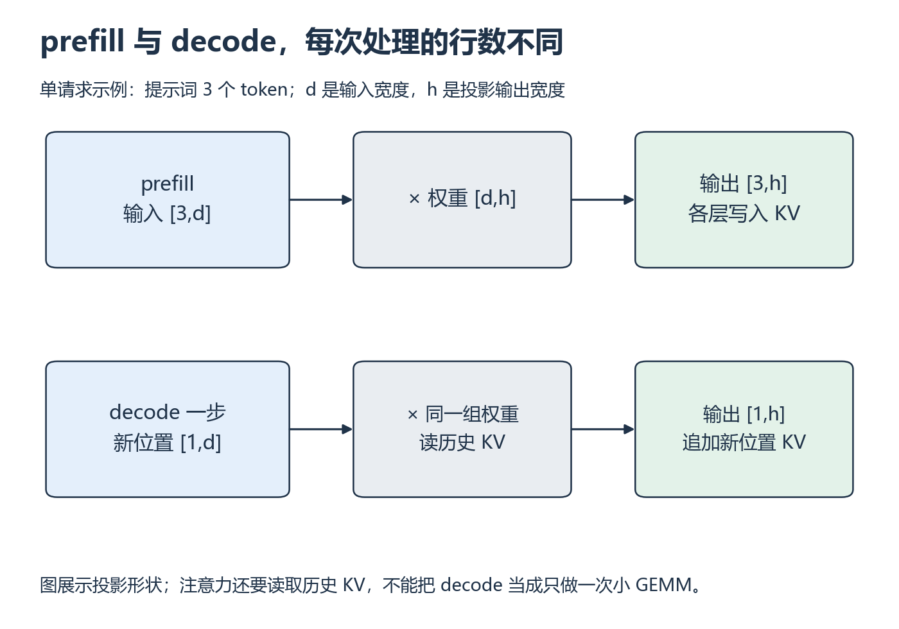
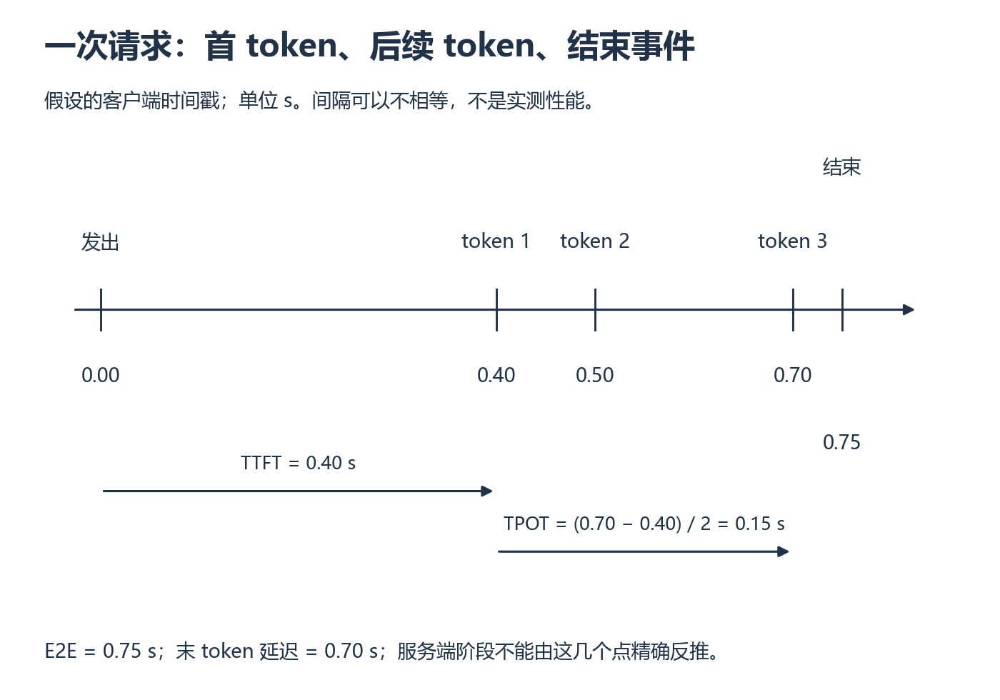

# W8 第 1 段：prefill 和 decode 为什么资源特征不同

[本单元](README.md) · [课程目录](../../course/README.md)

生成式服务为什么会“等了一会儿才开始，然后一个字一个字出现”？首个输出前要处理提示词，随后不断生成新 token。两段工作访问的数据不同，计时也要分开，否则一个平均数会把问题藏起来。

开始前，回忆 W6 中 Q/K/V 的形状，以及 W4 的矩阵乘法计算量。不会读请求 JSON 时先完成 [P6](../../course/foundations/p06.md)；HTTP 请求会在下一段和 [S2](../../course/bridges/s02.md) 中展开，W7 多卡实验不是这里的前提。

## 视频与正文怎么配合

主要讲解：[CS336 2026 Lecture 10 · Inference](https://www.youtube.com/watch?v=EfM546A79aM)。看到 prefill/decode 时暂停，写出两次投影的矩阵形状；看到吞吐与延迟时，画一次请求的时间线。视频分钟位置待核验，可以按下面的讲义函数阅读。

资源定位：[prefill、decode 与请求延迟](../../resources/serving.md#r-inference) → [token、模板与请求格式](../../resources/serving.md#r-token)。

**先看/读**：[CS336 Lecture 10](../../resources/serving.md#r-inference)，配 [lecture_10.py](../../resources/serving.md#r-inference) 的 `review_transformer`、`arithmetic_intensity_of_inference`、`throughput_and_latency`。量化、推测解码先跳过。

先读 [token 与模板](../../resources/serving.md#r-token) 的 tokenizer 开篇和 BPE 小例子，再读推理讲义。两部分预计约 15 与 60 分钟；已看懂视频的重复内容可在讲义中回查，不必再完整读一遍。请求 JSON 留在下一段。

**卡点补充**：[Scaling Book Part 7](../../resources/serving.md#r-inference) 的 `The Basics of Transformer Inference` 与 `What do we actually want to optimize?`，补充算术强度与指标的解释；与视频重复部分不再重读；不进入多加速器部署章节。

## 先弄清模型每一步接收什么

token 是 tokenizer 给文本编码后的编号，不等于一个汉字或单词。相同文本使用不同 tokenizer、模板或特殊符号，token 数可能不同。聊天模板把角色和内容组织成模型接收的序列；本单元固定 tokenizer revision 和模板，再核对真实输入长度。

提示词先经过聊天模板，再由 tokenizer 编成输入 ID 序列。**预填充（prefill）**一次处理这批已有位置，产生各层的 Key/Value，并得到首个输出 token 所需的结果。随后进入**逐步解码（decode）**：将新 token 加入序列，读取已有 KV，计算新位置并继续生成。下一步需要前一步选出的 token，因此同一个请求的这些步骤有依赖关系。

对一个无 batch 合并的请求，prefill 的投影可看作 (S,d)×(d,h)，单步 decode 为 (1,d)×(d,h)；后者仍需访问权重，不能仅凭计算少就认定利用率高。KV 保存各层历史位置的 Key/Value，并非上一轮的整个分数矩阵。

*先比较两排输入行数，再看权重与 KV 哪些仍要访问 [放大查看 SVG](../../assets/figures/w08-prefill-decode.svg)。暂停：若提示词长度翻倍，prefill 投影的输入行数与参数数量分别怎样变化？*

## 客户端看到的时间，怎样拆开？

假设客户端在 0 秒发出请求，在 0.40、0.50、0.70 秒收到三个 token，在 0.75 秒收到结束事件。下图只用来练习计时，不代表任何模型的速度。

*从左到右读事件，再看下面的计时间隔。[放大查看 SVG](../../assets/figures/w08-request-timeline.svg)。暂停：如果结束事件推迟到 0.90 秒，哪些指标改变，哪些保持原值？*

**首 token 延迟（TTFT）**从发出请求算到首个输出，例子中为 0.40 秒。它可能包含网络、排队、分词和 prefill；不能把它直接叫作 GPU prefill 时间。

**平均每个后续 token 的时间（TPOT）**是首末 token 之间的时长除以间隔数。三个 token 只有两个间隔，因此 (0.70−0.40)/(3−1)=0.15 秒。两个实际间隔分别是 0.10 和 0.20 秒；均值没有说明它们一样长。

**端到端延迟（E2E）**还取决于结束口径。这里计到协议结束事件，所以为 0.75 秒；“发出到末 token”则是 0.70 秒。若只延后结束事件，E2E 改变，TTFT 与 TPOT 不变。计时起止点写清楚，比只记住指标名称更有用。

## 换一组时间自己算

**暂停题**：请求在 0 秒发出，三个输出 token 分别在 0.20、0.25、0.30 秒到达。TTFT、平均 TPOT、末 token 延迟各是多少？只输出一个 token 时呢？

先写答案，再核对

TTFT=0.20 秒；平均 TPOT=(0.30−0.20)/(3−1)=0.05 秒；发出到末 token 是 0.30 秒。若协议结束消息更晚到达，完整请求 E2E 还应计至结束事件，不能用末 token 偷换。只有一个 token 时 TPOT 分母为零，记录不适用，不能填 0。这个例子假设逐 token 到达；真实 streaming chunk 可能含多个 token，客户端接收时间也不等于 GPU 生成时间。

**动手练习**：画单请求的发送、首 token、后续 token、结束时间轴；用几个假设时间戳手算 TTFT、TPOT 和端到端延迟，写明不足 2 个输出 token 的处理。

**检查结果**：区分请求延迟、GPU kernel 延迟与输出吞吐，不将“生成更快”当成未定义指标。

## 完成后

能画出请求事件并解释三个计时区间后，继续启动服务，观察实际请求怎样经过这些步骤。

[上一课](README.md) · [下一课](session-02.md)
