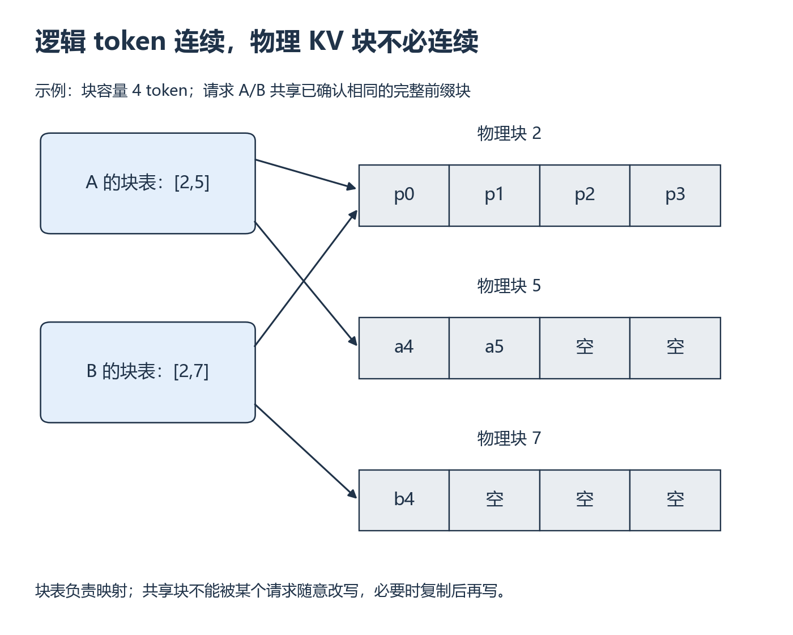

# W9 第 2 段：共享前缀以后，谁可以修改那块 KV？

[本单元](README.md) · [课程目录](../../course/README.md)

两个请求可能从相同前缀开始，后面却生成不同内容。共享能减少重复保存，但必须保持每个请求看到的历史仍正确。先看块表，再讨论分叉时的复制。

## 视频与正文

主要阅读下列正文与图解。视频范围待核验；已看懂的重复内容只需回查。

## 开始前

先算过上一段的有效 KV 与块容量；共享与复制的区别可回看 [W1](../week-01-foundations/session-02.md)。

资源定位：[KV 容量、分页和共享](../../resources/serving.md#r-paged)。

**先读**：同一论文 §4.3 的基本解码流程和 §4.4 开头的 parallel sampling / copy-on-write 案例。读到能更新块表和引用计数即可，beam search 的完整执行细节作为进阶。

**配套视频**：[CS336 Lecture 10](../../resources/serving.md#r-inference) 配 [讲义](../../resources/serving.md#r-inference) 的 `paged_attention`，用于图解仍不清楚时，替换本段部分阅读。

## 用逻辑位置查表，再找物理块

下图每块容纳 4 个 token。A 的块表是 [2,5]，B 是 [2,7]；两者第一个逻辑块都指向物理块 2，后面的续写落在不同块。读取 A 的第 4 号 token 时，4÷4 得逻辑块号 1、块内偏移 0，再查到物理块 5。

共享的完整前缀保持不变时可以继续复用。如果两条路径需要修改同一共享块，就要先让需要修改的路径拥有独立数据，即写时复制（copy-on-write）的思想。具体实现支持哪些共享粒度，需要按所用版本核对。

**例子与图解：逻辑块不等于物理位置**

*先从左侧块表找映射，再看右侧块内 token 与空位 [放大查看 SVG](../../assets/figures/w09-kv-pages.svg)。暂停：A 再生成一个 token，当前尾块是否已经必须新申请一块？*

物理块号是示意编号，不是 GPU 地址。图中请求 A 的第 4 号 token 位于物理块 5 的偏移 0；换一个块表，逻辑位置可以不变而物理位置改变。

**暂停题**：若两个请求共享的尾块里只写了 3 个 token，接下来各生成不同 token，能直接在原共享块写入吗？

核对依据

不能让一方覆写另一方仍需读取的前缀。论文的共享与 copy-on-write 机制会为需要独立修改的路径建立副本或独立块，再更新映射；完全填满且不变的前缀块可继续共享。实际 vLLM APC 的缓存粒度与支持条件按本机版本文档核对，论文示意不保证当前实现共享所有部分块。

**动手练习**：手工更新“相同前缀、不同续写”的块表，指出共享、分叉和释放各涉及什么。随后拟定共同前缀与独立前缀的两组输入，检查 token IDs，而不是只比较肉眼相似的文本。

**检查结果**：将论文中的共享场景与自己准备测的跨请求 APC 区分，不能直接视为完全相同的当前实现。

## 完成后

把代码、预测与实际结果记在同一份笔记中。完成本段检查后，沿下方链接继续。

[上一课](session-01.md) · [下一课](session-03.md)
