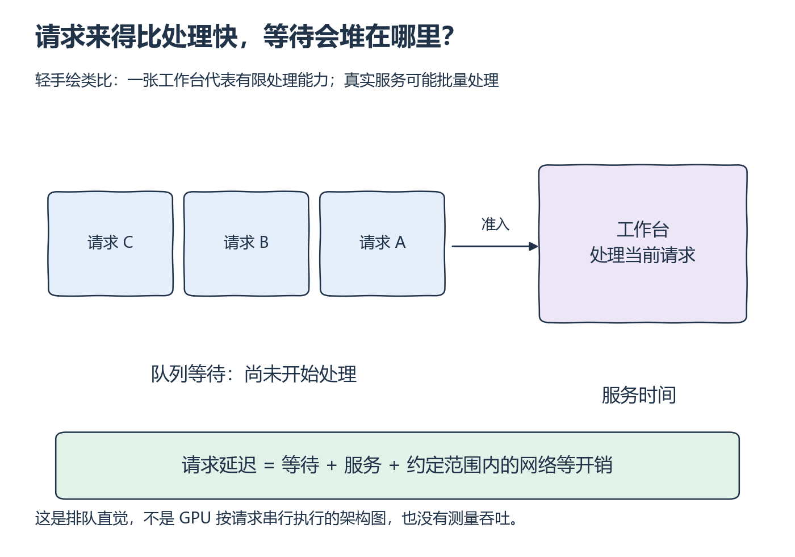

# W10 第 1 段：配置了 20 req/s，服务就一定收到了吗？

[本单元](README.md) · [课程目录](../../course/README.md)

请求生成器也有自己的等待。并发名额被占满后，计划发出的请求可能仍留在客户端；因此配置到达率、实际发送率和完成吞吐要分别记录。

## 视频与正文

先看 [CS336 2026 Lecture 10 · Inference](https://www.youtube.com/watch?v=EfM546A79aM)：continuous batching 与请求负载；暂停区分计划到达率、实际发送率和完成吞吐。

视频分钟位置待核验；下列章节或函数用于正文定位，也可以直接按正文完成练习。

## 开始前

先完成 W8/W9 的请求与缓存检查，分位数回 [M4](../../course/prerequisites.md)；本段从一个并发门限例子开始。

资源定位：[负载、明细和统计字段](../../resources/serving.md#r-bench)。

**先读**：[bench serve](../../resources/serving.md#r-bench) 的 `--request-rate`、`--burstiness`、`--max-concurrency`；统计部分看 `--percentile-metrics`、`--metric-percentiles`、`--goodput`。每个参数先核对安装版本，再写入配置。

**接着想一想**：把 W8 时间轴扩成多请求图。预定发送、真实发送与服务完成可能有不同速率；并发上限会使负载发生变化，不能仅凭配置标签称为固定到达率实验。

## 请求开始处理之前，可能已经排了两次队

**到达率**表示单位时间计划产生多少请求，**并发数**表示同时未完成的请求数量。它们单位不同，也不是可互换的两个速度参数。客户端可能先因并发名额等待，发出后还可能在服务端排队。

下图用排队与工作台作类比：工作台表示有限的处理能力，并不意味着真实 GPU 必须逐请求串行运行。连续批处理仍受资源约束；增加请求数以后，吞吐未必继续增长，等待和尾延迟却可能上升。

*先看谁还没进入工作台，再看谁已经占用处理能力 [放大查看 SVG](../../assets/figures/w10-queue-intuition.svg)。暂停：如果每秒进入的工作持续超过每秒完成的工作，队列会怎样变化？*

**例子与图解：负载参数有不同职责**

~~~text
计划到达 → 客户端并发门限 → 实际发出 → 服务端等待 → 执行 → 完成
                ↑                                      ↓
                └─────────── 释放并发名额 ──────────────┘
~~~

**暂停题**：设置每秒 20 个请求、并发上限 2，单请求约 1 秒，能否仅凭配置声称服务器收到 20 req/s？

核对依据

不能。在这个简化稳定例子里，两份名额约每秒只允许完成 2 个请求；客户端可能等待、积压或按工具规则限制发送。保存计划/实际发送时间、并发触顶与失败记录。固定随机种子与轨迹，先改长度分布，再单独改到达强度，避免一起变动后归因。

**动手练习**：第一组固定上限扫至少 3 个计划到达率；第二组固定计划到达率扫至少 3 个上限。保留实际发送、测量窗口、完成/失败数，检查是否触顶。

**检查结果**：能说清每组实验控制了什么、实际观测又是什么，图例不将二者混写。

## 完成后

把代码、预测与实际结果记在同一份笔记中。完成本段检查后，沿下方链接继续。

[上一课](README.md) · [下一课](session-02.md)
