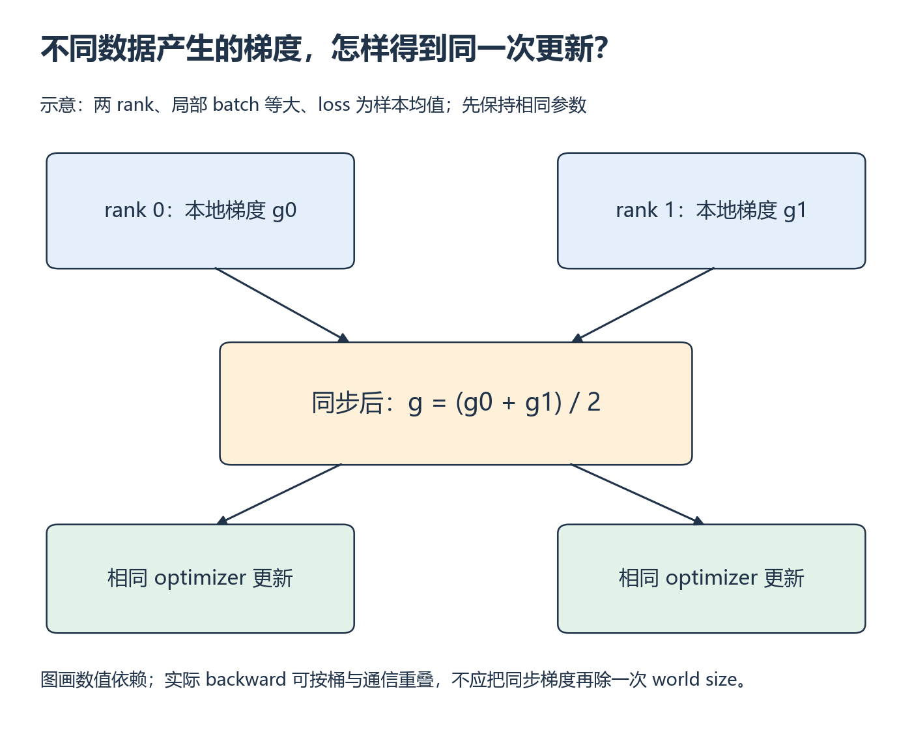

# W11 第 2 段：平均本地梯度，什么时候等于全局平均梯度？

[本单元](README.md) · [课程目录](../../course/README.md)

DDP 同步之后，各模型副本应按相同梯度更新。但“先在本地取平均，再对 rank 取平均”有条件：各 rank 的样本权重必须与你想比较的全局 loss 一致。

## 视频与正文

主要阅读下列正文与图解。视频范围待核验；已看懂的重复内容只需回查。

## 开始前

上一段已核对样本 ID 和初始化；链式法则不熟时回 [M3 与单卡训练 D](../../course/prerequisites.md)。

资源定位：[梯度同步和公平更新](../../resources/training.md#r-ddp)。

**先读**：[DDP 入门](../../resources/training.md#r-ddp) 的 `Basic Use Case`、`Skewed Processing Speeds`、`Save and Load Checkpoints`；先跳过与模型并行组合的示例。

**接着想一想**：以 W7 的 AllReduce 数据量和 W1 参数账本估算梯度通信规模，再用 W6 的时间线方法检查实际同步位置。

## 样本数相等时，先平均再平均才自然对齐

若两个 rank 各有相同数量的样本，并且 loss 都按局部样本均值计算，那么两份梯度的平均就是所有这些样本的平均梯度。若一边有 1 个样本、另一边有 3 个，两份本地均值等权平均就把小 batch 中的样本权重放大了；需要按全局目标重新处理权重。

下图只画数值依赖。实际 backward 可以一边产生梯度桶，一边进行通信，最后 optimizer 才消费完成同步的梯度。计时要看真实重叠情况，不能把图画成顺序就认为实现一定完全串行。

*先追踪本地梯度的来源，再看共享的平均值如何回到两侧 [放大查看 SVG](../../assets/figures/w11-gradient-sync.svg)。暂停：如果初始模型参数不同，只同步梯度能否保证这一步之后参数相同？*

**例子与自查：DDP 平均的是哪一个梯度**

用标量模型 ŷ=w×x，loss=(ŷ−y)²，w=0，SGD 学习率 0.1。rank0 仅有 (x=1,y=1)，rank1 仅有 (x=3,y=3)。先手算两份梯度、平均梯度与一步后的 w。

核对推导

梯度为 2(wx−y)x：rank0 得 −2，rank1 得 −18；两者平均 −10，更新后 w=0−0.1×(−10)=1。单卡对同两样本取平均 loss 得到同一梯度。该推导要求各 rank 样本数相等、loss reduction 和累积缩放一致；不同样本数的“本地均值再平均”不自动等于全局样本均值。DDP 的默认梯度同步处理平均；不能再手动除一次 world size。

**动手练习**：先固定累积步数为 1，用 microbatch 调整保持全局 batch 不变；比较 1/2 卡的一次更新、稳态 step time、吞吐和峰值显存。若增加累积，必须另查所用版本的 `no_sync` 与 loss 缩放规则，不能沿用未经核对的假设。

**检查结果**：loss/参数差异在规定容差内；比较处理的样本数、计时边界一致，解释小模型通信开销可能占主导。

## 完成后

把代码、预测与实际结果记在同一份笔记中。完成本段检查后，沿下方链接继续。

[上一课](session-01.md) · [下一课](session-03.md)
