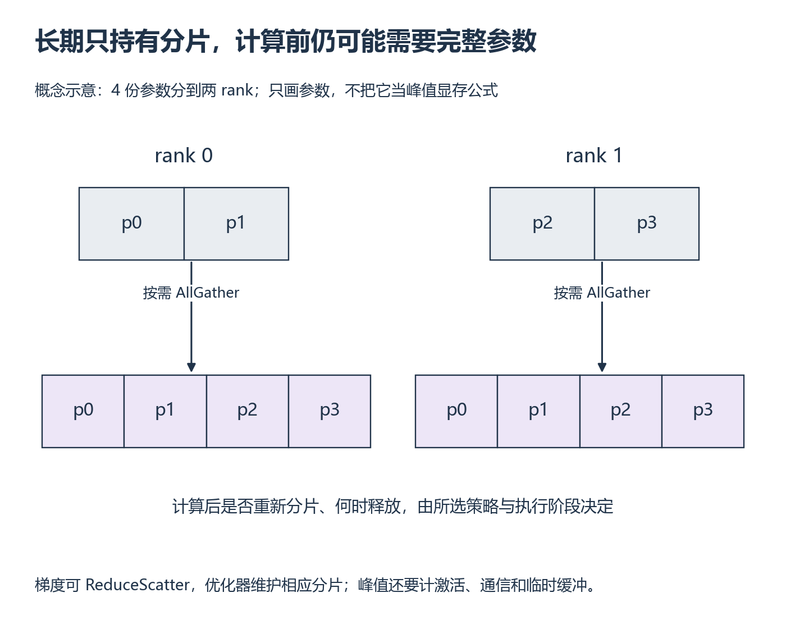

# W12 第 2 段：平时只留分片，执行这一层时怎么办？

[本单元](README.md) · [课程目录](../../course/README.md)

分片以通信换取较少的重复存储。把聚合、计算和重新分片放到执行顺序中，才能理解为什么同一个模型在不同时间看到的显存占用不一样。

## 视频与正文

主要阅读下列正文与图解。视频范围待核验；已看懂的重复内容只需回查。

## 开始前

先完成上一段状态账本，继续使用 W11 的模型、global batch、精度与优化器。

资源定位：[FSDP2 参数聚合与分片](../../resources/training.md#r-fsdp)。

**先读**：[FSDP2 教程](../../resources/training.md#r-fsdp) 的 `How to use FSDP2 → Model Initialization`、`Forward/Backward with Prefetching`。继续读梯度裁剪与 DTensor 优化器相关说明，确认参数对象和状态的位置。本周精度先沿用 DDP；Mixed Precision 章节按需再看。

**接着想一想**：在一张前向/反向图上标参数聚合和梯度通信，结合 W7 解释数据量和等待。教程预取用于理解时序，不要求把所有预取参数都调一遍。

## 在需要完整参数的边界前聚合

下图把四份参数分给两个 rank：一侧长期持有 p0、p1，另一侧持有 p2、p3。执行需要这些完整参数的计算前，各侧通过 AllGather 得到所需数据。反向后，梯度可以用 ReduceScatter 归约并分回相应所有者，优化器维护对应分片的状态。

图是依赖示意，不承诺某个配置一定在每一层之后立刻释放参数。预取和保留策略会改变哪些数据同时存在；峰值因此必须覆盖真实 forward、backward 和 optimizer step，不能只在初始化后读一次内存。

**例子与图解：存储形态随时间改变**

*上排看长期持有者，下排看计算时需要的数据 [放大查看 SVG](../../assets/figures/w12-shard-gather.svg)。暂停：若参数聚合与下一层预取同时存在，峰值为何可能超过稳定分片大小？*

这是帮助定位通信的概念图；预取、保留参数和重分片策略会改变具体时序。按官方例子先 fully_shard，再创建 optimizer，避免优化器引用错误的参数对象。

**暂停题**：只在模型初始化后读取显存，是否足够对照 Adam 状态和执行峰值？

核对依据

不够。Adam 状态可能在首次更新时才建立；须完成真实 optimizer step，再分别记录稳定持有状态和训练区间峰值。保持 W11 模型、global batch、精度与计时边界，双方可运行的配置才比较速度。DDP OOM 另列为容量结果，不能记成吞吐 0 再算加速比。

**动手练习**：保持 W11 的模型、精度、优化器和全局 batch，在 2 卡上比较 DDP/FSDP2；包含完整 optimizer step 后的状态，测稳态吞吐和峰值显存。

**检查结果**：正确性与测量范围一致；DDP OOM 的配置单列，另选双方可运行的配置比较速度。

## 完成后

把代码、预测与实际结果记在同一份笔记中。完成本段检查后，沿下方链接继续。

[上一课](session-01.md) · [下一课](session-03.md)
