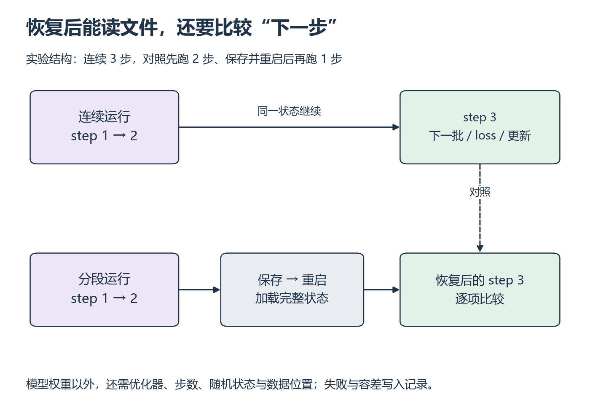

# W12 第 3 段：权重一样，为什么恢复后的下一步仍然不同？

[本单元](README.md) · [课程目录](../../course/README.md)

优化器动量、随机数和数据位置都会影响下一步。保存文件只是让状态能够被读回；恢复是否正确，要用同一初始条件下的连续运行作对照。

## 视频与正文

主要阅读下列正文与图解。视频范围待核验；已看懂的重复内容只需回查。

## 开始前

先完成 S5 的文件读回，能解释模型和 Adam 状态；保持本次 world size 与环境一致。

资源定位：[FSDP2 参数聚合与分片](../../resources/training.md#r-fsdp) → [模型、优化器与应用状态恢复](../../resources/training.md#r-dcp)。

**先读**：FSDP2 教程的 `State Dict with DCP APIs`，再联读 [DCP 教程](../../resources/training.md#r-dcp) 的 `How DCP works`、`Saving`、`Loading`，追踪 `get_state_dict` / `set_state_dict` 的状态处理。

**接着想一想**：所选 DCP 页面使用 `fully_shard`，与 FSDP2 教程联读其 state-dict 路径；开始实验仍须匹配安装版本。模型和优化器之外的步数、RNG 和数据进度需要明确保存方案。

## 固定保存边界，才能列完整状态

本实验选择完成一个 step、清理梯度、尚未取下一批的边界保存。这样不必处理梯度累积中途尚未完成的贡献，但仍要保存模型、优化器、步数、随机状态与数据位置；使用学习率调度器或 scaler 时也要处理它们。

对照不是“保存前参数与加载后参数相同”就结束。恢复后还要取到相同下一批，用相同随机条件计算，并比较 loss、更新后的参数和必要的优化器状态。若下一批 ID 已不同，先修数据进度，不要立刻把浮点误差当成原因。

**例子与自查：恢复要接上同一次更新**

*先找两条路径共同的保存前状态，再对齐恢复后的下一步 [放大查看 SVG](../../assets/figures/w12-next-step.svg)。暂停：只加载模型、重新创建空 Adam 状态，第三步还能保证与连续运行相同吗？*

**暂停题**：下面哪些状态需要恢复或可重建：模型、Adam 状态、step、随机数状态、下一批样本位置、AMP scaler、学习率 scheduler？保存了文件为什么还不能写“恢复通过”？

核对清单

恢复时至少处理模型、优化器、step、RNG 和数据进度；使用 scaler/scheduler 时也要保存相应状态，否则明确标不适用。多 rank 的 RNG/数据位置要逐 rank 处理或使用可说明的确定性重建方案。保存时点固定在完成 step 后、梯度已清理且下一批尚未取出的边界，避免遗漏累积中途梯度。DCP 负责状态保存/加载的机制，应用侧仍需声明并恢复这些对象。所选 DCP 示例使用 fully_shard；沿 FSDP2 的 state-dict 路径核对版本即可。

比较恢复后的下一批样本 ID、loss、参数，以及必要优化器状态；容差事先写明，保持 world size 和环境相同。出现差异按初始化→数据→RNG→模型→优化器/调度状态顺序排查。只有文件生成而没有重启后的下一步比较，仍为待验证。

**动手练习**：确定性小配置运行两条路径：连续训练，与中断后重启恢复；比较恢复后的下一步 loss/参数。保持 world size 和依赖环境相同。

**完成后检查**：恢复验证涵盖优化器与训练进度，报告里能找到状态清单及比较结果。

## 整理记录与可选拓展

在 `labs/06-training/fsdp2/` 保存状态账本、DDP/FSDP2 对照和恢复验证记录；关联训练项目，不复制 W11 的数据与测量实现。

进阶只选跨 world size 恢复或 activation checkpointing，分别另设正确性和性能检查，与同 world size 的实验结果分开记录。

## 完成后

把代码、预测与实际结果记在同一份笔记中。完成本段检查后，沿下方链接继续。

[上一课](session-02.md) · [下一课](assessment.md)
