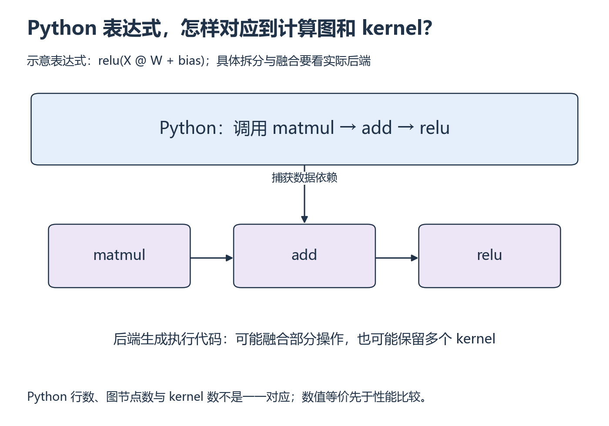

# W13 第 1 段：一行 Python，会变成几个 kernel？

[本单元](README.md) · [课程目录](../../course/README.md)

把模型交给编译器后，Python 表达式、计算图和设备 kernel 不再有简单的一一对应。先理解这三个层次，再比较同一输入下的输出，最后才计时。

## 视频与正文

先看 [CS336 2026 Lecture 6](https://www.youtube.com/watch?v=xnDHaNUvHBg)：eager 与 compiled 计算；暂停区分首次编译和稳定运行，不把编译成本隐藏。

视频分钟位置待核验；找不到对应主题时，按下列正文范围阅读。重复内容只需回查。

## 目标与先修

先确认 eager 与 compile 算同一件事，再讨论优化。先通过 W6 的 Block 与测量，优先沿用可用 Linux 单卡环境；本机 Windows CPU 检查不代表 GPU 编译已就绪。

## 读哪里，在哪里停

| 阅读参考 | 原始来源与指定范围 | 停止点 |
| --- | --- | --- |
| 15 分钟 | [CS336 L6 视频](../../resources/gpu.md#r-l6)，配 [固定讲义](../../resources/gpu.md#r-l6) 的 naive_vs_builtin_vs_compiled_gelu | 只理解三组比较方法，不新增 GELU 项目 |
| 20 分钟 | [torch.compile 教程](../../resources/models.md#r-compile) 的 Basic Usage | 函数/模块包装与调用结束 |
| 10 分钟 | 对照自己的 W5 表达式或 W6 Block | 列出输入、dtype、dropout、autograd 与误差约定 |

访问日：2026-10-01。教程环境显示 2.14.0+cu130，实际环境另记录。

## 表达式描述计算，图描述依赖，kernel 执行工作

`relu(X @ W + bias)` 包含矩阵乘法、加法与激活。计算图记录它们之间的数据依赖，后端再选择怎样生成执行代码；有些操作可能融合，有些仍独立。不能从 Python 行数推断 kernel 数，也不能从 kernel 数变少直接推出整个 Block 变快。

**即时执行（eager）**和编译路径应使用同一组参数、输入与数值约定。编译包装只是准备入口，第一次接到真实输入时还可能发生捕获和代码生成。先按图比较输出，后面的时间才有可比性。

compile 可以捕获、优化和生成执行代码，但不改变实验应比较的数学目标。编译包装与首次真实调用不是同一时间边界。融合、kernel 数和整体延迟是不同证据，先把输出对齐作为前提。

复用已有表达式或模型，固定参数和输入；避免在两路径之间更换 dtype、dropout 或 grad 模式。Triton 第三组只有语义与精度可比时才加入。

## 暂停题与预测

1. 编译包装很快，是否意味着没有编译启动成本？实际工作可能在哪一步发生？
2. eager 在 eval、compile 在 train，输出不同能归因于编译器吗？还需核对哪些条件？

先列调用阶段，再列数学与运行条件，最后回 Basic Usage。

## 读图与自查

*先从表达式拆出三种运算，再沿图边确认谁依赖谁 [放大查看 SVG](../../assets/figures/w13-graph-kernels.svg)。暂停：如果 add 与 relu 融合了，矩阵乘法的数学输出与 bias 语义可以随意改变吗？*

图中先比较输出，再进入下一段的计时。包装函数与真正给输入执行是两个步骤；不能把包装耗时当成完整编译成本。

写下预测后，再核对本段问题

**题 1**：包装阶段很短也可能尚未完成实际捕获和代码生成，首次遇到真实输入时才支付这些成本。需要把包装、首次调用与后续调用分别记录。

**题 2**：train/eval 可能改变 dropout 或某些模块行为，输出不同不能先归因于编译器。还需对齐参数、输入、随机状态、dtype、autograd、后端与数值容差。若条件不一致，回到图中公共输入处逐项检查。

保留自己的推导，再与实际结果比较。若不一致，按下面的回看位置找出最早出现差异的一步。

## 可选：问 AI

先独立作答和核对，仍有疑问时再使用；跳过本节不影响完成本段。

> 我的 eager/compile 对照条件是【输入、参数、dtype、eval、dropout、autograd 和容差】，结果为【误差或报错】。请先检查是否在比较同一计算，只追问一个缺失条件，再建议最小核对步骤。不要直接重写模型或承诺编译必然加速。

## 动手与检查

实验目录：`labs/03-triton-attention/systems-study/`，引用 W5/W6 实现，不复制一份 Block。动手时加入 `compare_compile.py` 的编排入口，固定一组 shape 与随机输入。

保存实际 Python/PyTorch/Triton/CUDA、设备与 compile 配置，检查输出最大绝对/相对误差；先设容差，再核对。前向实验使用 eval、dropout=0，autograd 是否关闭按 W6 对齐。编译失败保留错误和 eager 基线，修环境另计，不把失败写成速度 0。

## 结果不对时，从哪里查起

| 卡点 | 最小回看位置 | 重新检查 |
| --- | --- | --- |
| 输出不一致 | Basic Usage、W6 语义记录 | 参数/随机性/精度是否相同 |
| 环境不支持 | 教程与本机实际版本/错误 | 区分接口使用与后端依赖 |

- [ ] 两路径语义与数值对齐。
- [ ] 版本、配置、失败与限制可追溯。
- [ ] 复用已有实验而非新造模型。

在 `notes.md` 的 `W13-S01` 留下预测、命令与问题；通过后进入 [第二段](session-02.md)。

## 完成后

把代码、预测与实际结果记在同一份笔记中。完成本段检查后，沿下方链接继续。

[上一课](README.md) · [下一课](session-02.md)
