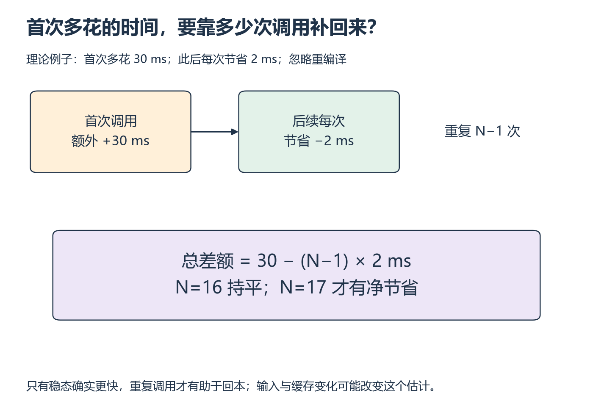

# W13 第 2 段：第一次慢下来，后面能省回来吗？

[本单元](README.md) · [课程目录](../../course/README.md)

编译可能让重复计算变快，却增加第一次调用成本。你需要运行多少次才值得等待，取决于两种时间差；只报告最快的一次稳态延迟会漏掉这个问题。

## 视频与正文

主要阅读下列正文与图解；视频范围待核验。读到暂停题时，先预测再运行。

## 目标与先修

分别测量首次和稳态，判断单算子收益能否传到模型。先通过 eager/compile 正确性，继续固定同一输入和环境。

## 读哪里，在哪里停

| 阅读参考 | 原始来源与指定范围 | 停止点 |
| --- | --- | --- |
| 25 分钟 | [torch.compile 教程](../../resources/models.md#r-compile) 的 Demonstrating Speedups | 预热与计时方法结束，不抄示例加速比 |
| 15 分钟 | [CS336 L6 固定讲义](../../resources/gpu.md#r-l6) 的 benchmarking | 同步与重复计时核对完成 |
| 20 分钟 | 回看 W6 算子表和时间线方法，画两阶段时间区间 | 首次/稳态、算子/Block 的边界完整即停 |

本段只比较已有表达式和 Block；区域编译属于后续选读。

## 用累计时间比较，而不是只看一次调用

设首次多花 ΔF，后续每次节省 Δt，总共调用 N 次，则额外时间为 ΔF−(N−1)Δt。减 1 是因为首次调用已经单独计过，不能再次算成普通稳态调用。

下图用额外 30 ms、每次节省 2 ms 演示：需要 15 次后续调用，加上首次共 16 次才持平；第 17 次才有净节省。如果后续并没有更快，重复调用也无法补回正的首次差额。输入或缓存状态改变时，要重新检查这个估计是否适用。

*先分开首次与后续，再把后续次数写成 N−1 [放大查看 SVG](../../assets/figures/w13-amortization.svg)。暂停：若只调用 10 次，编译路径在这个假设中仍多花多少时间？*

图表示阶段，未填实测时间。新进程仍可能复用磁盘缓存，不能只凭“新进程”宣称彻底冷编译。首次调用含哪些缓存与设备初始化成本必须记录。

令 ΔF 为 compile 与 eager 的首次调用时间差，Δt 为 eager 与 compile 的稳态单次时间差。总共调用 N 次时，compile 相对 eager 多花的时间约为 `ΔF − (N−1)×Δt`。当 ΔF>0 且 Δt>0，首次之后还需 `ceil(ΔF/Δt)` 次调用，总次数要再加 1。Δt≤0 时，增加调用次数不能摊平正的首次差额。此估算假设后续不重编译、输入与缓存条件保持一致。

## 暂停题与预测

1. 若首次调用多花 2 秒、后续每次节省 0.5 毫秒，首次之后还需多少次调用持平？包含首次的总次数是多少？这能直接预测实际服务冷启动吗？
2. 单算子快两倍、只占模型时间 10%，整体理想收益能到两倍吗？时间线还可能出现哪些限制？

先统一秒/毫秒，再列占比和边界，最后回两套计时方法。

## 读图与自查

| 调用范围 | eager 累计时间 | compile 累计时间 |
| --- | --- | --- |
| 第一次 | F_eager | F_compile |
| 此后 N−1 次 | (N−1)×t_eager | (N−1)×t_compile |
| 总时间 | F_eager+(N−1)×t_eager | F_compile+(N−1)×t_compile |

对照上面的阶段图，分别圈出首次与稳态两行。表中是代数关系，尚未填本机测量；回本指 compile 总时间不再多于 eager。

写下预测后，再核对本段问题

**题 1**：Δt=0.0005 秒，首次之后还需 2/0.0005=4000 次，总调用次数为 4001。持平不等于已经有净节省；该估算也没有覆盖服务加载、排队或不同缓存状态，不能直接预测冷启动。

**题 2**：原总时间归一化为 1，优化后理想时间=0.9+0.1/2=0.95，整体加速约 1/0.95=1.053 倍。前提是其他区段不变且没有新增开销；应再看时间线的依赖与提交间隙。若两条稳态路径没有正的时间差，就不能靠反复调用摊平正的首次差额。

保留自己的推导，再与实际结果比较。若不一致，按下面的回看位置找出最早出现差异的一步。

## 可选：问 AI

先独立作答和核对，仍有疑问时再使用；跳过本节不影响完成本段。

> 这是我的首次和稳态记录：【F_eager、F_compile、t_eager、t_compile、单位、缓存条件】。请先让我推导 N 次调用总时间，再检查回本公式是否漏了首次。然后用我的热点占比核对整体收益，不能用教程加速比替代数据。

## 动手与检查

继续 `labs/03-triton-attention/systems-study/`。分别测 eager/compile 的首次调用、预热后稳态；对已有算子与同一 Block 各留一组，固定精度、输入、autograd 和同步范围。

按共同测量约定保留三组原始数据，记录新进程、已有磁盘缓存、所用 compile 配置以及是否计初始化/分配。缓存未知就写未知，私有清缓存函数不作稳定默认依赖。正式计时无 profiler，代表性 trace 用于解释区段/kernel 变化。

未加速也是有效结果；保存模型与算子的实际 Δt、ΔF 和条件，不能只报告最佳一组。

## 结果不对时，从哪里查起

| 卡点 | 最小回看位置 | 重新检查 |
| --- | --- | --- |
| 首次成本忽高忽低 | Demonstrating Speedups、自己的缓存记录 | 初始化/缓存状态是否一致 |
| kernel 少但模型不快 | W6 时间线 | 关键路径与未优化区段 |

- [ ] 四类比较边界清楚：算子/模型、首次/稳态。
- [ ] 原始数据与缓存条件齐全。
- [ ] 回本推导适用条件明确，无收益如实记录。

在 `notes.md` 的 `W13-S02` 留下预测、命令和解释；通过后进入 [第三段](session-03.md)。

## 完成后

把代码、预测与实际结果记在同一份笔记中。完成本段检查后，沿下方链接继续。

[上一课](session-01.md) · [下一课](session-03.md)
