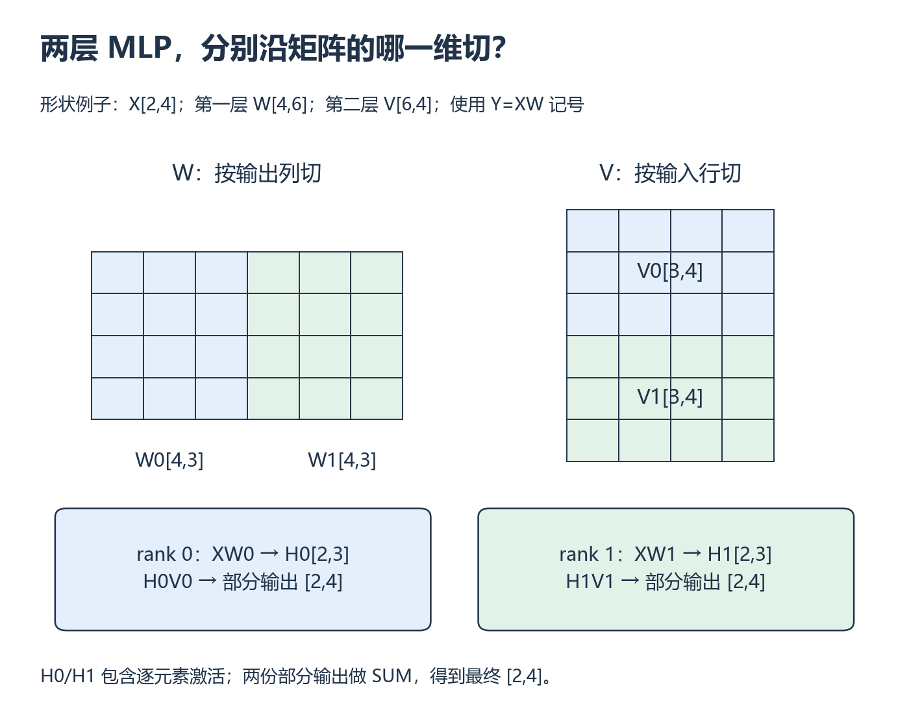
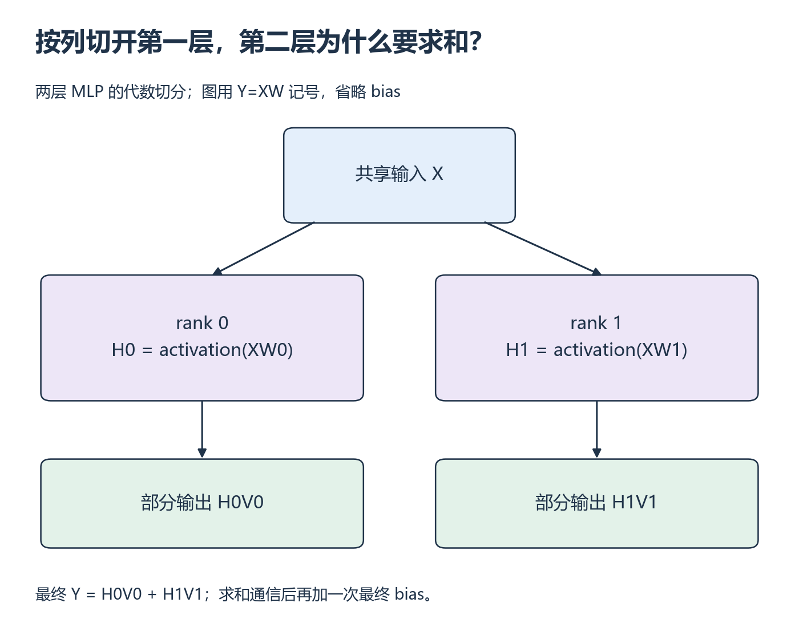

# W14 第 1 段：切开权重以后，激活函数还能各算各的吗？

[本单元](README.md) · [课程目录](../../course/README.md)

张量并行的难点不仅是把矩阵切小，还要保持原计算顺序。完整输出列可以独立做非线性，未合并的部分和却通常不行；一个两层 MLP 足以看出差别。

## 视频与正文

先看 [CS336 2026 Lecture 7 · Parallelism](https://cs336.stanford.edu/)：从课表 Recordings 打开对应讲次；TP 部分暂停画一个 Linear 的切分与通信。

视频分钟位置待核验；下列章节或函数用于正文定位，也可以直接按正文完成练习。

## 开始前

先会 W4 矩阵乘法与 W7 通信；按顺序完成 W12。纸面与 CPU 代数验证无需额外 GPU。

资源定位：[TP 的两层 MLP 代数](../../resources/training.md#r-megatron) → [通信、TP 和 PP 讲义](../../resources/training.md#r-l7)。

**先读**：[Megatron-LM PDF](../../resources/training.md#r-megatron)，v4 的 §3 `Model Parallel Transformers`，只读两层 MLP 与 Attention 的切分部分，暂不读大模型训练结果。

**联读/看**：[CS336 第 7 讲讲义](../../resources/training.md#r-l7) 的 `tensor_parallelism`、`tensor_parallelism_main`，视频使用 [官方列表](../../resources/optional.md#x-navigation) 第 7 讲对应主题；第 8 讲留作深入。

## 先判断局部结果是完整元素，还是部分和

**张量并行（TP）**把同一层的计算分给不同设备。第一层按输出列切分时，每片已经算出了某些完整输出元素，因此可独立应用逐元素激活；第二层沿输入维切分时，各片只贡献最终输出的一部分，需要相加。

下图采用数学记号 Y=XW；它与 `nn.Linear.weight` 保存为 [out,in] 的约定不同。先在纸上写 shape，再接到代码的转置方式。若局部值还只是部分和，就不要擅自把 ReLU 移到合并前。

*图中 X[2,4]，每片隐藏结果 H[2,3]，第二层各产生 [2,4] 部分输出。先看切分方向，再核对矩阵内维。 [放大查看 SVG](../../assets/figures/w14-weight-slices.svg)。暂停：第一层两片输出应该拼接还是求和？第二层为什么不同？*

**再用实际数值算一遍**

采用数学权重形状输入维×输出维，无 bias：
x=[−1,2]，W₁ 为 2×2 单位矩阵，激活 ReLU，W₂=[[1],[3]]。
第一层按列切给两个分片，各输出 −1 与 2，局部激活后为 0 与 2；第二层的贡献分别是 0×1 和 2×3，合并为 6。

*先看第一层各片是否拥有完整输出元素，再看第二层为何需要相加 [放大查看 SVG](../../assets/figures/w14-tensor-parallel.svg)。暂停：第二层若加入最终 bias，应该在每片都加，还是在合并结果上加一次？*

**暂停题**：ReLU(−1+2) 是否等于 ReLU(−1)+ReLU(2)？这个反例限制了什么切分顺序？

核对答案

左边 1，右边 2，不相等。沿求和维拆出的部分和通常要先合并，再做非线性；不能随意把激活分发到未合并的部分和。上述第一层按输出列切，各片负责完整输出元素，所以能各自激活；第二层沿输入行切后将线性部分输出求和，得到未切分结果 6。

**动手练习**：先约定数学权重形状为输入维×输出维，用无 bias 的两层 MLP 画列切第一层、行切第二层。若代码使用 `nn.Linear.weight`，显式转换其转置存储约定。

**检查结果**：能解释为什么不能随意交换局部求和与非线性运算，每个中间 shape 都写得出来。

## 完成后

把代码、预测与实际结果记在同一份笔记中。完成本段检查后，沿下方链接继续。

[上一课](README.md) · [下一课](session-02.md)
