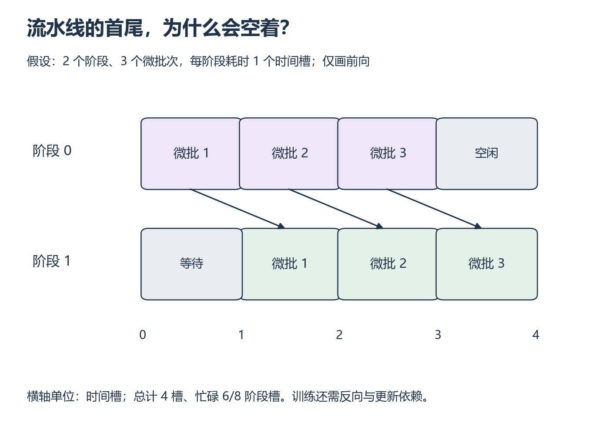

# W14 第 3 段：流水线已经装满，为什么首尾仍有空闲？

[本单元](README.md) · [课程目录](../../course/README.md)

流水线并行把不同层放在不同阶段，微批次依次通过它们。第一个微批次尚未到达后级时，后级只能等；最后一个微批次离开前级后，前级也会空下来。

## 视频与正文

可从 [CS336 2026 Lecture 7 官方课表](https://cs336.stanford.edu/) 的 Recordings 打开 Parallelism，看到 PP 时暂停画微批次时间线。视频分钟位置待核验；正文按下列函数和章节阅读。

## 中文补充（按需）

NVIDIA 中文[推理优化](https://developer.nvidia.cn/blog/mastering-llm-techniques-inference-optimization/)只读“管道并行”段：按层拆设备、等待与微批次，停在“张量并行度”前；指定文字已预读。它帮助理解流水线气泡；本课仍只画 2 stage 前向时间线，完整训练调度留作后续。微批次依赖与空闲区间按本页推演，不用旧文章的泛化效率公式代替时间线。[范围与版本](../../resources/training.md#cn-parallel)。

## 开始前

先区分 TP 在层内切分、PP 在阶段间传激活；本段只手算前向依赖，训练流水线另有反向与更新。

资源定位：[TP 通信与 PP 流水线](../../resources/training.md#r-parallel) → [通信、TP 和 PP 讲义](../../resources/training.md#r-l7)。

**先读**：Bridge 同页 `Pipeline Parallelism` 与 `Interleaved Pipeline Parallel Schedule` 的概念说明；后者只用于认识还有其他调度。配 CS336 第 7 讲的 `pipeline_parallelism`、`pipeline_parallelism_main` 理解基础示例。

**接着想一想**：TP 在层内切张量，PP 在阶段间传激活；不要将两种通信图混画。训练中的 backward 和参数更新约束比前向演示更多。

## 从一个微批次追到相邻两个微批次

**流水线并行（PP）**允许阶段 0 处理下一微批次时，阶段 1 处理上一微批次。但对同一个微批次，阶段 1 必须先拿到阶段 0 的结果。把每次执行画在所属阶段的时间线上，就能同时看到串行依赖与不同微批次之间的重叠。

暂时假设两阶段等速、传输耗时为零，用下面的表先手算。这里的空闲称为气泡（bubble）；它是这个简化执行安排中的空槽，不能直接当作真实训练的 GPU 利用率损失。

**例子与图解：只看前向的流水线**

2 个 stage，各 microbatch 在每个 stage 用 1 个时间单位，传输暂忽略，连续送入 3 个 microbatch：

| 时间槽 | stage A | stage B |
| --- | --- | --- |
| 0～1 | micro1 | 空闲 |
| 1～2 | micro2 | micro1 |
| 2～3 | micro3 | micro2 |
| 3～4 | 空闲 | micro3 |

**暂停题**：总时长、吞吐、槽位空闲比例是多少？若 B 每个 microbatch 用时 2，总时长又是多少？

核对答案

均衡时总时长 4，吞吐 3/4 个 microbatch/时间单位；共 8 个 stage 时间槽，空闲 2 个，比例 25%。B 变慢时执行区间为 1～3、3～5、5～7，总时长 7。A 是否受缓冲容量阻塞需要另外声明；此例假定能暂存中间结果。图未含 backward、通信或优化器更新，不能用来宣称训练流水线的实测效率。

*先沿箭头追一个微批次，再横向比较同一时段的两个阶段 [放大查看 SVG](../../assets/figures/w14-pipeline-timeline.svg)。暂停：增加一个微批次但阶段耗时不变，总时长与空闲比例怎样变化？*

**动手练习**：画 2 stage、多个 microbatch 的时间线，先声明是前向演示还是训练调度，再标计算、传输和气泡；手算一个均衡例子及一个慢 stage 例子。

**完成后检查**：能比较 DP/TP/PP 的切分对象，指出模型估算与实测的边界。完整 PP 训练作为扩展。

## 整理记录与可选拓展

在 `labs/06-training/parallelism/` 交付 MLP shape/通信图、切分对齐脚本与 pipeline 时间线。

进阶增加一种 stage 不均衡或 TP 分片数，先提出预测再验证；CP、EP、3D 并行训练另排单元。

## 完成后

把代码、预测与实际结果记在同一份笔记中。完成本段检查后，沿下方链接继续。

[上一课](session-02.md) · [下一课](assessment.md)
