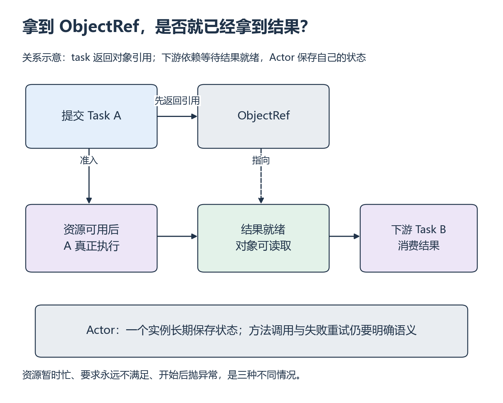

# W15 第 1 段：函数返回的是结果，还是指向未来结果的引用？

[本单元](README.md) · [课程目录](../../course/README.md)

本地函数返回时，通常已经得到了值。远程任务提交后却可能仍在等待资源；你先拿到的是结果引用。把提交、执行和取结果分开，才能理解并发为什么有时消失。

## 视频与正文

主要阅读下列正文与图解。视频范围待核验；已看懂的重复内容只需回查。

## 开始前

先完成 P8 的两个独立实例与 S6 的依赖图；CPU Task 不需要先跑完多卡训练性能实验。

资源定位：[Task、Actor 与 ObjectRef](../../resources/scheduling.md#r-ray-task)。

**先读**：[Task / Actor 资源卡](../../resources/scheduling.md#r-ray-task)：Tasks 的首个 remote 函数、执行/取结果和 Passing Object References，约 30 分钟；ray.remote API 中 Foo Actor 的创建、方法调用和 get，约 20 分钟。按这两份官方页面完成，其他导航入口不是必读。先在纸上跟踪返回值，再修改最小示例。

**接着想一想**：把 Python 返回值与 ObjectRef 画成两种对象，标出真正等待结果的位置。Actor 用于持有状态，不能仅因语法相似就当成普通无状态函数。

## 提交以后，结果可能还没有产生

**Task** 是提交到 Ray 执行的函数工作，**ObjectRef** 是对结果对象的引用。下游把顶层 ObjectRef 作为参数时，表达的是数据依赖：只有前面的结果就绪，后面才能使用它。`ray.get` 则在调用处需要实际值时等待并取回。

**Actor** 是持有状态的远程实例。先按 P8 的普通类理解它保存什么，再加上远程调用；本实验只使用默认同步 Actor。提交多个独立任务后再收集结果，可以保留并行机会；每提交一个就马上 get，会把等待插回循环中。

**例子与图解：先理解引用，再讨论并发**

*上排看提交返回，下排看真实执行与依赖 [放大查看 SVG](../../assets/figures/w15-ray-objects.svg)。暂停：ObjectRef 已存在但任务最终报错，能否把引用存在当作任务成功？*

ObjectRef 是结果的引用，提交时计算可能尚未完成；顶层任务参数的对象依赖由 Ray 解析。先提交独立任务后统一收集，才能保留并发机会。Actor 是远程的有状态对象，这里使用默认同步 Actor，不讨论异步 Actor 的并发语义。

**暂停题**：同一个同步 Counter Actor 初值 0，依次加 2、加 3，取返回值应是什么？新建第二个 Counter 后读取它会得到什么？

核对答案

同一提交者按顺序调用并核对结果时，应依次得到 2、5；新对象仍为 0。给每个 Actor/Task 保存 ID，避免将不同状态对象混为一谈。先用本地 Python 类和函数生成参考值；远程正确性依赖真实输出，不能仅凭 ObjectRef 存在判定成功。

**动手练习**：写数值计算 Task 和计数 Actor，提交多个任务后收集返回；将结果与本地函数计算对齐。不要在每提交一个任务后立即等待它，从而意外串行化全部工作。

**检查结果**：能解释异步提交、等待与依赖关系，结果正确。

## 完成后

把代码、预测与实际结果记在同一份笔记中。完成本段检查后，沿下方链接继续。

[上一课](README.md) · [下一课](session-02.md)
