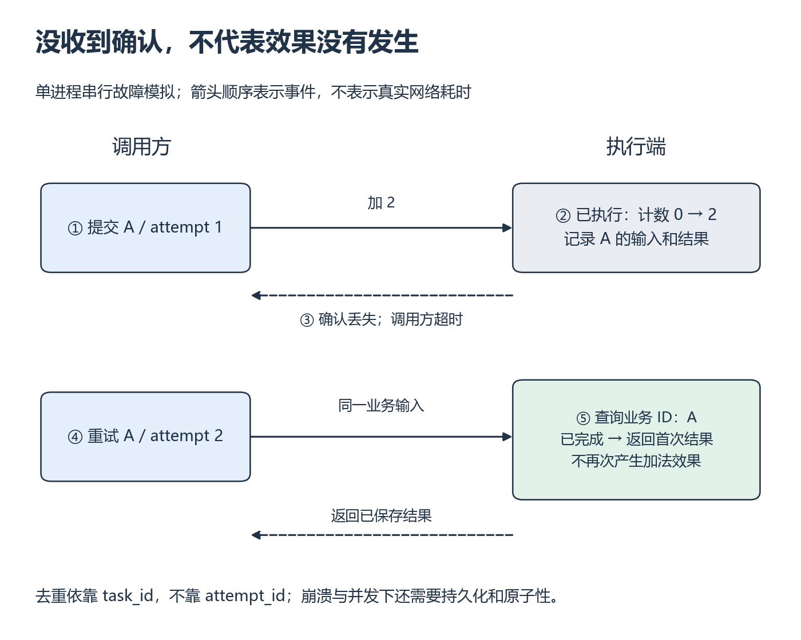

# W15 第 3 段：任务没开始，是资源忙、永远放不下，还是已经失败？

[本单元](README.md) · [课程目录](../../course/README.md)

只有结束时刻的日志无法区分等待发生在哪里。给任务从提交到结束都留下事件，才能判断它是尚未开始、执行中，还是已经以错误结束。

## 视频与正文

主要阅读下列正文与图解。视频范围待核验；已看懂的重复内容只需回查。

## 中文补充（按需）

AWS 官方中文[采用退避的重试](https://docs.aws.amazon.com/zh_cn/prescriptive-guidance/latest/cloud-design-patterns/retry-backoff.html)，只读意图、动机、适用性和“问题和注意事项”，到实现前停止。它是现有英文重试材料的官方译文，指定文字已预读；重点检查幂等性、限次与退避，不套用 Lambda/Step Functions 实现。Ray 的 max_retries、Actor 状态及异常传播仍按本页和原接口核对。[范围与版本](../../resources/scheduling.md#cn-retry)。

## 开始前

前两段结果正确，能说明逻辑资源与实际占用；继续使用同一单机时钟与明确任务 ID。

资源定位：[可行性、可用性与节点选择](../../resources/scheduling.md#r-ray-schedule)。

**先读**：[Scheduling](../../resources/scheduling.md#r-ray-schedule) 的 `Resources`，区分 feasible、available、infeasible；再看 `Scheduling Strategies → DEFAULT`，暂不尝试所有放置策略。

**接着想一想**：W10 记录请求等待，这里记录作业等待；虽然都需要时间轴，测量对象和机制不同。Ray 的节点放置也不自动等于自己想要的 FIFO/SJF 队列策略。

把[任务与 ObjectRef 图](session-01.md)中的提交、真正执行、结果就绪分别标上时间。任务停在不同箭头前，应该查的日志也不同。

## 先比较总容量，再看当前空闲量

要求 3 个 CPU，而每个节点总共最多 2 个，这个任务在当前配置中**不可行（infeasible）**。节点容量足够但名额暂被占用，则是**可行但暂不可用（feasible, unavailable）**。任务已开始后抛出异常属于执行失败，增加资源不能自动修复坏输入。

用 task_id 标识逻辑任务，attempt_id 区分重试。submit、start、end 允许重建等待与执行时间，但 submit 到 start 可能还包含依赖、启动等开销。要归因于某种排队机制，还需相应状态或事件，不能只靠两个时间点。

**例子与自查：日志能说明什么**

| task_id | submit | start | end | status |
| --- | --- | --- | --- | --- |
| A | 0.0 | 0.2 | 0.7 | success |
| B | 0.0 | 0.3 | 0.6 | failed |

单位均为同一单机时钟的秒。A 的等待和执行时间是多少？B 能否从统计中删去？某任务要求 3 个逻辑 CPU，而所有节点容量最多 2，它是暂时忙还是不可行？

核对答案

A 等待 0.2、执行 0.5 秒；这段等待含调度/启动等开销，不能全部归因资源排队。B 保留失败类型和时间；成功吞吐与失败率分别报。3 CPU 请求在该集群配置下不可行（infeasible）；容量足够但暂被占用才是 feasible 而 unavailable。Ray 的 DEFAULT 节点策略不保证自己的 FIFO/SJF，W16 的待提交队列需单独实现。

**动手练习**：给每个任务记录 ID、资源、提交/开始/结束、结果或失败。单机实验统一时钟口径，改变资源请求与任务数，解释何时等待；保留失败记录，不能只保存成功样本。

**完成后检查**：从日志可重建等待时间与执行时间，区分资源不足和任务尚未完成；W16 将直接复用事件字段。

## 超时以后，第一次加法可能已经发生了

假设 Actor 接到“计数器加 2”：服务端已经把 0 改为 2，但回复没有按时到达。调用方只看到超时，又提交一次。若执行端不知道两次尝试属于同一逻辑请求，就会再次加 2。**重试（retry）**是在失败或结果不明时再次尝试；**幂等（idempotency）**要求同一逻辑操作重复处理仍得到约定的同一效果。单纯加法并不幂等。

*按编号从上到下读；虚线是未到达的确认，右下是需要自己补的判断。[放大查看 SVG](../../assets/figures/w15-retry-dedup.svg)。暂停：若只按 attempt_id 去重，第二次尝试会被认作同一业务操作吗？*

先读 [Retry with backoff](https://docs.aws.amazon.com/prescriptive-guidance/latest/cloud-design-patterns/retry-backoff.html) 的 Intent、Motivation、Applicability、Issues and considerations，到 Implementation 前停止。重点是暂时性故障、重试放大负载和幂等要求；AWS 服务部署不是前置。然后查 [ray.get 的 timeout 参数](https://docs.ray.io/en/latest/ray-core/api/doc/ray.get.html)：它限制调用方等待结果的时间，不能据此断言远端从未执行。取消与回滚也不是同一件事。

### 先运行坏例子，再修复一次重复效果

在仓库根目录运行 `python exercises/systems/retry_start.py`。这是不需要 Ray 的串行故障模拟：第一次调用效果已发生，驱动把确认标为丢失，再提交第二次。不会真正制造网络故障，也没有伪装成真实耗时的 sleep。观察两条 attempt 记录与最终计数，原样保存到 W15 的实验笔记。

复制起点后补全 `CounterService.apply_once(task_id, amount)`。接口要求：task_id 为非空字符串、amount 为正整数；同一 ID 与相同参数重放时返回首次结果，不再改计数；同一 ID 却换参数时明确拒绝。已完成表记录业务输入和结果，不能只保存“这个 ID 出现过”。

1. 先手算无保护与去重后的结果，再用 `--mode deduplicated` 运行，比较每次尝试的 effect_delta。不要删掉失败/超时尝试。
2. 把重放次数改为 3；在 A 完成后插入新任务 B，再重放 A，A 应返回原结果而非此时的全局计数。
3. 同一 A 改 amount、空 ID、负数、浮点数分别检查；参数错误应失败，不能因为“重试总会成功”继续循环。
4. 合上起点，从空文件写同一接口；在已有计数 Actor 中复用相同业务规则，再保留 Ray 运行记录。没有实际 Ray 结果时，模拟通过与 Actor 集成仍分开记。

核对重复效果和返回值

无保护时 A 两次各加 2，最终为 4；去重后最终为 2，两次尝试的 effect_delta 为 2、0。A 完成结果为 2，B 再加 5 后总数为 7，重放 A 应返回已保存的 2，不应重新加或返回 7。attempt_id 用于观察每次尝试，task_id 才指向同一业务操作。

### 这个修复保证了什么，又依赖什么？

本题是单进程串行调用，去重表与计数更新之间没有故障注入。若进程在“加了计数、尚未记 ID”之间崩溃，或多个执行者同时查询，普通字典不能保证只发生一次效果。重启后去重表也会丢失；若重复窗口还在，就需要持久化结果与业务效果的原子性设计。这里只要求指出这个缺口，不实现事务存储。

对于暂时性错误，重试应有最大次数和退避间隔；随机抖动用于避免许多调用方同时再发。确定性坏输入应直接修复。退避减轻拥塞，不会自动修复重复副作用；也不能把一次本地模拟通过宣称成分布式“恰好一次”。

本段故障练习预计 2～4 小时，已计入 W15 单元范围；复用 Actor 和原日志，不另建调度项目。

## 整理记录与可选拓展

在 `labs/07-scheduling/ray-basics/` 交付 Task/Actor 示例和事件记录器。CPU sleep 只能验证日志与排队逻辑，不能作为 GPU 利用率结论。

进阶的多 GPU 成组预留后置；本单元不实现集群级调度器。

## 完成后

把代码、预测与实际结果记在同一份笔记中。完成本段检查后，沿下方链接继续。

[上一课](session-02.md) · [下一课](assessment.md)
